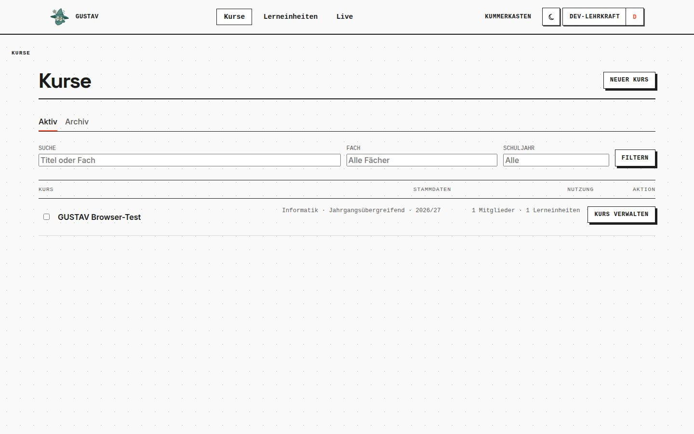
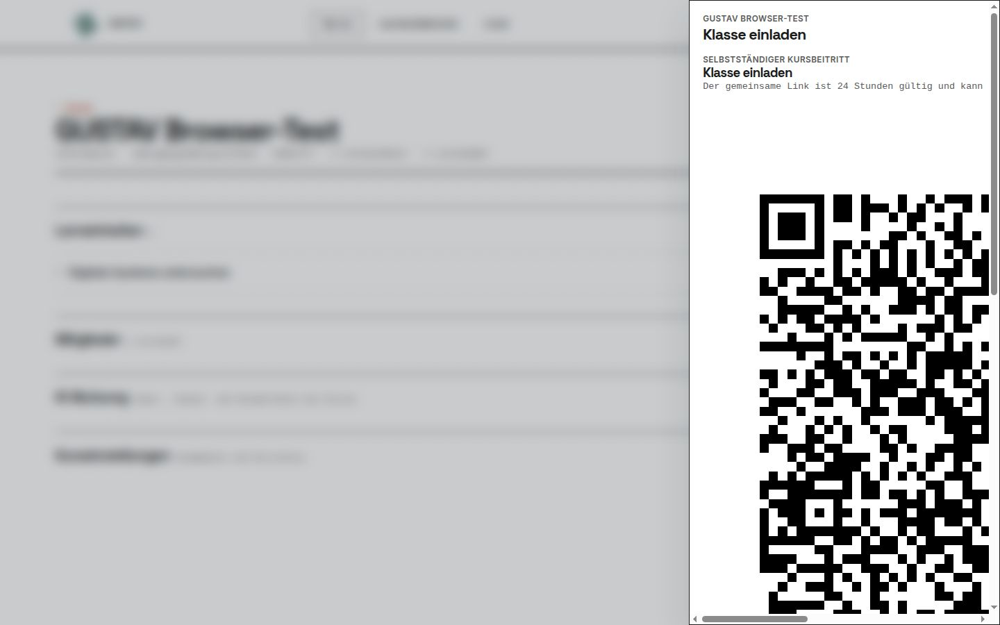

<p align="center">
  
</p>

# GUSTAV

**AI-assisted learning platform for schools · Version 0.0.4 · early alpha**

GUSTAV is a learning platform that I am developing as a teacher for real classroom use. It grew out of a practical question: How can software help students learn more effectively while helping teachers understand and improve the learning process—without taking pedagogical judgement out of their hands?

The name is a recursive German acronym: **GUSTAV unterstützt Schüler tadellos als Vertretungslehrer**. Despite the name, GUSTAV is not intended to replace teachers. It supports a learning cycle in which teachers prepare and release content, students work on it, feedback leads to revision, and the resulting learning progress informs further teaching decisions. AI is one tool within this cycle, not the purpose of the project.

## What I hope GUSTAV can contribute

I see considerable potential in bringing several forms of learning support together in one place.

GUSTAV acts as a central hub where students can find materials, activities, and the structure of their learning journey. Its module graph makes that journey visible and serves as an advance organizer: students can see how topics and activities relate to each other and where their current work fits into the wider sequence.

Students can receive timely, pedagogically grounded feedback and use it to revise their work. Practice modules help them revisit and consolidate important concepts instead of encountering them only once. At the same time, patterns in students’ work can help teachers make informed decisions about what to revisit, where additional support is needed, and how their teaching can be improved.

My hope is that these elements can contribute to better learning processes and, ultimately, better learning outcomes. GUSTAV has a great deal of potential, but that potential should be examined through classroom practice and evidence rather than treated as a promise that has already been proven.

## A tour of GUSTAV

The gallery shows the real GUSTAV 0.0.4 interface with dedicated, non-personal development data.

<table>
  <tr>
    <td width="50%">
      <br>
      <strong>Courses at a glance</strong><br>
      Teachers organize courses and see the current teaching context in one place.
    </td>
    <td width="50%">
      <br>
      <strong>Designing a learning journey</strong><br>
      Linear and modular learning units connect materials, tasks, phases, and dependencies.
    </td>
  </tr>
  <tr>
    <td width="50%">
      <br>
      <strong>Inviting a class</strong><br>
      Teachers can share a short-lived class link, present a QR code, or send individual invitations.
    </td>
    <td width="50%">
      <br>
      <strong>Learning in context</strong><br>
      Students work with materials and tasks while keeping the wider learning path visible.
    </td>
  </tr>
  <tr>
    <td width="50%">
      <br>
      <strong>Feedback that leads to revision</strong><br>
      Timely formative feedback helps students reconsider and improve their work.
    </td>
    <td width="50%">
      <br>
      <strong>Practising important concepts</strong><br>
      Practice modules support deliberate repetition and make progress visible.
    </td>
  </tr>
</table>

## What GUSTAV can do today

For teaching and course organization, GUSTAV can:

- create and manage courses, reusable learning units, sections, materials, and tasks;
- combine linear learning sequences with modular paths, phases, and dependency graphs;
- release content step by step for a course or unlock modular content for individual students;
- invite learners through a time-limited class link, QR code, or individual email;
- show current progress and recent submission states during ongoing classroom work.

For students, GUSTAV can:

- provide a structured learning workspace with text, files, embedded simulations, native tasks, and H5P content;
- accept answers as text or file uploads;
- process submissions asynchronously and provide formative feedback;
- support revision instead of treating the first submission as the end of the learning process;
- offer native and H5P-based practice sessions for revisiting important concepts.

Under the hood, GUSTAV uses Keycloak for identity, Supabase Postgres and Storage for data, a contract-first OpenAPI description, and a separate learning worker for asynchronous analysis and feedback.

## AI transparency

GUSTAV uses AI for the analysis of student submissions and for formative feedback. The current learning pipeline is built around DSPy programs and operator-configured OpenAI-compatible model endpoints, with local infrastructure options such as Ollama.

AI-generated feedback is not authoritative. It must remain open to correction and be used within a pedagogical process for which teachers retain responsibility.

AI tools are also used during development as aids for discussion, drafting, review, and debugging. They do not replace pedagogical judgement, architectural decisions, tests, code review, or responsibility for the published project.

## Project status

Version 0.0.4 is an early alpha. The former server-rendered product interface has been retired, and SvelteKit is now GUSTAV's product frontend. The backend's Clean Architecture boundaries are established and protected by automated checks.

GUSTAV is already used and tested through realistic classroom workflows, but it is not a finished product. Breaking changes should be expected.

Important current limitations include:

- IServ single sign-on is planned but not finished;
- AI feedback requires critical pedagogical use and careful model configuration;
- H5P adds operational and security complexity;
- production operation requires an independent privacy, security, backup, and deployment assessment.

The honest status of the project is part of its openness: publishing GUSTAV means making work in progress, trade-offs, and unresolved questions visible rather than claiming completeness.

## Try GUSTAV locally

The local environment mirrors the production architecture and is the best way to explore the project safely.

Prerequisites:

- Linux
- Docker with Docker Compose
- Supabase CLI
- GNU Make
- free local ports `80` and `443`

```bash
git clone https://github.com/Rensing1/gustav.git gustav
cd gustav

cp .env.example .env
supabase start
supabase db reset --yes
supabase status

# Copy the local Supabase URL and keys reported above into .env, then continue.
make db-login-user
make learning-worker-db-login-user
make up
```

Open `https://app.localhost`. GUSTAV uses a local Caddy certificate authority and never weakens TLS or secure-cookie checks for development. The [E2E and browser setup guide](docs/tests/e2e_howto.md) explains certificate trust, repeatable teacher and student personas, and common setup problems.

## Self-hosting

GUSTAV is self-hostable, but an early-alpha installation outside local evaluation requires the operator to take responsibility for TLS, domains, secrets, identity and email configuration, backups, updates, monitoring, and school-specific privacy compliance.

H5P packages and libraries are treated as trusted executable content and require additional operational care. This public repository deliberately does not ship school- or provider-specific production runbooks.

## Development and quality

GUSTAV is developed in public with a few non-negotiable principles:

- **pedagogy first:** technology should support learning and professional judgement;
- **security and privacy first:** education data deserves strict authorization, minimal exposure, and fail-closed behavior;
- **Free and Open Source:** educational software should be inspectable, adaptable, and shareable;
- **contract-first APIs:** API changes begin in `api/openapi.yml`;
- **test-driven development:** behavior is described by a failing test before implementation;
- **Clean Architecture:** business rules should remain independent of web frameworks and infrastructure.

Common checks:

```bash
make test
make verify
```

Changes with a user-facing workflow additionally require the authenticated feature-acceptance suite through `make verify-feature`. See the [Make target reference](docs/references/make_targets.md) for prerequisites and narrower checks.

## A personal project, open to collaboration

GUSTAV is a personal Free and Open Source project. I develop it alongside my work as a teacher and share it publicly because I believe educational software should be understandable, adaptable, open to scrutiny, and shaped by the people who use it.

Although GUSTAV began in my own teaching practice, it does not have to remain a one-person project. Teachers, students, developers, designers, researchers, self-hosters, and anyone interested in thoughtful educational technology are warmly invited to help improve it.

There are many useful ways to contribute: try GUSTAV, share a classroom perspective, report a problem, question a pedagogical or technical decision, improve the documentation, suggest an accessible design, or contribute code. You do not need to be a professional software developer to make a valuable contribution.

Please read [CONTRIBUTING.md](CONTRIBUTING.md) before preparing a larger contribution. Bugs, ideas, and pedagogical questions can be raised through [GitHub Issues](https://github.com/Rensing1/gustav/issues). Never include student data, credentials, or other personal information in an issue, log, screenshot, or example.

## Documentation

- [Architecture](docs/ARCHITECTURE.md)
- [Bounded contexts](docs/bounded_contexts.md)
- [Domain glossary](docs/glossary.md)
- [OpenAPI contract](api/openapi.yml)
- [Teaching reference](docs/references/teaching.md)
- [Learning reference](docs/references/learning.md)
- [Local browser and E2E guide](docs/tests/e2e_howto.md)
- [Changelog](docs/CHANGELOG.md)
- [Roadmap](docs/ROADMAP.md)

## License

GUSTAV is licensed under the [GNU Affero General Public License v3](LICENCE.md). Additional information about bundled components is available in [docs/LICENCE.md](docs/LICENCE.md) and [THIRD_PARTY_NOTICES.md](THIRD_PARTY_NOTICES.md).
