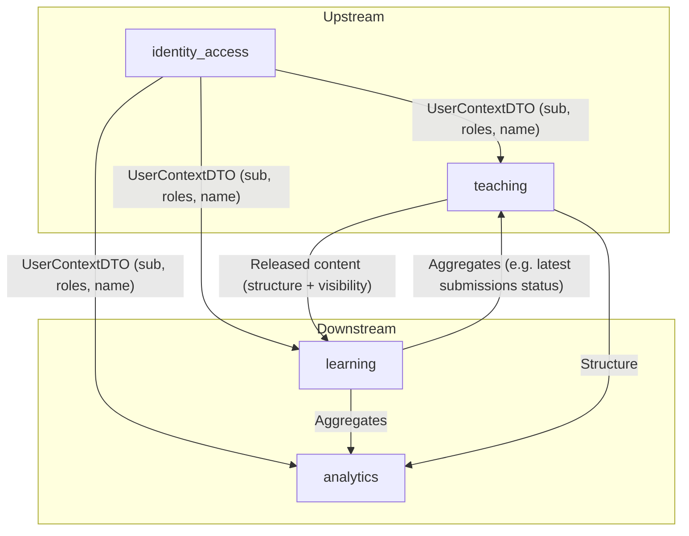

# Bounded Contexts

Last reviewed: 2026-02-23

Dieses Dokument beschreibt die fachliche Aufteilung (Bounded Contexts) in GUSTAV alpha‑2.
Es ist bewusst konzeptionell gehalten. Terminologie bitte konsistent mit `docs/glossary.md` verwenden.

## Kontexte (alpha‑2)
1. **`identity_access` (Benutzerverwaltung)**: Authentifizierung/Session‑Handling und Rollen/Identität als minimaler, datenschutzfreundlicher Kontext für alle nachgelagerten Bereiche.
2. **`teaching` (Unterrichten)**: Lehrkräfte erstellen/verwalten wiederverwendbare Inhalte (`Unit`) und organisieren sie in Kursen inkl. Freigaben.
3. **`learning` (Lernen)**: Schüler bearbeiten freigegebene Inhalte, erstellen Abgaben (`Submission`) und erhalten Auswertung/Feedback.
4. **`analytics` (Diagnostik)**: Aggregierte Sichten für Lehrkräfte. (Noch kein eigenes Paket; erste diagnostische Sichten sind aktuell Teil von `teaching`.)

## `identity_access` (Benutzerverwaltung)

Ziel: Andere Kontexte sollen Nutzer eindeutig adressieren können, ohne E‑Mail/PII als technische Schlüssel zu verwenden.

**Verantwortung**
- Login/SSO via Keycloak (OIDC Authorization Code Flow + PKCE)
- Serverseitige App‑Session (`gustav_session` Cookie) und Ableitung eines minimalen User‑Kontexts
- Bereitstellung eines **UserContextDTO** (kontextübergreifend), der ohne PII auskommt:
  - `sub` (OIDC Subject, stabiler opaker String)
  - `roles` (Realm‑Rollen, gefiltert auf `student|teacher|admin`)
  - `name` (Anzeigename; z. B. aus `gustav_display_name` oder Fallback‑Humanisierung)

**Nicht-Ziele**
- Keine Speicherung/Weitergabe von Passwörtern oder Passwort‑Hashes in der App‑Domäne.
- E‑Mail ist (wenn überhaupt) ein IdP‑Attribut, aber kein fachlicher Identifikator für nachgelagerte Kontexte.

Siehe Referenz: `docs/references/user_management.md`.

## `teaching` (Unterrichten)

Ziel: Lehrkräfte modellieren Lerninhalte und steuern Sichtbarkeit im Kurs.

**Kernbegriffe**
- `Course` (Kurs): organisatorische Hülle; enthält Mitglieder und Kurs‑Konfiguration.
- `CourseModule` (Kursmodul): Beziehung zwischen `Course` und `Unit` inkl. Reihenfolge im Kurs.
- `Unit` (Lerneinheit): wiederverwendbarer Inhaltsbaustein (autor‑scoped).
- `Section` (Abschnitt): Unterteilung einer Unit; kleinste Einheit für Freigaben.
- `Material` (Material): Markdown oder Datei‑Material innerhalb eines Abschnitts.
- `Task` (Aufgabe): Aufgaben innerhalb eines Abschnitts, inkl. Kriterien für Auswertung.
- `Release`/Sichtbarkeit: pro Kursmodul/Abschnitt wird Sichtbarkeit geschaltet (Freigabe).

**Datenhoheit**
- `teaching` ist Quelle der Wahrheit für Struktur (Kurse/Units/Sections/Materials/Tasks) und Freigaben.

Siehe Referenzen: `docs/references/teaching.md`, `docs/database_schema.md`.

## `learning` (Lernen)

Ziel: Schüler bearbeiten freigegebene Aufgaben und erhalten Feedback/Auswertung.

**Kernbegriffe**
- `Submission` (Abgabe): immutable Einreichung eines Schülers zu einer Aufgabe.
  - enthält u. a. `analysis_status`, `analysis_json` (Auswertung) und `feedback_md` (Rückmeldung)
  - Versuchszähler wird serverseitig geführt (attempts/max_attempts)

**Abhängigkeiten**
- `learning` konsumiert Struktur/Freigaben aus `teaching` (fail‑closed: ohne Freigabe kein Zugriff).
- Für Lehrkräfte‑Sichten (z. B. Live‑Übersicht) liefert `learning` aggregierte Abgabe‑Signale, nicht die Roh‑Inhalte.

Siehe Referenzen: `docs/references/learning.md`, `docs/references/learning_ai.md`.

## Beziehungen zwischen den Kontexten (Context Map)

