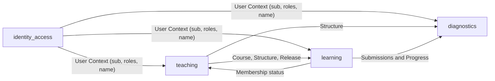

# Bounded Contexts

Stand: Version 0.0.4. Zuletzt geprüft: 2026-08-16.

Dieses Dokument beschreibt die fachliche Aufteilung von GUSTAV. Die Kontexte sind fachliche Verantwortungsgrenzen; sie müssen nicht jeweils genau einem technischen Prozess oder einem einzelnen Verzeichnis entsprechen. Terminologie wird konsistent mit `docs/glossary.md` verwendet.

## Kontexte

1. **`identity_access` (Benutzerverwaltung):** Authentifizierung, Rollen, Identität, Sessions und technische Zugangsmittel.
2. **`teaching` (Unterrichten):** Wiederverwendbare Lerninhalte, Kurse, Mitgliedschaften, Kurseinladungen, Freigaben und Authoring.
3. **`learning` (Lernen):** Sichtbarer Lernweg, Bearbeitung, Abgaben, Feedback, Dialoge, Portfolio und Übungssitzungen.
4. **`diagnostics` (Diagnostik):** Datensparsame Leseprojektionen für Unterrichtsbeobachtung, Lernstandsübersicht und Live-Begleitung.

## `identity_access` (Benutzerverwaltung)

### Verantwortung

- Login und Registrierung über Keycloak mit OIDC Authorization Code Flow und PKCE;
- serverseitige App- und Browser-BFF-Sessions;
- Rollen `student`, `teacher` und `admin`;
- minimale Identitätsprojektion für andere Kontexte;
- CLI-Tokens mit expliziten, eng begrenzten Capabilities;
- Passwort-Reset, E-Mail-Verifikation und sichere Abmeldung.

### Geteiltes Modell

Andere Kontexte erhalten nur den benötigten User Context:

- `sub`: stabiler, opaker OIDC-Bezeichner;
- `roles`: gefilterte GUSTAV-Rollen;
- `name`: Anzeigename für die Oberfläche.

E-Mail-Adresse, Tokens und Keycloak-Interna sind keine allgemeinen kontextübergreifenden Attribute.

## `teaching` (Unterrichten)

### Verantwortung

- Kurse anlegen, archivieren, wiederherstellen und kontrolliert löschen;
- Kursmitgliedschaften verwalten;
- Kurseinladungen erzeugen, rotieren, widerrufen und nach erfolgreicher Authentifizierung einlösen;
- wiederverwendbare Lerneinheiten und deren Modulgraphen authoren;
- Phasen, Lernmodule, Übungsmodule, Abschnitte, Materialien und Aufgaben verwalten;
- Lerneinheiten einem Kurs zuordnen und Inhalte freigeben;
- Authoring über Weboberfläche und capability-begrenzte CLI ermöglichen.

### Fachliche Grenzen

- Eine `Unit` ist wiederverwendbar und zunächst nicht an einen Kurs gebunden.
- Ein `Course Module` ordnet eine `Unit` in einen konkreten `Course` ein.
- Eine `Release` steuert die Sichtbarkeit im Kurskontext.
- Eine `Course Invitation` ist eine zeitlich begrenzte Capability für den Beitritt zu genau einem Kurs.
- Authoring legt Aufgaben und Übungsangebote fest, speichert aber keinen individuellen Lernfortschritt.

## `learning` (Lernen)

### Verantwortung

- nur freigegebene Kurse, Lerneinheiten und Module anzeigen;
- Lernweg und Voraussetzungen aus dem Modulgraphen ableiten;
- Entwürfe und endgültige Abgaben verwalten;
- Datei-, Bild-, PDF-, Simulations-, H5P- und Dialogabläufe koordinieren;
- KI-gestützte Analyse und formatives Feedback verarbeiten;
- frühere Arbeiten, Portfolio und Exporte bereitstellen;
- Übungsstapel, Übungssitzungen, Versuche und Wiederholungszustände verwalten.

### Fachliche Grenzen

- `Submission` und `Practice State` gehören der lernenden Person.
- Sichtbarkeit und Mitgliedschaft werden an Repository- und Datenbankgrenzen durchgesetzt.
- KI-Anbieter sind austauschbare Adapter; Analyse- und Feedbackverträge gehören zum Learning-Kontext.
- Teaching darf Lernstände über freigegebene Diagnostikprojektionen lesen, aber nicht die Learning-Historie als eigenes Modell duplizieren.

## `diagnostics` (Diagnostik)

### Verantwortung

- Kursmatrix und Lernendenprofil als eigene Read Models bereitstellen;
- aktuelle Unterrichtsaktivität für den Live-Arbeitsraum projizieren;
- Teaching-Struktur und Learning-Ereignisse datensparsam zusammenführen;
- Lehrkräften Hinweise für pädagogische Entscheidungen geben, ohne automatische Urteile über Lernende zu fällen.

`diagnostics` ist ein etablierter eigener Kontext. Die SvelteKit-Räume `/diagnostics` und `/live` konsumieren seine Read Models; Mutationen bleiben in `teaching` beziehungsweise `learning`.

## Context Map

## Technische Zuordnung

- `backend/identity_access/` enthält die wichtigsten Identity-&-Access-Adapter und Modelle.
- `backend/teaching/` enthält Teaching-Services und Persistenzadapter.
- `backend/learning/` enthält Learning Use Cases, Practice, Worker und KI-Adapter.
- Diagnostik ist gegenwärtig vor allem durch explizite Read Models und API-Endpunkte abgebildet; die fachliche Grenze gilt unabhängig von der Paketstruktur.
- `frontend/src/routes/` bildet die Produkträume ab, enthält aber keine dauerhafte fachliche Persistenz.
- `backend/web/` übersetzt HTTP und Auth-Kontext; es ist selbst kein Bounded Context.
