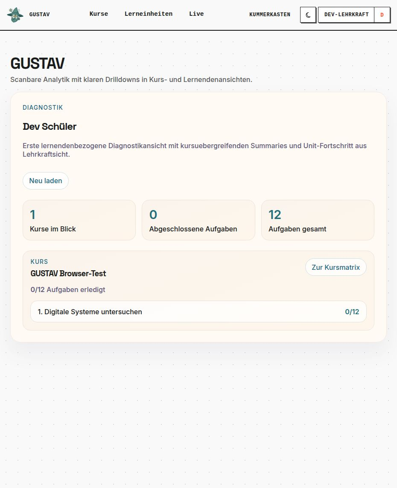

# Diagnostics

GUSTAV-Version: 0.0.4
Last verified: 2026-08-20
[Deutsche Version](diagnostics.de.md)

## Purpose

Diagnostics condenses available learning activity for pedagogical follow-up. While **„Live“** (“Live”) supports an ongoing lesson, **„Diagnostik“** (“Diagnostics”) helps teachers review an entire course or a single learner's status across courses.

## Prerequisites

- You are signed in as an authorised teacher.
- You own the relevant course, and it contains members and assigned learning units.
- Diagnostics data becomes available only when learners work on tasks and save submissions.

## Step by step

1. Open **„Diagnostik“**.
2. Select **„Kurse öffnen“** (“Open courses”) and open the desired course context.
3. In the course matrix, learners are shown alongside the available task states.
4. Select a learner to open the **„Lernendenprofil“** (“Learner profile”).
5. The profile displays the number of courses included, completed tasks, and total tasks.
6. Open a course in the profile to return to its course matrix and examine the context in more detail.

## Learner view

Diagnostics is a teacher view. Learners see their own tasks, feedback, and learning paths in the learning workspace, but neither the course matrix nor other learners' profiles.

## How it works

Diagnostics reads purpose-specific summaries from available course, task, and submission data. Access remains restricted to the authorised teacher and their courses. Learners are associated internally through their protected identity; diagnostics receives only the data required for its view.

The course matrix supports comparison within a specific teaching context. In contrast, the learner profile summarises task progress across several courses owned by the teacher.

## Limitations

- The current diagnostics view is an initial summary, not a complete learning analytics system.
- It displays available activity; missing data does not automatically indicate a lack of knowledge or participation.
- Task progress and the number of completed tasks are not a grade.
- Practice intervals, stability, and due reviews are not presented in a dedicated teacher diagnostics view in this version.
- Data from other teachers' courses is not visible.
- Diagnostics does not prescribe automatic pedagogical measures or support decisions.

## Common problems

- **„Noch keine Diagnostikdaten für diesen Kurs verfügbar“** (“No diagnostics data available for this course yet”): Check memberships, course assignments, and whether tasks have already been completed.
- **Learner profile is empty:** No task states that can be summarised are available for this learner in your courses yet.
- **Live view and diagnostics have different emphases:** Live view shows the current classroom snapshot; diagnostics summarises available task states.
- **Task is missing from the matrix:** Check whether it belongs to the assigned learning unit and the visible course context.

## Related chapters

- [Courses and members](courses-and-members.en.md)
- [Submissions and feedback](submissions-and-feedback.en.md)
- [Practice modules](practice-modules.en.md)
- [Live view](live-view.en.md)

Architecture context: [Bounded contexts](../bounded_contexts.md).
