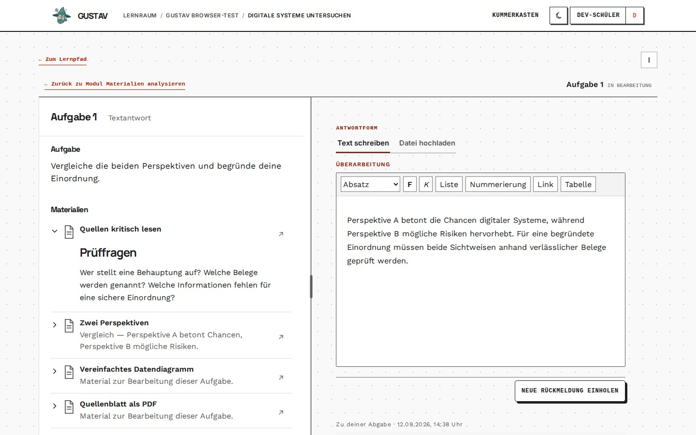

# Lernraum

GUSTAV-Version: 0.0.4
Zuletzt geprüft: 2026-08-20
[English version](learner-workspace.en.md)

## Zweck

Der Lernraum ist die zentrale Arbeitsfläche der Lernenden. Er hält Kurs, Lernweg, Materialien, Aufgaben und frühere Bearbeitungen in einem gemeinsamen Zusammenhang. Dieses Kapitel hilft Lehrkräften nachzuvollziehen, was Lernende tatsächlich sehen und bedienen können.

## Voraussetzungen

- Die lernende Person ist Mitglied eines aktiven Kurses.
- Dem Kurs ist mindestens eine Lerneinheit zugeordnet.
- Der gewünschte Abschnitt beziehungsweise Graphknoten ist sichtbar und bei modularen Lerneinheiten freigeschaltet.
- Benötigte H5P-Inhalte und Dateien sind vollständig gespeichert.

## Schritt für Schritt

1. Die lernende Person öffnet **„Lernraum“** und wählt unter **„Aktuelle Kurse“** einen Kurs.
2. Sie öffnet eine sichtbare Lerneinheit. Bei modularen Lerneinheiten zeigt der Graph den Lernweg und die Zustände der einzelnen Knoten.
3. Sie wählt einen offenen Knoten beziehungsweise Abschnitt. Materialien und Aufgaben erscheinen in der Arbeitsfläche.
4. Markdown-Texte werden direkt gelesen. Dateien werden über **„Datei öffnen“** geladen. Eine interaktive Simulation wird bewusst mit **„Simulation starten“** geöffnet und kann zurückgesetzt oder geschlossen werden.
5. Eine Aufgabe wird in derselben Arbeitsfläche geöffnet. Die Bearbeitung kann mit **„Pausieren“** verlassen und später wieder aufgenommen werden, soweit der gespeicherte Zustand dies unterstützt.
6. Für Übungsmodule wechselt die lernende Person über **„Üben“** in den gesonderten Wiederholungsablauf.

## Lernendensicht

Lernende sehen nur eigene aktive Kurse, zugeordnete Lerneinheiten und zugängliche Inhalte. Im modularen Graphen bleiben auch gesperrte Lernschritte als Orientierung sichtbar, können aber nicht geöffnet werden. Offene und erledigte Knoten zeigen den individuellen Lernstand, nicht den Stand der ganzen Klasse.

Materialien, Aufgabe, eigene frühere Abgaben und Rückmeldungen werden kontextbezogen dargestellt. Interne technische IDs, Musterlösungen, Kriterien und Lehrkraft-Kontext werden nicht als versteckte Hilfen ausgeliefert.

## So funktioniert es

Zugriff wird nicht nur durch ausgeblendete Schaltflächen geschützt. Kursmitgliedschaft, Zuordnung und Freischaltung werden bei jedem geschützten Abruf erneut geprüft. Private Dateien und H5P-Inhalte erhalten nur kurzlebige, auf den konkreten Lernkontext begrenzte Zugriffe.

Bei modularen Einheiten berechnet GUSTAV für jede Person, welche Voraussetzungen erfüllt sind. Der Graph dient zugleich als Advance Organizer: Lernende können erkennen, wo sie stehen und welche Schritte folgen, ohne gesperrte Inhalte vorzeitig zu öffnen.

## Grenzen

- Ein gesperrter Inhalt bleibt auch über einen kopierten Direktlink gesperrt.
- Ein ungesendeter Textentwurf liegt nur im aktuellen Browsertab. Er ist keine serverseitige Sicherung und erscheint nicht automatisch auf einem anderen Gerät oder in einem anderen Tab.
- Simulationen laufen abgeschirmt und senden keine Ergebnisse an GUSTAV.
- Nicht jede Dateiform kann direkt als Vorschau dargestellt werden.
- Eine noch nicht fertig eingerichtete H5P-Aufgabe zeigt nur, dass sie nicht bereit ist.
- Der Lernraum arbeitet nicht offline. Für das Laden und Abgeben ist eine Verbindung zum GUSTAV-Server nötig.

## Typische Probleme

- **„Noch keine Lerneinheiten sichtbar“:** Prüfe Kursmitgliedschaft und Kurszuordnung der Lerneinheit.
- **Modul bleibt gesperrt:** Prüfe im Authoring die gerichteten Voraussetzungen und deren benötigte Anzahl.
- **Datei oder H5P lädt nicht:** Prüfe, ob Inhalt und Kurszuordnung noch bestehen; ein alter kurzlebiger Link kann nicht dauerhaft wiederverwendet werden.
- **Entwurf fehlt auf einem anderen Gerät:** Ungesendete Entwürfe werden nicht zwischen Geräten synchronisiert.
- **Vergangener Kurs statt aktueller Kurs:** Der Kurs wurde archiviert und ist nicht mehr für aktive Bearbeitung vorgesehen.

## Verwandte Kapitel

- [Kurse und Mitglieder](courses-and-members.de.md)
- [Lerneinheiten und Freigaben](learning-units-and-releases.de.md)
- [Materialien und Aufgaben](materials-and-tasks.de.md)
- [Abgaben und Rückmeldung](submissions-and-feedback.de.md)
- [Übungsmodule](practice-modules.de.md)

Technische Details: [Learning-Referenz](../references/learning.md).
