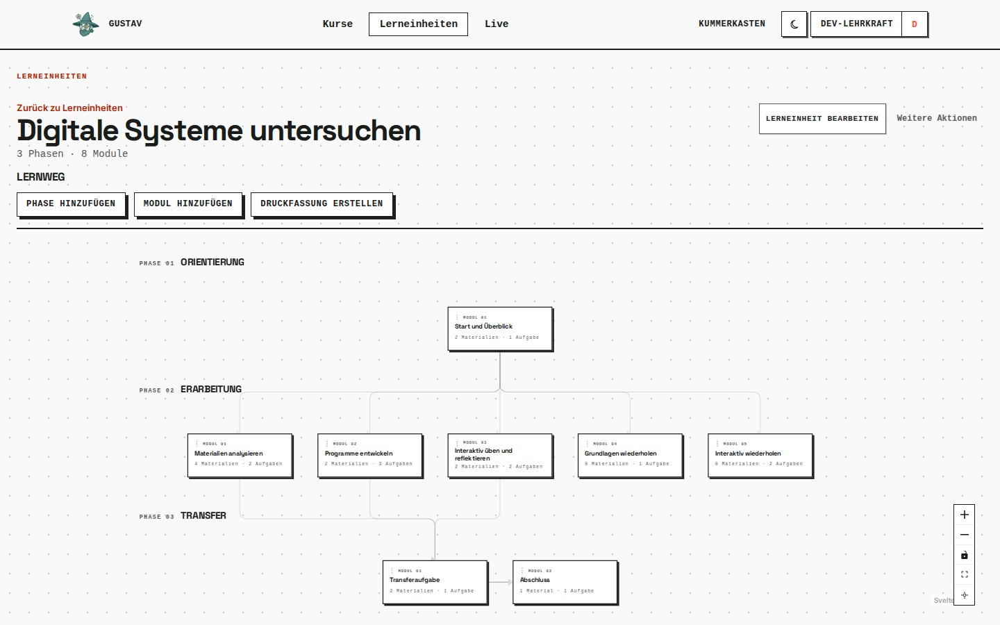

# Lerneinheiten und Freigaben

GUSTAV-Version: 0.0.4
Zuletzt geprüft: 2026-08-20
[English version](learning-units-and-releases.en.md)

## Zweck

Lerneinheiten bündeln wiederverwendbare Unterrichtsinhalte. Eine Lehrkraft erstellt sie einmal und kann sie anschließend einem oder mehreren eigenen Kursen zuordnen. GUSTAV unterstützt lineare Lerneinheiten und modulare Lernwege.

## Voraussetzungen

- Du bist als Lehrkraft angemeldet.
- Für die Verwendung im Unterricht existiert ein aktiver, vollständig konfigurierter Kurs.
- Vor der Zuordnung sollte die Lerneinheit genügend Inhalte besitzen, damit Lernende nicht in leere Arbeitsbereiche gelangen.

## Schritt für Schritt

1. Öffne **„Lerneinheiten“** und wähle **„Neue Lerneinheit“**.
2. Vergib einen Titel und entscheide dich für **„Modular“** oder **„Linear“**. Dieser Grundtyp bestimmt die weitere Struktur.
3. In einer linearen Lerneinheit legst du geordnete Abschnitte an.
4. In einer modularen Lerneinheit fügst du Phasen sowie **„Lernmodul“**- oder **„Übungsmodul“**-Knoten hinzu. Verbinde Lernmodule in der Richtung, in der Voraussetzungen gelten sollen.
5. Wähle ein Lernmodul aus und stelle unter **„Freischaltung“** ein, wie viele seiner eingehenden Voraussetzungen erfüllt sein müssen.
6. Ergänze Inhalte wie in [Materialien und Aufgaben](materials-and-tasks.de.md) beschrieben.
7. Öffne anschließend den gewünschten Kurs und wähle unter **„Lerneinheiten“** die Aktion **„Lerneinheit hinzufügen“**.
8. Prüfe die Lernendensicht, bevor du die Einheit im Unterricht einsetzt.

## Lernendensicht

Zugeordnete Lerneinheiten erscheinen im aktiven Kurs. Bei modularen Einheiten sehen Lernende den gesamten Lernweg als Graphen. Knoten können offen, gesperrt oder erledigt sein. Material und Aufgaben eines geöffneten Knotens erscheinen gemeinsam in einer Arbeitsfläche.

Übungsmodule sind wiederholbar und werden nie als erledigt markiert. Ihr besonderes Verhalten wird in [Übungsmodule](practice-modules.de.md) beschrieben.

## So funktioniert es

Eine Lerneinheit bleibt Eigentum ihrer Autorin oder ihres Autors. Die Kurszuordnung verweist auf diese wiederverwendbare Einheit; sie erzeugt keine unabhängige Kopie. Änderungen an der Einheit wirken deshalb in allen Kursen, denen sie zugeordnet ist.

Im modularen Graphen bedeutet eine gerichtete Verbindung: Das Ziel hängt von der Quelle ab. Die eingestellte Anzahl erforderlicher Vorgänger bestimmt, ob alle oder nur ein Teil der eingehenden Voraussetzungen erfüllt sein müssen. GUSTAV berechnet den Zustand für jede lernende Person anhand ihrer eigenen Bearbeitung.

## Grenzen

- Linear und modular sind unterschiedliche Strukturmodelle; ein nachträglicher Wechsel ist nicht als normale Bearbeitungsaktion vorgesehen.
- Eine Kurszuordnung ist keine Kopie. Änderungen können mehrere laufende Kurse gleichzeitig betreffen.
- Übungsmodule dürfen keine ausgehenden Verbindungen besitzen und können keine anderen Module freischalten.
- Ein gesperrtes Modul kann von Lernenden nicht durch einen direkten Link umgangen werden.
- Das Entfernen einer Lerneinheit aus einem Kurs löscht nicht die wiederverwendbare Lerneinheit, verändert aber ihre Verfügbarkeit in diesem Kurs.
- Gleichzeitige inhaltliche Änderungen durch mehrere Personen besitzen keine gemeinsame Echtzeit-Konfliktbearbeitung.

## Typische Probleme

- **Modul bleibt gesperrt:** Prüfe Richtung und Anzahl der eingehenden Verbindungen sowie den Wert unter **„Freischaltung“**.
- **Keine Lerneinheit im Kurs:** Ordne sie im Kurs über **„Lerneinheit hinzufügen“** zu.
- **Änderung erscheint in mehreren Kursen:** Das ist bei einer wiederverwendbaren Lerneinheit beabsichtigt.
- **Verbindung zu einem Übungsmodul lässt sich nicht weiterführen:** Übungsmodule dürfen nur Ziel, nicht Quelle einer Verbindung sein.

## Verwandte Kapitel

- [Kurse und Mitglieder](courses-and-members.de.md)
- [Materialien und Aufgaben](materials-and-tasks.de.md)
- [Lernraum](learner-workspace.de.md)
- [Übungsmodule](practice-modules.de.md)

Technische Details: [Teaching-Referenz](../references/teaching.md) und [Glossar](../glossary.md).
