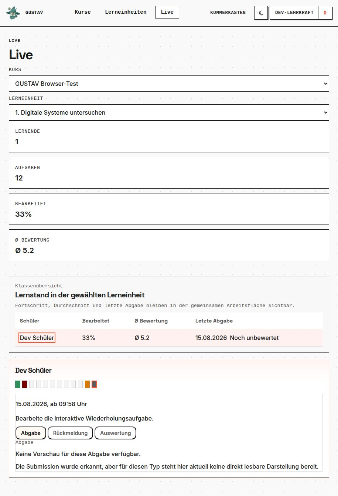

# Live-Ansicht

GUSTAV-Version: 0.0.4
Zuletzt geprüft: 2026-08-20
[English version](live-view.en.md)

## Zweck

Die Live-Ansicht unterstützt die Lehrkraft während einer laufenden Unterrichtsphase. Sie zeigt den aktuellen Arbeitsstand einer ausgewählten Lerneinheit und ermöglicht den schnellen Wechsel von der Klassenübersicht zur letzten Abgabe einer einzelnen Person.

## Voraussetzungen

- Du bist die besitzende Lehrkraft des Kurses.
- Der Kurs ist vorhanden und ihm ist mindestens eine Lerneinheit zugeordnet.
- Mitglieder und Aufgaben existieren; aussagekräftige Detaildaten entstehen erst durch Abgaben.

## Schritt für Schritt

1. Öffne **„Unterrichten“** oder direkt **„Live“**.
2. Wähle unter **„Kurs“** den gewünschten Kurs und anschließend unter **„Lerneinheit“** die aktuelle Einheit.
3. Wähle **„Live öffnen“**. Die Tabelle zeigt Lernende, Fortschritt, Durchschnitt und letzte Abgabe.
4. Sortiere die Übersicht bei Bedarf nach Schülerbezeichnung oder letzter Abgabe.
5. Wähle eine Schülerzeile. Rechts erscheinen Aufgabenleiste und Detailansicht.
6. Wechsle zwischen **„Abgabe“** und **„Rückmeldung“**. Bei Dialogaufgaben kann auch der berechtigungsgeprüfte Dialogverlauf erscheinen.
7. Lass die Ansicht während der Arbeitsphase geöffnet; neue Zustände werden regelmäßig nachgeladen.

## Lernendensicht

Lernende sehen nicht die Klassenmatrix. Sie arbeiten weiter im Lernraum und erhalten dort ihre eigene Rückmeldung. Die Live-Ansicht ist eine getrennte Lehrkraftprojektion und erlaubt keinen Zugriff auf Arbeiten aus fremden Kursen.

## So funktioniert es

Die Übersicht liest gezielt vorbereitete Daten für genau einen Kurs und eine Lerneinheit. Sie aktualisiert veränderte Zeilen und Detailzustände regelmäßig, ohne die komplette Seite für jede Änderung neu aufzubauen. Die Detailansicht zeigt die letzte berechtigte Abgabe zur gewählten Aufgabe sowie vorhandene Rückmeldung.

Durchschnitt und Fortschritt dienen der Orientierung im Unterricht. Sie fassen vorhandene Aufgabenstände zusammen und sollen auffällige Unterstützungsbedarfe sichtbar machen.

## Grenzen

- Live zeigt einen aktuellen Ausschnitt und ist keine langfristige Lernverlaufsanalyse.
- Die Detailfläche konzentriert sich auf die letzte Abgabe; sie ersetzt keine vollständige Abgabehistorie.
- Ein Durchschnitt ist keine automatisch erzeugte Note und darf nicht ohne fachliche Einordnung verwendet werden.
- Ohne zugeordnete Lerneinheit oder Abgaben bleibt die Ansicht leer beziehungsweise zeigt **„Noch keine Abgabe“**.
- Übungszustände besitzen derzeit keine eigene Live-Auswertung.
- Aktualisierung erfolgt regelmäßig, aber nicht als garantierte sekundengenaue Echtzeitübertragung.

## Typische Probleme

- **„Keine Lerneinheiten verfügbar“:** Ordne dem Kurs zuerst eine Lerneinheit zu.
- **„Noch keine Kurse für den Live-Raum verfügbar“:** Lege einen eigenen Kurs an beziehungsweise prüfe seinen Status.
- **„Noch keine Abgabe“:** Die gewählte Person hat für diese Aufgabe noch keine sichtbare Abgabe gespeichert.
- **Rückmeldung fehlt:** Die Analyse kann noch laufen oder fehlgeschlagen sein; die gespeicherte Abgabe kann trotzdem vorhanden sein.
- **Werte ändern sich nicht sofort:** Warte auf die nächste Aktualisierung oder lade die Ansicht neu.

## Verwandte Kapitel

- [Kurse und Mitglieder](courses-and-members.de.md)
- [Abgaben und Rückmeldung](submissions-and-feedback.de.md)
- [Diagnostik](diagnostics.de.md)

Technische Details: [Live-Referenz](../references/teaching_live.md).
