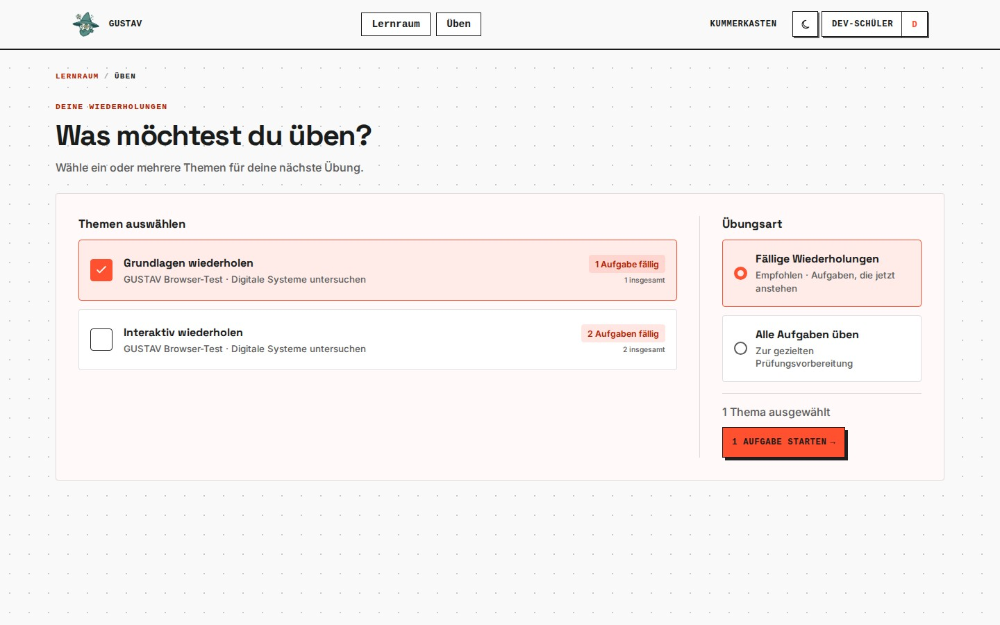
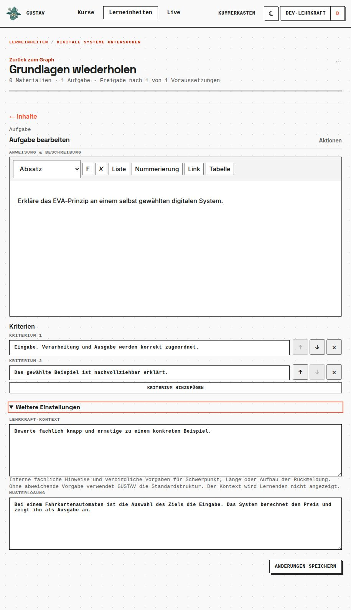

# Übungsmodule

GUSTAV-Version: 0.0.4
Zuletzt geprüft: 2026-08-20
[English version](practice-modules.en.md)

## Zweck

Übungsmodule unterstützen aktiven Abruf und verteilte Wiederholung. Eine Lehrkraft stellt dafür wiederholbare Aufgaben zusammen. GUSTAV bietet neue oder fällige Aufgaben später erneut an, ohne das Übungsmodul als endgültig erledigt zu markieren.

## Voraussetzungen

- Die Lerneinheit ist modular; lineare Lerneinheiten besitzen keine Übungsmodule.
- Das Übungsmodul ist für die lernende Person durch seine eingehenden Voraussetzungen geöffnet.
- Es enthält mindestens eine gültige native Freitext- oder H5P-Aufgabe.
- Eine native Übungsaufgabe besitzt Aufgabenstellung, mindestens ein Kriterium, Lehrkraft-Kontext und eine von der Lehrkraft verfasste Musterlösung.

## Schritt für Schritt

1. Öffne eine modulare Lerneinheit und wähle beim Hinzufügen eines Knotens als **„Modultyp“** die Option **„Übungsmodul“**.
2. Verbinde vorausgehende Lernmodule mit dem Übungsmodul und stelle unter **„Freischaltung“** ein, wie viele Voraussetzungen erfüllt sein müssen.
3. Öffne das Übungsmodul und wähle **„Aufgabe hinzufügen“**.
4. Lege eine **„Normale Aufgabe“** mit Kriterien, **„Lehrkraft-Kontext“** und **„Musterlösung“** an oder erstelle eine vollständige **„H5P“**-Aufgabe.
5. Prüfe, dass der Kurs der Lerneinheit zugeordnet ist. Ein offenes, nicht leeres Übungsmodul erscheint im Bereich **„Üben“**.
6. Lernende wählen einen oder mehrere Stapel und entweder **„Fällige Wiederholungen“** oder **„Alle Aufgaben üben“**.
7. In der Sitzung bearbeiten sie eine Aufgabe nach der anderen, erhalten Rückmeldung und können eine Aufgabe für diese Sitzung überspringen oder die Sitzung bewusst beenden.

## Lernendensicht

Unter **„Üben“** sehen Lernende nur offene Übungsstapel mit gültigen Aufgaben. **„Fällige Wiederholungen“** enthält neue und aktuell anstehende Aufgaben; **„Alle Aufgaben üben“** dient der gezielten Prüfungsvorbereitung mit allen Aufgaben der gewählten Stapel.

Native Antworten werden knapp ausgewertet. Sichtbar sind **„Sicher beantwortet“**, **„Teilweise beantwortet“** oder **„Noch nicht sicher“** sowie der nächste Wiederholungszeitpunkt. Nach dem ersten abgeschlossenen Versuch kann die Musterlösung bewusst geöffnet werden. H5P-Aufgaben verwenden ihr Punkteergebnis und zeigen keine separate Musterlösungsschaltfläche.

## So funktioniert es

Beim Start wird die Aufgabenmenge als Sitzung gespeichert. Spätere Inhalts- oder Fälligkeitsänderungen fügen dieser laufenden Sitzung nicht unbemerkt Aufgaben hinzu. Pro lernender Person kann höchstens eine Sitzung aktiv sein; ein erneuter Einstieg setzt sie fort.

Teilweise oder nicht ausreichend beantwortete Aufgaben werden in derselben Sitzung höchstens einmal erneut vorgelegt. Überspringen verändert den individuellen Wiederholungszustand nicht. Ein Abruf der Musterlösung macht genau den nächsten Versuch zu einem unterstützten Versuch und verhindert, dass dieser wie ein selbstständiger sicherer Abruf gewertet wird.

GUSTAV plant Wiederholungen mit dem versionierten Scheduler `gustav-practice-v1`. Wiederholt wird dieselbe von der Lehrkraft erstellte Aufgabe; GUSTAV erzeugt keine neuen Aufgabenvarianten.

## Grenzen

- Übungsmodule enthalten keine Materialien und dürfen keine ausgehenden Verbindungen besitzen.
- Sie werden niemals als erledigt markiert und schalten keine nachfolgenden Module frei.
- Visuelle, Scratch-, Calliope-, Filius- und Dialogaufgaben werden nicht unterstützt.
- Abgabefrist und maximale Versuche sind für Übungsaufgaben nicht zulässig.
- Änderungen an Aufgabe, Kriterien, Musterlösung oder H5P-Inhalt setzen bestehende Wiederholungsstände nicht zurück.
- Die Wiederholung derselben Aufgabe belegt keinen Transfer auf neue Situationen. Dafür müssen weitere, anders ausgerichtete Aufgaben erstellt werden.
- Eine eigene Lehrkraft-Diagnostik für Übungsstände ist in dieser Version noch nicht vorhanden.
- Mikrofoneingabe und Transkription gehören nicht zum Übungsmodul.
- Eine Sitzung ist technisch auf 50 Stapel und 1.000 Snapshot-Aufgaben begrenzt.

## Typische Probleme

- **Übungsstapel erscheint nicht:** Das Modul ist gesperrt, leer oder enthält keine gültige Aufgabe.
- **Native Aufgabe lässt sich nicht speichern:** Ergänze Kriterien, Lehrkraft-Kontext und Musterlösung und entferne Abgabefrist beziehungsweise Versuchslimit.
- **Es ist heute nichts fällig:** Wähle bei Bedarf **„Alle Aufgaben üben“**; das verändert durch echte vorgezogene Abrufversuche die weitere Planung.
- **Eine Aufgabe erscheint erneut:** Teilweise oder nicht sichere Antworten können innerhalb derselben Sitzung genau einmal wiederholt werden.
- **Sitzung startet nicht neu:** Es existiert bereits eine aktive Sitzung. Setze sie fort oder beende sie bewusst.

## Verwandte Kapitel

- [Lerneinheiten und Freigaben](learning-units-and-releases.de.md)
- [Materialien und Aufgaben](materials-and-tasks.de.md)
- [Lernraum](learner-workspace.de.md)
- [Diagnostik](diagnostics.de.md)

Technische Details: [Learning-Referenz](../references/learning.md), [Teaching-Referenz](../references/teaching.md) und [Scheduler-Konzept](../research/practice_scheduler_concept.md).
