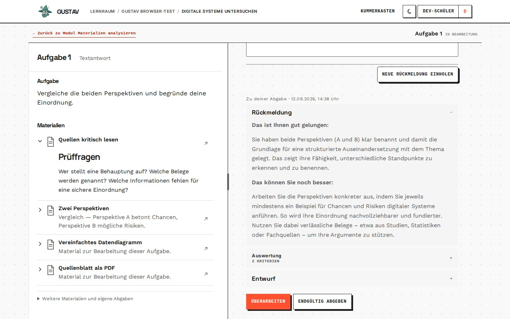

# Abgaben und Rückmeldung

GUSTAV-Version: 0.0.4
Zuletzt geprüft: 2026-08-23
[English version](submissions-and-feedback.en.md)

## Zweck

GUSTAV trennt formative Rückmeldung von der endgültigen Abgabe. Lernende können eine Fassung prüfen lassen, die Rückmeldung reflektieren und überarbeiten, bevor sie genau diese Fassung endgültig abgeben.

## Voraussetzungen

- Die Aufgabe ist für die lernende Person zugänglich.
- Der Aufgabentyp unterstützt die vorgesehene Text- oder Dateibearbeitung.
- Bei KI-Rückmeldung sind Analyse- und Feedbackdienst betriebsbereit.
- Für eine endgültige Abgabe wurde zur aktuellen Fassung bereits Rückmeldung eingeholt.

## Schritt für Schritt

1. Die lernende Person verfasst eine Antwort oder wählt eine passende Datei aus.
2. Mit **„Rückmeldung einholen“** wird die aktuelle Fassung als unveränderlicher Versuch gespeichert und zur Auswertung vorgemerkt.
3. Während der Verarbeitung zeigt GUSTAV einen laufenden Zustand. Nach Abschluss öffnet sich **„Rückmeldung“**. Die zugehörigen Bewertungen lassen sich darin über **„Kriterien im Detail“** nachvollziehen.
4. Unter **„Dein nächster Schritt“** kann die lernende Person mit **„Überarbeiten“** direkt zum Texteditor oder Dateifeld zurückkehren oder die unveränderte Fassung **„Endgültig abgeben“**.
5. Eine geänderte Fassung benötigt erneut Rückmeldung. Nur wenn der aktuelle Entwurf genau der zuletzt geprüften Fassung entspricht, wird **„Endgültig abgeben“** ermöglicht.
6. Nach der endgültigen Abgabe ersetzt **„Aufgabe abgeschlossen“** die Bearbeitungsaktionen. Liegt im selben Modul noch eine andere offene Aufgabe, führt der Rückknopf zur Modulansicht; andernfalls führt er zum Lernpfad. In linearen Lerneinheiten führt er zurück zu den Inhalten.

## Lernendensicht

Die Oberfläche unterscheidet den bearbeitbaren Entwurf von gespeicherten Versuchen. Frühere Abgaben lassen sich mit ihrer Rückmeldung und den Kriterien im Detail öffnen. `Kriterien im Detail` enthält eine nummerierte Liste; zunächst sind alle einzelnen Kriterien geschlossen und die jeweilige Begründung lässt sich bewusst aufklappen. Kriterien werden ohne Punktwerte als **„Mangelhaft“**, **„Ansatzweise“**, **„Gelungen“** oder **„Hervorragend“** beschrieben und zusätzlich durch eine dezente Farbmarke unterschieden. Die ausgeschriebene Stufe bleibt maßgeblich; Farbe ist nur eine visuelle Hilfe. Diese Begriffe beziehen sich ausschließlich auf das jeweilige Kriterium, nicht auf die lernende Person. Der Aktionsbereich ist bewusst flach gestaltet: Er trennt Rückmeldung, Entscheidung und Kriterien durch Abstand und feine horizontale Linien statt durch verschachtelte Kästen. Bei Dateiaufgaben werden Dateiname, Typ und verfügbare Vorschau angezeigt. Bei KI-Dialogen beendet die endgültige Abgabe den Dialog und löst die Abschlussauswertung aus.

## So funktioniert es

Jede an den Server gesendete Fassung wird als unveränderlicher Versuch gespeichert. Doppelte Übertragungen werden durch wiederholbare Anfragen abgefangen. Datei-Uploads werden vor der Analyse auf Größe, Typ, Signatur und Aufgabenbindung geprüft.

Die Verarbeitung läuft im Hintergrund. GUSTAV veröffentlicht erst eine vollständig validierte Auswertung und Rückmeldung. Ein technischer Fehler verändert eine gespeicherte Antwort nicht; die Oberfläche zeigt stattdessen einen bereinigten Fehlerzustand.

KI-Rückmeldung ist formativ. Sie soll zur Überarbeitung anregen und ist weder eine Note noch ein unanfechtbares fachliches Urteil.

## Grenzen

- Ein ungesendeter Editorentwurf ist nur im aktuellen Browsertab verfügbar.
- Eine endgültige Abgabe ist nur für die zuletzt zur Rückmeldung gespeicherte, unveränderte Fassung möglich.
- Teilweise KI-Ergebnisse werden nicht angezeigt. Bei einem Verarbeitungsfehler kann die Rückmeldung fehlen, obwohl die Antwort sicher gespeichert ist.
- Zulässige Dateiformate und Größen hängen vom Aufgabentyp ab; eine umbenannte unpassende Datei wird nicht allein wegen ihrer Endung akzeptiert.
- Versuchslimits gelten serverseitig und können nicht durch Neuladen oder einen zweiten Tab umgangen werden.
- Die KI darf keine abschließende pädagogische Entscheidung anstelle der Lehrkraft treffen.

## Typische Probleme

- **„Für diese Fassung zuerst Rückmeldung einholen“:** Der Entwurf wurde nach der letzten Rückmeldung verändert.
- **Rückmeldung bleibt aus:** Warte zunächst auf den laufenden Zustand. Bei einem stabilen Fehler kann die Fassung erneut zur Rückmeldung eingereicht werden.
- **Datei wird abgelehnt:** Verwende das für den Aufgabentyp erwartete Originalformat und wähle die Datei erneut aus.
- **Doppelklick erzeugt keine zweite Abgabe:** Das ist beabsichtigter Schutz vor doppelten Versuchen.
- **Sitzung ist abgelaufen:** Melde dich erneut an. GUSTAV versucht, den sicheren Arbeitskontext wiederherzustellen; prüfe den Entwurf trotzdem vor dem erneuten Senden.

## Verwandte Kapitel

- [Materialien und Aufgaben](materials-and-tasks.de.md)
- [Lernraum](learner-workspace.de.md)
- [Live-Ansicht](live-view.de.md)
- [Diagnostik](diagnostics.de.md)

Technische Details: [Learning-Referenz](../references/learning.md) und [Learning-AI-Referenz](../references/learning_ai.md).
