# Paket 4: Designvergleich Learning und Teaching

Stand: 9. September 2026. Ergänzt um H5P und Auth auf ausdrücklichen Folgeauftrag. Konkrete Befunde sind von Gestaltungsvorschlägen und Prüfgrenzen getrennt. Noch keine Designimplementierung und keine vollständige Abnahme der Plattform.

**Aktuellster Stand:** Die [abgeschlossene zusätzliche lokale Untersuchung mit DS-33 bis DS-35](2026-09-09-designaudit-zusatzlandschaft.md#abschluss-der-zusätzlichen-lokalen-untersuchung) ergänzt die [Restprüfung mit DS-26 bis DS-32](2026-09-09-designabschluss-restpruefung.md). Die freigegebene Zusatzlandschaft und lokale Mails ermöglichten jetzt auch echte Registrierung/Verifikation/Reset, Kursbeitritt, Datei-Abgaben, Dialogabschluss, weiteres H5P, Bilddruck und die Prüfung einer linearen Einheit sowie einer Klasse mit 24 Lernenden. Frühere „noch offen“-Absätze beschreiben historische Zwischenstände. Die repräsentative lokale Untersuchung ist abgeschlossen; Designreparaturen und ausdrücklich benannte externe Abnahmegrenzen bleiben offen. Nicht als fehlerfreie Plattformfreigabe lesen.

## Ergebnis in verständlicher Form

### Reparaturabnahme H5P · 10. September 2026

Die folgenden Statusangaben ersetzen für diese Befunde die historischen offenen Aussagen weiter unten. Beide vollständigen Gates `h5p-drag-layout` und `h5p-design-consistency` sowie `make docker-validate` bestanden. 45 Bildnachweise bei 1440/1024/390/320 px in Light/Dark tatsächlich gesichtet; lokale synthetische Testdaten bereinigt. Keine Bibliotheksaktualisierung, Inhaltsmigration oder Änderung der Bewertungslogik.

| Befund | Status und Nachweis |
| --- | --- |
| DS-13 | Behoben: kantige zentrale Außenrahmen für [Player](assets/2026-09-10-designreparatur-paket4/choice-ready-390-dark.png) und [Editor](assets/2026-09-10-designreparatur-paket4/editor-390-dark.png). |
| DS-14 | Behoben: deutsche Standardbedienung, [Editor speichern/neuladen](assets/2026-09-10-designreparatur-paket4/editor-1440-light.png) und [echte Auswertung/Wiederholung](assets/2026-09-10-designreparatur-paket4/choice-wrong-390-dark.png). Gespeicherter englischer Autorentext bleibt absichtlich unverändert. |
| DS-15 | Behoben: aktive Auswertungsaktion und Antwortzustände kontrastgeprüft; [lesbare Zuordnung](assets/2026-09-10-designreparatur-paket4/drag-readable-390-dark.png), echte Maus-/Tastaturbedienung und gespeichertes Ergebnis. |
| DS-16 | Behoben: [Editorbeschriftungen und Felder](assets/2026-09-10-designreparatur-paket4/editor-320-dark.png) sowie [Bestätigungsdialog](assets/2026-09-10-designreparatur-paket4/editor-confirmation-dark.png) im dunklen Modus lesbar und erreichbar. Mehrzeilige Titel wachsen mit. |
| DS-17 | Behoben: alle H5P-Variablen auf zentrale Tokens abgebildet, Referenztest ohne undefinierte Werte; Player und Editor erhalten dieselben lokalen Build-Ressourcen. [Helle](assets/2026-09-10-designreparatur-paket4/choice-correct-1024-light.png) und [dunkle Auswertung](assets/2026-09-10-designreparatur-paket4/choice-correct-1024-dark.png). |

DS-32 ist in der Restprüfung mit demselben Reparaturpaket abgenommen. Nachweise gelten für die repräsentativen geprüften Interaktionsfamilien, nicht für jede H5P-Hub-Bibliothek, physische Geräte oder vollständige Screenreader-Konformität.

GUSTAV hat bereits eine erkennbare gemeinsame Gestaltung: kantige Flächen, klare Rahmen, Monospace-Beschriftungen für Aktionen und harte Schatten. Diese Sprache tragen die Lehrkraft-Startseite, die Katalogaktionen, der Kursbereich und auch der Kummerkasten für Lernende. Daneben bestehen andere Gestaltungen fort: die Übungsbuttons, die Kurserstellung, Teile der Dialoge und die Mitgliedersuche. Es geht deshalb nicht um ein neues Design für jede Rolle, sondern um das konsequente Anwenden derselben Regeln auf vergleichbare Elemente.

Die frühere Prüfung hat diesen Vergleich nicht ausreichend durchgeführt. `/learning/practice` hätte als offensichtlicher Gegenvergleich aufgenommen werden müssen. Dieser Katalog ergänzt die [Aufgabenraum-Stichprobe vom 8. September](2026-09-08-lernenden-ui-befundkatalog.md), ohne deren Reichweite nachträglich größer darzustellen.

## Grundlage und Nachweisgrenzen

- Laufende lokale Installation, regulär vertrautes TLS, echte getrennte Browserlogins mit den vorhandenen synthetischen Dev-Personas. Keine neuen Übungssitzungen, Abgaben, Beiträge, Kurse oder Lerneinheiten angelegt; nichts gespeichert, gelöscht oder freigegeben.
- Quellabgleich: `master`, `f9610e80`. Kein Neuaufbau der laufenden Installation für diesen Audit; Gleichheit aller Container mit dem Commit nicht vollständig nachgewiesen.
- Headless Chromium; Desktop 1440 × 1000, Tabletgröße 1024 × 768 und Mobilgröße 390 × 844 CSS-Pixel. Kein echter Touchgerätetest und keine Safari-/Firefox-Abnahme.
- Screenshots wurden tatsächlich betrachtet; berechnete CSS-Eigenschaften ergänzen die Sichtprüfung. Maßstab: [DESIGN.md](../DESIGN.md), insbesondere gemeinsame Formen, Aktionshierarchie und Light/Dark. Kein externer Designentwurf.
- Buttonmessungen unten beziehen sich auf benannte sichtbare Aktionen. Versteckte Menüaktionen und kurzzeitige Navigations-/Theme-Zwischenstände sind kein Befundnachweis.
- Funktionsstichproben: Thema auswählen aktiviert den Übungsstart; Kurs- und Lerneinheitenauswahl aktiviert „Live öffnen“; Startaktionen nicht ausgelöst. Kurserstellungsdialog geöffnet und abgebrochen, Mitgliederdrawer geöffnet und geschlossen, Lerneinheitensuche ohne Treffer und zurück, Mitgliedersuche ohne Treffer. Sichtbarer Tastaturfokus am Übungsstart und Hover am Live-Button. Kein vollständiger Tastatur- oder Screenreader-Rundlauf.

## Tatsächliche Abdeckung

„Sichtprüfung“ bedeutet den erreichten Zustand, nicht alle Zustände der Route. D = Desktop, T = Tabletgröße, M = Mobilgröße; L = Light, N = Dark.

| Bereich | Erreichter und betrachteter Zustand | Umfang |
| --- | --- | --- |
| `/teaching` | Start, deaktivierte Auswahl; aktivierter Live-Button, Hover | D L/N; T L; M L/N |
| `/teaching/courses` | Belegter Kurskatalog; „Neuer Kurs“ mit leerem Formular | D L |
| `/teaching/courses/[courseId]` | Kursdetail; Mitgliederverwaltung belegt/ohne Suchtreffer; Kurseinstellungen geöffnet | D L; Mitgliedersuche zusätzlich D N |
| `/teaching/courses/[courseId]/ai-usage` | Belegte Tokenübersicht und Filter | D L, kein Filter-/Export-Rundlauf |
| `/teaching/units` | Belegter Katalog, leere Suche; Erstellungsdialog | D L |
| `/teaching/units/[unitId]` | Modularer Graph, Werkzeugleiste, Gesamtansicht | D L; keine erneute rollenübergreifende Geometrieabnahme |
| `/teaching/units/[unitId]/print` | Inhaltsauswahl, oberer sichtbarer Bereich | D L; keine Druckerzeugung oder Drucklayout-Abnahme |
| `/teaching/kummerkasten` | Leere offene Ansicht | D L; keine Beiträge vorhanden |
| `/learning/practice` | Themenauswahl, deaktivierter/aktivierter Start, Tastaturfokus; mobil auch bis zum Startbutton gescrollt | D L/N; T L; M L/N, Startbutton separat M L |
| `/learning` und `/learning/courses/[courseId]` | Belegte Kurs-/Lerneinheitenlisten | D L |
| `/learning/courses/[courseId]/archive` | Oberer Bereich vorhandener Abgaben/Rückmeldungen und Exportaktion | D L; Export nicht ausgelöst |
| `/learning/kummerkasten` | Leeres Eingabeformular | D L; nichts gesendet |
| `/live`, `/diagnostics` | Jeweilige Einstiegsseite | D L; keine Detailansichten |

Offen bleiben insbesondere die übrigen Modul-Inhaltseditoren, lineare Lerneinheiten, vollständige Graphzustandsvergleiche beider Rollen, die separate Mitgliederroute, Einladungen, belegter Lehrkraft-Kummerkasten, laufende Übung und Zusammenfassung, Live-/Diagnostikdetails, Profil sowie umfassende Fehler-/Ladezustände. Aufgabenraum und Lernendengraph wurden am Vortag untersucht, heute nicht vollständig wiederholt. Der H5P-Inhaltseditor wurde im Folgeauftrag über die bekannte Modulroute geöffnet; der Übergang vom Graphknoten zum Editor ist damit nicht vollständig abgenommen. Nicht alle Desktop-Unterseiten wurden mobil oder dunkel geprüft.

### Erweiterte Abdeckung: H5P und Auth

| Bereich | Tatsächlich geprüft | Grenze |
| --- | --- | --- |
| H5P-Lernendenaufgabe | Vorhandenes Beispiel im Aufgabenraum geladen; D L/N und M N | Nur Minimalinhalt ohne echte Antwort-/Auswertungsbuttons; keine Abgabe erzeugt |
| H5P-Lehrkrafteditor | Modul-Inhaltseditor direkt geöffnet, H5P-Aufgabe ausgewählt, eingebetteter Editor geladen; D L/N und M N | Keine Änderungen gespeichert, kein Import/Reset/Export, keine anderen Inhaltstypen |
| Keycloak-Anmeldung | D L und M L; leeres Login abgeschickt; beide echten Dev-Logins vorher erfolgreich | Kein absichtlich falsches Passwort eines Kontos; kein IServ-Rundlauf |
| Registrierung und Passwort vergessen | Formulare über echte Links geöffnet, D L und M L | Keine Registrierung, keine Reset-Mail, kein Mail-/Token-Folgeablauf |
| Auth-Dark-Mode | Betriebssystem-Farbpräferenz im Browser auf Dark gestellt und Login neu geladen | Seite blieb hell; kein erreichbarer Theme-Umschalter, daher keine künstlich erzwungene Dark-Abnahme |

Die Anmeldung mit vollständig leeren Feldern erreichte den Server und zeigte „Ungültiger Benutzername oder Passwort.“; es wurde kein Konto angegeben. Die Fehlerdarstellung wurde betrachtet. Weitere Auth-Zustände wie abgelaufene Links, Verifikation, Passwortänderung und Logoutbestätigung bleiben offen.

## Konkrete Befunde

P2 = regulär zu behebende Inkonsistenz oder Darstellungsfehler. Die Reihenfolge innerhalb dieser Gruppe priorisiert Lesbarkeit und fehlerhafte Anordnung vor reiner Optik.

### DS-01 · P2 · Mitgliedersuche im Dark Mode kaum lesbar

**Behoben und lokal abgenommen am 10. September 2026:** Gemeinsame Feldfarben mit gemessenem Textkontrast von mindestens 4,5:1. Nachweis: `make verify-feature FEATURE=teacher-course-detail`; [Dark, 390 px](assets/2026-09-10-designreparatur-paket2/members-dark-390.png). Die ursprüngliche Reproduktion folgt zur Nachvollziehbarkeit.

Reproduktion: Kurs öffnen → „Mitglieder verwalten“ → Dark Mode → Suchtext eingeben. Der Text ist `rgb(240, 241, 241)`, der Hintergrund bleibt `rgba(255, 252, 247, 0.92)`. Die Eingabe ist dadurch fast weiß auf fast weiß. Vergleich: Die Kursauswahl auf `/teaching` wechselt passend auf eine dunkle Fläche.

Quelle: `frontend/src/lib/styles/teaching-workspace.css`, `.workspace-member-search input` (ab Zeile 368), fest eingetragener heller Hintergrund statt Theme-Fläche. Ziel: passende gemeinsame Feldfarben in beiden Modi; Lesbarkeit mit eingegebenem Text testen, nicht nur mit Platzhalter.

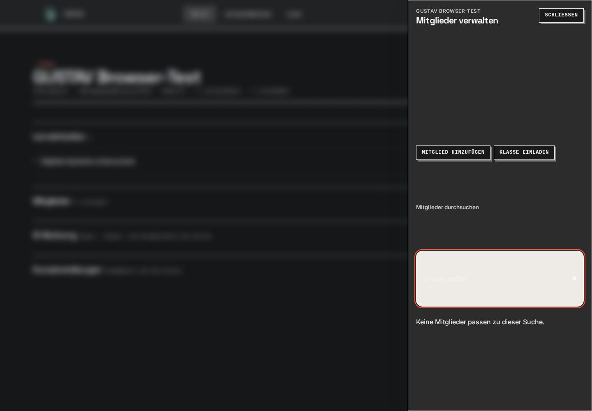

### DS-02 · P2 · Mitgliederverwaltung streckt Felder und Abstände

**Behoben und lokal abgenommen am 10. September 2026:** Inhalt beginnt oben, einzeilige Suche bleibt 44 px hoch, Aktionen behalten ihre eigene Größe. Nachweis: `make verify-feature FEATURE=teacher-course-detail`; [Desktop](assets/2026-09-10-designreparatur-paket2/members-light-1440.png), [320 px](assets/2026-09-10-designreparatur-paket2/members-light-320.png).

Bei einem Mitglied und Desktophöhe 1000 px misst das Suchfeld rund 128 px Höhe und 15,2 px Eckenradius. Zwischen Kopf, Aktionen und Suche entstehen große Leerflächen; auch „Profil“ wird unüblich hoch und schmal. Nach erneutem Öffnen reproduziert. Das ist nicht nur eine andere Dichte: Ein einzeiliges Suchfeld nimmt die Form eines großen Textkastens an. Vergleich: 44 px Suchfeld im Lerneinheitenkatalog.

Quelle: `frontend/src/routes/teaching/courses/[courseId]/+page.svelte`, Mitgliederbereich; `teaching-workspace.css`, `.workspace-modal-card`, `.workspace-drawer-card`, `.workspace-member-search`. Das Zusammenspiel aus vollhohem Drawer und Grid-Streckung ist ein Ursachenverdacht, noch kein isoliert getesteter Fix. Ziel: Inhalt am Anfang anordnen, Feldhöhe unabhängig von freier Drawerhöhe halten.

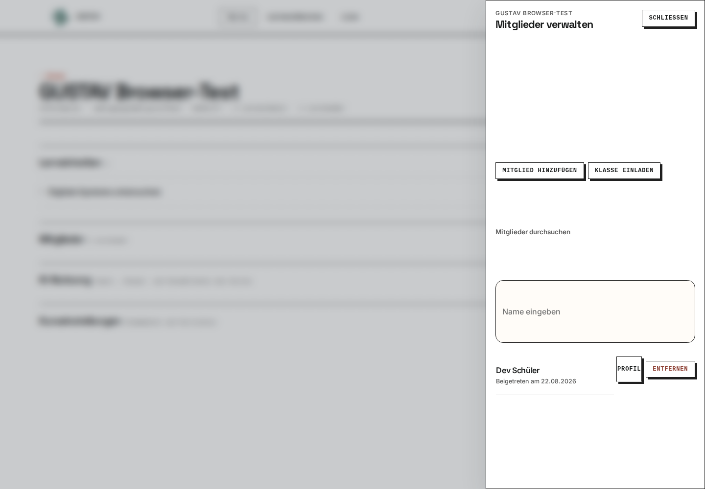

### DS-03 · P2 · Üben verwendet eine eigene Buttonfamilie

**Behoben und lokal abgenommen am 10. September 2026:** Die eigene Practice-Buttonfamilie entfällt; vorhandene Workspace-Varianten tragen primäre, sekundäre und destruktive Aktionen. Aktiver Start einschließlich Hover/Fokus erreicht mindestens 4,5:1 Textkontrast. Nachweis: `make verify-feature FEATURE=design-system-consistency`; [Light](assets/2026-09-10-designreparatur-paket2/practice-controls-light-390.png), [Dark](assets/2026-09-10-designreparatur-paket2/practice-controls-dark-390.png).

Vergleich im gleichen Desktop-/Light-Zustand:

| Merkmal | „1 Aufgabe starten“ auf Practice | „Neue Lerneinheit“ auf Teaching | „Kurs anlegen“ im Kursdialog |
| --- | --- | --- | --- |
| Schrift | Space Grotesk, 14,4 px, fett | Monospace, 12,16 px, fett | Inter, 16 px, fett |
| Schreibweise | normale Groß-/Kleinschreibung | Großbuchstaben | normale Groß-/Kleinschreibung |
| Eckenradius | 4 px | 0 px | 13,12 px |
| Schatten | keiner | hart, 4 × 4 px | keiner |

Eine primäre Aktion darf farblich anders aussehen als eine sekundäre Navigation. Das erklärt aber nicht den gleichzeitigen Wechsel von Schrift, Form und Schatten. Auch „Beitrag senden“ im Lernenden-Kummerkasten und „Lernleistung exportieren“ verwenden die kantige Sprache: Der Unterschied ist nicht allein durch die Rolle begründet. Practice bleibt auch mobil und dunkel eine eigene Familie.

Quelle: `frontend/src/lib/styles/practice.css:265`, `.practice-button`; `PracticeStackSelector.svelte`. Ziel: dieselbe Basis und bewusst benannte primäre/sekundäre Varianten, nicht alle Aktionen identisch einfärben.

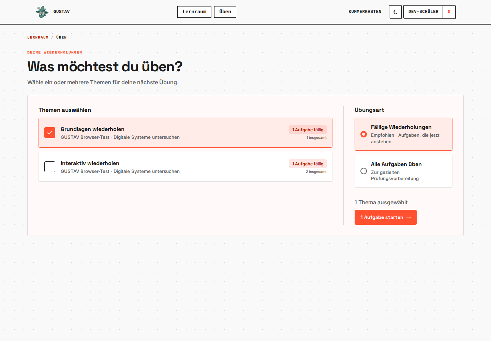

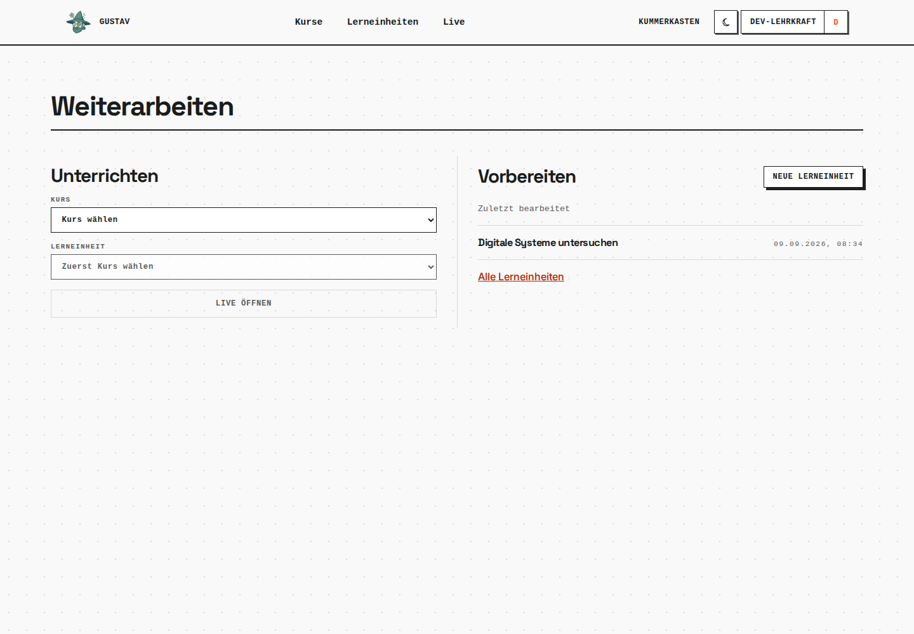

### DS-04 · P2 · Erstellungsdialoge mischen unterschiedliche Gestaltungen

**Behoben und lokal abgenommen am 10. September 2026:** Kantige Rahmen, gemeinsame Aktionen und Schließen-Beschriftung; geteilte Fokusführung einschließlich Escape und Rückgabe an den Auslöser. Nachweis: beide Paket-2-Gates; [Kurs](assets/2026-09-10-designreparatur-paket2/course-dialog-light-390.png), [Lerneinheit](assets/2026-09-10-designreparatur-paket2/unit-dialog-dark-390.png).

„Neuer Kurs“ öffnet einen Dialog mit runden `primary-button`-/`ghost-button`-Aktionen, normaler Schrift und Textbutton „Schließen“. „Neue Lerneinheit“ nutzt für das Anlegen einen kantigen Workspace-Button, aber ein rundes Dialoggehäuse und ein Kreuz zum Schließen. Beide Dialoggehäuse haben etwa 16,8 px Radius und einen weichen Schatten. Die Mitgliederschublade verwendet wiederum einen kantigen „Schließen“-Button.

Quellen: `frontend/src/routes/teaching/courses/+page.svelte:120`, `frontend/src/routes/teaching/units/+page.svelte:92`, `frontend/src/lib/styles/app.css:331`, `teaching-workspace.css:278`. Ziel: gemeinsame Dialog- und Aktionsregeln; Größe und Modal-vs-Drawer dürfen fachlich variieren, die Grundsprache und Schließbedienung sollen nachvollziehbar einheitlich sein.

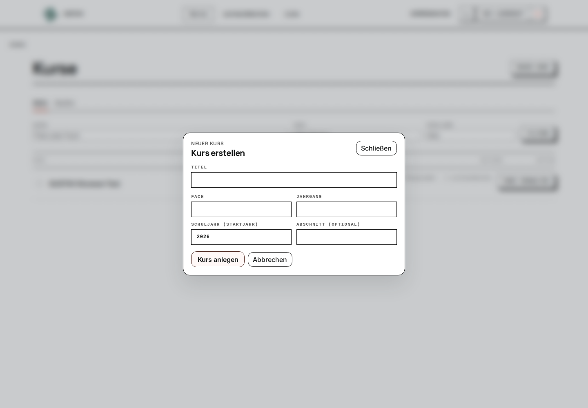

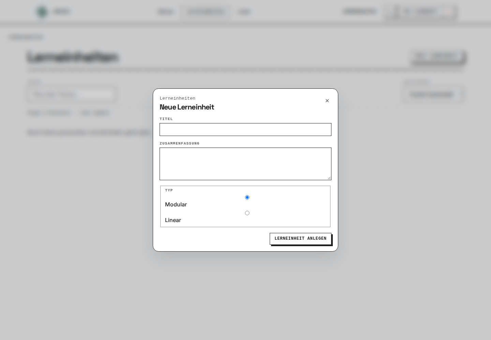

### DS-05 · P2 · Suchfelder der beiden Kataloge sind nicht gleich gestaltet

**Behoben und lokal abgenommen am 10. September 2026:** Gemeinsame Feldbasis und Mindesthöhe 44 px, Suche mit und ohne Treffer geprüft. Nachweis: `make verify-feature FEATURE=design-system-consistency`; [Kurse](assets/2026-09-10-designreparatur-paket2/course-catalog-dark-320.png), [Lerneinheiten](assets/2026-09-10-designreparatur-paket2/unit-catalog-dark-320.png).

Im Kurskatalog: Suche 26 px hoch, Innenabstand 1 × 2 px, schmaler Standardrahmen. Im Lerneinheitenkatalog: Suche 44 px hoch, horizontal 12 px Innenabstand. Damit unterscheiden sich direkt benachbarte Verwaltungslisten bei derselben Grundfunktion deutlich. Die zusätzliche Filteraktion im Kurskatalog kann fachlich begründet sein; die Feldgestaltung ist davon unabhängig vereinheitlichbar.

Quellen: `frontend/src/routes/teaching/courses/+page.svelte`, Filterformular; `frontend/src/routes/teaching/units/+page.svelte`, Suchbereich. Ziel: eine Feldbasis, konsistente Beschriftungen und bewusst definierte Dichte.

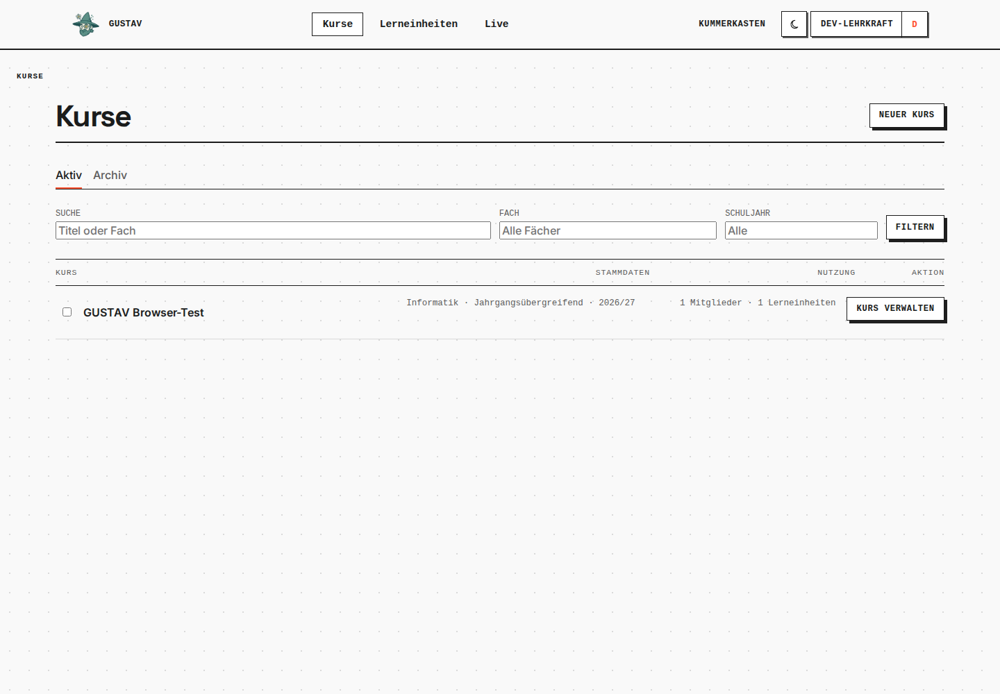

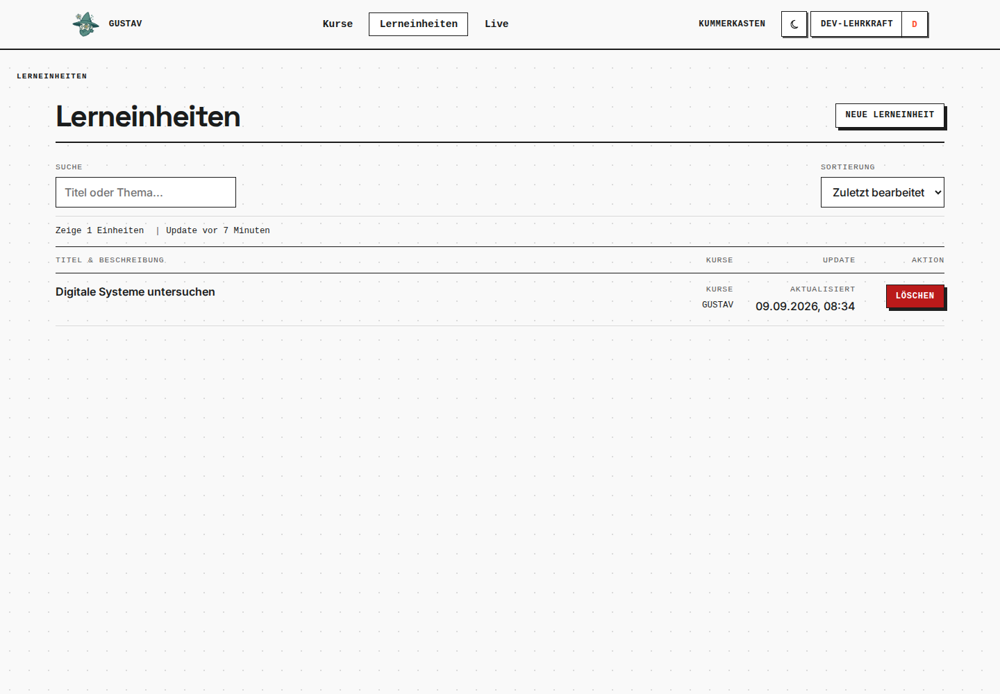

### DS-06 · P2 · Radioauswahl im Lerneinheitendialog ist falsch angeordnet

**Behoben und lokal abgenommen am 10. September 2026:** Auswahlkreise stehen neben ihrer Beschriftung, sind von Vollbreiten-/Mindesthöhenregeln ausgenommen und verwenden den Plattformakzent. Nachweis: `make verify-feature FEATURE=design-system-consistency`; [Light, 320 px](assets/2026-09-10-designreparatur-paket2/unit-dialog-light-320.png), [Dark, 1024 px](assets/2026-09-10-designreparatur-paket2/unit-dialog-dark-1024.png).

„Neue Lerneinheit“ → Typ: Die nativen Auswahlkreise stehen mittig oberhalb der linksbündigen Texte „Modular“ und „Linear“, statt jeweils eine kompakte Auswahlzeile mit ihnen zu bilden. Zusätzlich ist die Auswahl blau, während Practice und der Kummerkasten den Plattformakzent verwenden. Die starke räumliche Trennung ist der wichtigere Fehler; eine aufwendige Practice-Karte muss deshalb nicht in ein kleines Formular übernommen werden.

Nachweis: Screenshot unter DS-04. Quelle: `frontend/src/routes/teaching/units/+page.svelte:128` und `frontend/src/lib/styles/ui-primitives.css:143`: Die generische Regel für `.workspace-field input` setzt auch Radios auf `width: 100%`. Ziel: Textfelder und Auswahlfelder getrennt gestalten; Radio und Beschriftung zusammenhalten.

### DS-07 · P2 · Graph-Bedienelemente bleiben sprachlich uneinheitlich

Die Lehrkraftansicht enthält „Zoom In“, „Zoom Out“ und „Toggle Interactivity“ neben „Gesamtansicht“ und „Auswahl fokussieren“ im zugänglichen DOM. Verbindungen tragen technische IDs. Das bestätigt den älteren Befund UI-06 nun auch für die Lehrkraftrolle. Die kompakte Symbolwerkzeugleiste ist als funktionale Variante sinnvoll; uneinheitliche Sprache und technische Beschriftungen sind es nicht. Keine neue Behauptung, die Knotengeometrie beider Rollen sei heute vollständig verglichen worden.

## Weitere Gestaltungsvorschläge, noch keine Fehlerentscheidung

- DS-08 / P3: Aktionsgewichtung prüfen. Im Lerneinheitenkatalog ist „Löschen“ die auffällige rote Zeilenaktion; im Kurskatalog steht dort „Kurs verwalten“. Die unterschiedlichen Funktionen sind legitim. Dennoch sollte die normale Weiterarbeit visuell Vorrang haben und Destruktives nach einer gemeinsamen Regel platziert werden. Nicht ohne Beratung verschieben.

**DS-08 behoben und lokal abgenommen am 10. September 2026:** Gemäß freigegebener Entscheidung bleibt Bearbeiten direkt erreichbar; Löschen beziehungsweise Entfernen liegt unter dem sichtbar beschrifteten Menü „Weitere Aktionen“. Bestätigungen und Abbruch bleiben erhalten. Nachweis: beide Paket-2-Gates mit Menü-/Abbruchprüfung; [Katalog](assets/2026-09-10-designreparatur-paket2/unit-catalog-light-390.png), [Mitglieder](assets/2026-09-10-designreparatur-paket2/members-dark-390.png).
- DS-09 / P3: `/diagnostics` zeigt eine runde Karte, „GUSTAV“ als Haupttitel und erklärenden Text über die interne Aufteilung der Arbeitsflächen statt einer direkten Diagnosehandlung. Die Einstiegsseite wirkt gegenüber `/teaching` wie ein älterer Entwurf. Zielrichtung: sinnvoller Einstieg mit gemeinsamer Seitenüberschrift; Inhalt und Navigation zuerst beraten, nicht bloß CSS austauschen.

## Ergänzung: H5P und Auth

### Ergänzende Befunde zu H5P und Auth

- **DS-10 / P2 – Auth-Felder laufen mobil aus dem Rahmen.** Bei 390 px Viewport ragen Anmeldung, Registrierung und Passwort-vergessen-Felder rechts über die Karte; die Anmeldung hat 397 px Dokumentbreite. Schon am Desktop sind die Felder breiter als der Aktionsbutton. Gemessen: `box-sizing: content-box`, rund 75,4 px Feldhöhe und 100-Prozent-Breite plus Innenabstände. Quellen: `keycloak/themes/gustav/login/resources/css/auth-theme.css`, `.kc-input`, sowie `gustav.css`, `.kc-form .workspace-field .kc-input`. Ziel: gemeinsames Größenmodell für Felder und Karte; den gesamten schmalen Auth-Rundlauf vergleichen, nicht nur den Button.

**DS-10 behoben und lokal abgenommen am 10. September 2026:** Gemeinsamer Rahmen und Größenmodell ohne Überlauf bei 1440/1024/390/320 px. Nachweis: beide Paket-3-Feature-Gates; [Anmeldung mobil](assets/2026-09-10-designreparatur-paket3/login-light-390.png).

- **DS-11 / P2 – Auth-Beschriftung verspricht mehr als das Feld erlaubt.** „E-Mail-Adresse oder Benutzername“ steht an einem `type="email"`-Feld. Bei der rein lokalen Eingabe `testname` meldet der Browser `validity.typeMismatch=true`; es wurde damit kein Login abgeschickt. Quelle: `keycloak/themes/gustav/login/login.ftl`. Das ist eine Bedieninkonsistenz, nicht nur Stil. Vor einer Änderung klären, ob Benutzernamen weiterhin unterstützt werden sollen; dann Beschriftung und Feldtyp passend testen.

**DS-11 behoben und lokal abgenommen am 10. September 2026:** Anmeldung und Reset verlangen ausdrücklich eine E-Mail-Adresse; Registrierung weiterhin Schul-E-Mail. Native Eingabevalidierung und echte Login-/Mailrundläufe in `auth-design-consistency` und `course-invite-registration`; [Registrierung](assets/2026-09-10-designreparatur-paket3/registration-dark-390.png). Keine Kontoumbenennung oder IServ-Änderung.

- **DS-12 / P2 – Auth-Theme ist nicht durchgängig erreichbar.** Trotz emulierter dunkler Systemeinstellung bleibt der Login hell, ohne Theme-Auswahl. Der Quellabgleich zeigt zusätzlich, dass `login.ftl` alte Theme-Bezeichner liest, während `template.ftl` auch `dark` kennt. Das belegt unterschiedliche Theme-Initialisierung, aber keinen vollständigen Test aller Auth-Vorlagen. Ziel: gemeinsame, tatsächlich erreichbare Theme-Strategie; nicht nur vorhandene Dark-CSS-Regeln als erfolgreiche Unterstützung zählen.

**DS-12 behoben und lokal abgenommen am 10. September 2026:** Gemeinsame Initialisierung und sichtbarer Umschalter. Validierter App-Hinweis, gespeicherte Auth-Auswahl und Systemeinstellung einschließlich direkter Mailaufrufe getestet; [Reset dunkel](assets/2026-09-10-designreparatur-paket3/reset-password-dark-390.png). Alle 64 Paket-3-Bilder tatsächlich gesichtet.

- **DS-13 / P2 – H5P-Rahmen bleiben rund.** Die GUSTAV-Aufgabenkarte um den Lernendenplayer und der GUSTAV-Rahmen um den Lehrkrafteditor sind deutlich gerundet; daneben stehen kantige Arbeitsflächen und Buttons. Der Editorrahmen verwendet `.teacher-h5p-editor` mit `border-radius: 1rem` in `teaching-workspace.css:1347`. Das liegt außerhalb des eingebetteten H5P-Inhalts und kann deshalb unabhängig von dessen Bibliothek vereinheitlicht werden. Den Inhalt selbst nicht pauschal mit globalen CSS-Regeln überschreiben.
- **DS-14 / P2 – H5P-Editor mischt deutsche und englische Bedienung.** Die GUSTAV-Leiste zeigt „Importieren“, „Zurücksetzen“, „H5P speichern“; der geladene eingebettete Editor daneben „Copy“, „Paste & Replace“, „Title“, „Metadata“, „Enter fullscreen“. Unterschiedliche Buttondarstellung innen/außen ist ebenfalls sichtbar. Bibliotheksbedienung und Inhaltsschema sind getrennt zu betrachten: „Text“ und der Inhaltstitel stammen aus der Minimalbibliothek; eine deutsche Lokalisierung aller realen Inhaltstypen ist damit noch nicht geprüft. Zuerst die unterstützte H5P-Lokalisierung und Theme-Anbindung prüfen, nicht die Bibliothek ungeprüft umbauen.

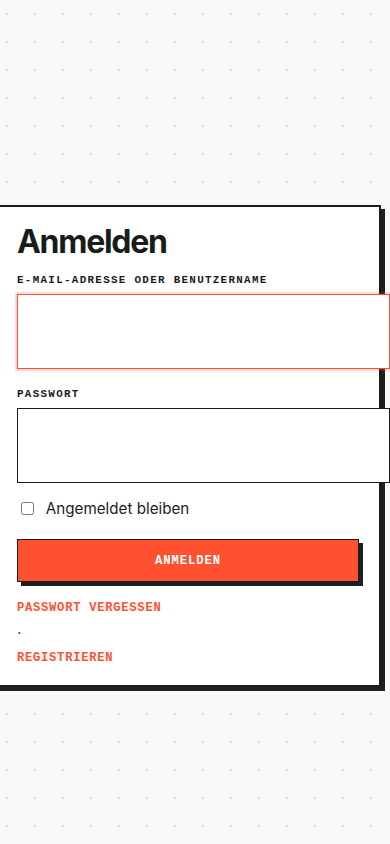

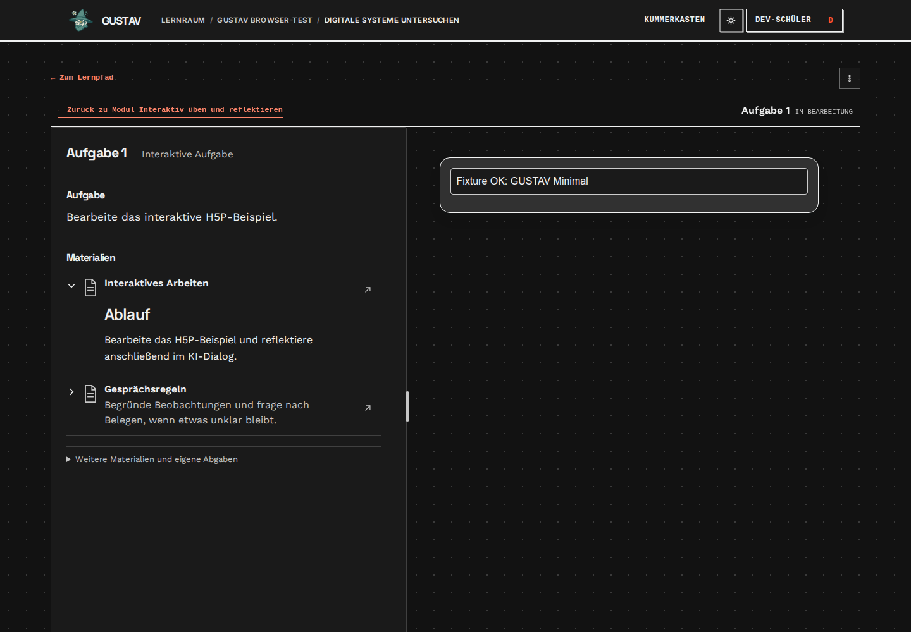

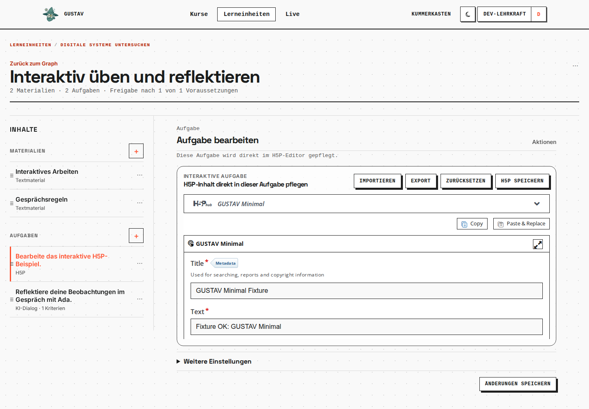

H5P-Prüflücke: Der vorhandene Inhalt zeigt lediglich „Fixture OK: GUSTAV Minimal“. Ein erfolgreicher Ladevorgang beweist weder konsistente Quizbuttons noch Drag-and-drop, Rückmeldung, Wiederholen oder Bewertung. Dafür ist eine zusätzliche repräsentative Auswahl tatsächlich genutzter Inhaltstypen nötig. Es wurden keine synthetischen Bewertungsereignisse ausgelöst, um einen scheinbaren Browsernachweis zu erzeugen.

### DS-15 · P2 · Reale H5P-Zuordnungsaufgabe: Schriftgröße und Dark-Kontrast

Zusätzliche Belegquelle: Zwei von Felix am 9. September bereitgestellte Screenshots derselben laufenden Übungsaufgabe, jeweils Light und Dark. Diese Bilder sind ein Sichtnachweis, kein eigener Interaktions- oder CSS-Messnachweis. Sie werden wegen sichtbarer Kontoinformationen nicht unverändert ins öffentliche Repository übernommen.

- Die Artikelbeschriftungen und verschiebbaren Begriffe erscheinen im Verhältnis zu Aufgabenstellung und Plattformtext extrem klein. Die großen, fast vollbreiten Zuordnungsflächen verschärfen den Größenbruch. Ob Inhaltsautoring, interne Skalierung oder GUSTAV-CSS die Ursache ist, muss an genau diesem Inhalt untersucht werden.
- In Dark bleiben die Begriffskarten hellgrau, während ihre Schrift sehr hell wird; dadurch sind die Begriffe kaum lesbar. Die H5P-Fläche wechselt nur teilweise passend zum Theme. Dies ist unabhängig von der offenen Größenursache ein sichtbarer Lesbarkeitsmangel.
- „Auswerten“ ist in beiden Bildern sehr kontrastarm, „Aufgabe überspringen“ dagegen deutlich lesbar, aber anders gestaltet. Felix hat ausdrücklich bestätigt, dass „Auswerten“ im gezeigten Zustand nicht deaktiviert ist. Damit liegt ein Lesbarkeitsfehler einer aktiven Aktion vor: nahezu weiße Schrift auf Weiß im Light Mode und dunkle Schrift auf dunkler Fläche im Dark Mode. Der Aktivierungszustand ist durch Felix bestätigt, nicht durch eigene DOM-Messung. Standard, deaktiviert und Fokus bleiben zusätzlich separat zu prüfen.
- Der abgerundete H5P-Rahmen bestätigt DS-13 auch für einen realen Übungsinhalt. Die Formulierung „Ordnen Sie …“ weicht vom sonstigen Du ab; das ist zunächst Inhaltssprache, nicht automatisch ein Plattform- oder DSPy-Fehler.

Nächster gezielter Nachweis: dieselbe Zuordnungsaufgabe in beiden Modi öffnen, Schrift-/Flächenmaße und Styles innen/außen getrennt ermitteln und einen echten Drag-/Tastaturablauf prüfen. Die aktive Auswerten-Aktion muss in beiden Modi klar lesbar sein; deaktivierte und fokussierte Varianten zusätzlich vergleichen. Erst danach Ursache und Reparatur festlegen. Die separate, parallel erschienene H5P-Layout-Arbeit wird hier nicht als eigener erledigter Nachweis vereinnahmt.

### DS-16 · P2 · H5P-Lehrkrafteditor im Dark Mode nur teilweise angepasst

Eigener Browsernachweis, Desktop und mobil: Der äußere Editorrahmen bleibt hellgrau, während seine Überschrift hell wird. Im eingebetteten Editor bleiben „Title“, „Text“ und der Hilfetext dunkel auf dunklem Hintergrund; die H5P-Hub-Zeile bleibt weiß. Die Formulareingaben selbst wechseln dagegen korrekt auf dunkle Flächen mit heller Schrift. Das ist eine unvollständige Theme-Anbindung, kein pauschales Versagen des gesamten Editors. Außen ist der feste helle Hintergrund von `.teacher-h5p-editor` ein konkreter Quellhinweis; innen muss die Theme-Integration mit H5P gesondert geprüft werden.

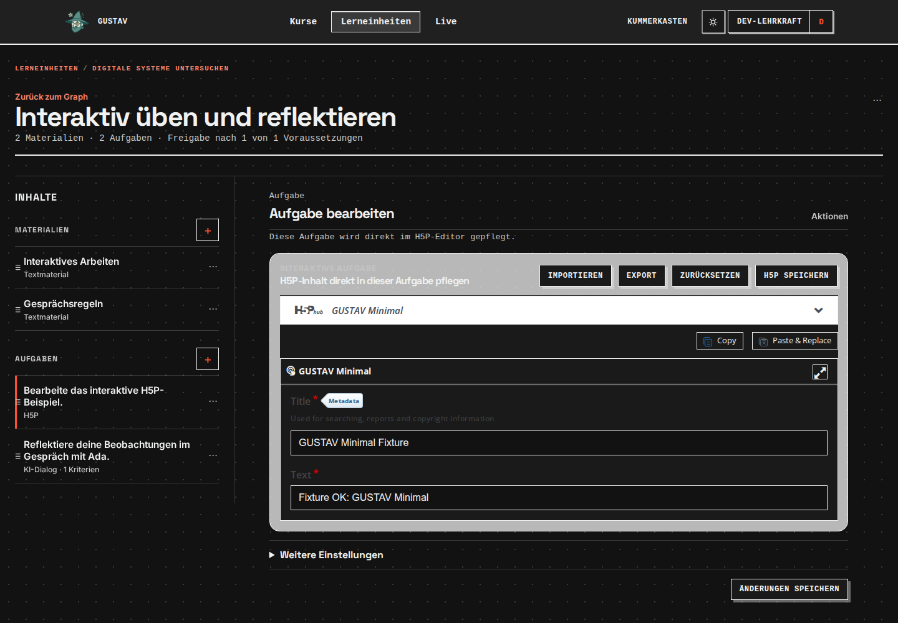

### Bereits konsistente Elemente

Teaching-Start, Kursaktionen, Lerneinheitenaktionen, Graph-Textwerkzeuge, KI-Nutzung und Lernenden-Kummerkasten teilen große Teile der kantigen Aktionssprache. Teaching und Practice brechen in den geprüften schmalen Ansichten auf eine Spalte um; der Practice-Start bleibt durch Scrollen erreichbar. Sein Tastaturfokus war sichtbar. Unterschiedliche Inhaltsbreiten für Graph, Listen und längere Lesetexte sind nicht automatisch Fehler. Rot für Destruktives und kompakte Symbolwerkzeuge sind ebenfalls keine grundsätzlichen Abweichungen.

## Vertiefungen und weitere Prüfungen

### Weitere Browserprüfung: Live, Diagnostik und Standardeditoren

Fortsetzung am 9. September mit erneut erfolgreicher lokaler CA-Prüfung und regulärem Dev-Lehrkraft-Login. Browser-Skill: Bedienung und Sichtprüfung getrennt; persistenter lokaler Prüfcontroller mit gezielter Freigabe. Bestehende Produktänderungen wurden weder verändert noch neu gebaut. Damit beschreiben die Bilder den laufenden Stack, nicht automatisch den neuesten uncommitteten CSS-Stand. Keine Inhalte oder Lernleistungen gespeichert; nur Navigation, Ansichten, Reiter und Einstellungen geöffnet beziehungsweise geschlossen.

Diese Tabelle erweitert die frühere Abdeckung; Live-/Diagnostikdetails und Standardeditoren sind nicht mehr pauschal als unbesucht zu behandeln:

| Arbeitsfläche | Erreichter Zustand und Bedienung | Betrachtete Größen/Modi |
| --- | --- | --- |
| Live über `/live` | Kurs und Lerneinheit über Auswahlfelder gewählt; Schülerzeile geöffnet; vorhandene Textabgabe und H5P-Abgabe ohne Vorschau; Rückmeldungsreiter gewählt | Desktop Light/Dark; mobil Dark, oben und bis zum Detail gescrollt |
| Diagnostik-Kursmatrix | Belegte Matrix direkt geöffnet, Lernendenname angeklickt | Desktop Light/Dark; mobil Light/Dark |
| Diagnostik-Lernendenprofil | Vorhandenes Profil; Lerneinheiten-Link angeklickt und 404 abgewartet | Desktop Light/Dark; 404 Light |
| Textmaterialeditor | Vorhandenes Material ausgewählt, geladene Formatierungsleiste und Inhalt betrachtet | Desktop Dark; mobil Dark. Frühe Light-Aufnahme zeigte noch die initiale Textarea und zählt nicht als vollständige Rich-Text-Sichtprüfung |
| Native Aufgabe | Vorhandene Aufgabe mit zwei Kriterien geöffnet; weitere Einstellungen geöffnet und wieder geschlossen | Desktop Light/Dark; Kriterienbereich mobil Light |
| Dateimaterialeditor | Vorhandenes Bildmaterial ausgewählt, Titel/Alternativtext und Dateiaktionen betrachtet | Desktop Light; keine neue Datei geöffnet oder hochgeladen |

Die Mobilansicht ist weiterhin ein 390 × 844 CSS-Pixel-Viewport, kein echter Touchgerätetest; Desktop 1440 × 1000. Die Prüfungen zeigen vorhandene Ansichten mit einem synthetischen Lernenden, keine vollbesetzte Klasse. Kein umfassender Realtime-, Sortier-, Speicher- oder Fehlerzustandsnachweis. Kurzzeitige Zustände direkt nach Navigation wurden nicht als endgültiger Zielzustand gewertet.

#### DS-18 · P2 · Aktiver Live-Reiter ist im Dark Mode kaum lesbar

Reproduktion: `/live` → Kurs → Lerneinheit → Lernendenzeile → „Rückmeldung“ → Dark Mode. Gemessen am ausgewählten Reiter: Schrift `rgb(240, 241, 241)`, Hintergrund `rgba(255, 250, 243, 0.96)`, Radius 11,52 px. Auch beim zuvor ausgewählten „Abgabe“-Reiter sichtbar. Dies ist ein aktiver, ausgewählter Reiter, kein deaktivierter Button.

Quelle: `frontend/src/lib/styles/teaching-workspace.css:100` und `:114`, `.workspace-tab` und `.workspace-tab--active`. Der feste helle Hintergrund erklärt den Konflikt mit der wechselnden Textfarbe. Zusätzlich weicht die runde Reitergestaltung von den unterstrichenen Reitern anderer Arbeitsflächen ab. Zuerst Lesbarkeit, anschließend gemeinsame Reitervarianten behandeln.

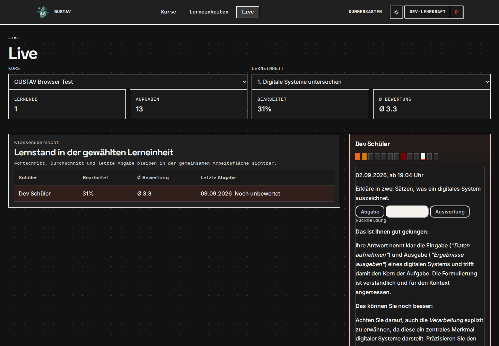

#### DS-19 · P2 · Diagnostikdetails verwenden eine ältere Gestaltung ohne tragfähigen Dark Mode

Kursmatrix und Lernendenprofil zeigen beigefarbene, stark gerundete Flächen, blaue Aktionen und runde „Neu laden“- beziehungsweise „Zur Kursmatrix“-Links. Im Dark Mode bleiben die Flächen hell, während Namen, Summenbeschriftungen und Lerneinheitentitel hell werden. Mehrere zentrale Angaben sind kaum lesbar. Dies konkretisiert den früheren Vorschlag DS-09: Nicht nur der Einstieg, sondern die tatsächlichen Detailseiten sind betroffen.

Quellen: `frontend/src/routes/diagnostics/courses/[courseId]/+page.svelte:64` und `frontend/src/routes/diagnostics/learners/[studentSub]/+page.svelte`, lokale Styles mit festen hellen Flächen. Vergleich: Die aktuelle Live-Matrix wechselt ihre Hauptflächen passend mit dem Theme. Begleittexte wie „kursuebergreifenden Summaries“ und „Erste … Diagnostikansicht“ sind ebenfalls nicht konsistent mit verständlichen fertigen Plattformtexten; fachliche Fortschrittsberechnungen wurden hier nicht bewertet.

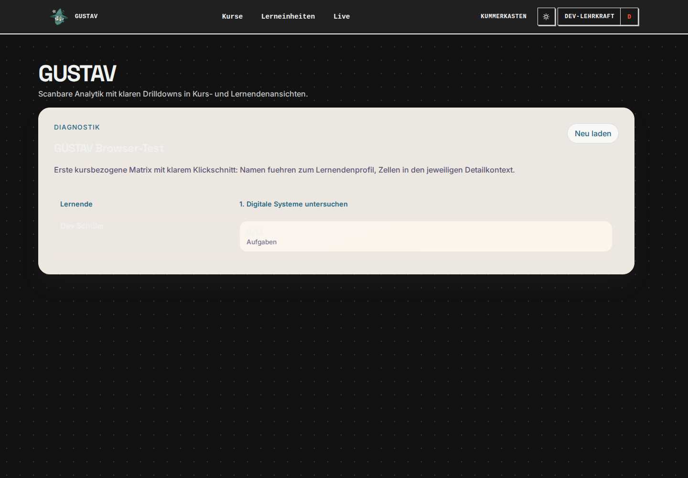

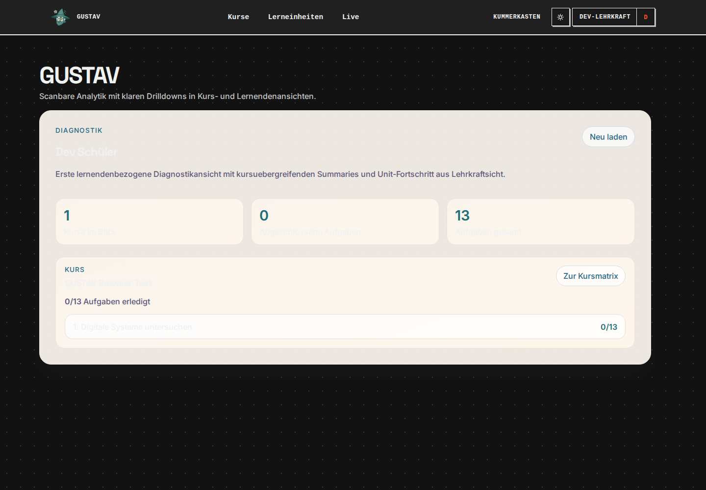

#### DS-20 · P2 · Diagnostik-Kursmatrix verbreitert mobil die gesamte Seite

Bei 390 px Viewport beträgt die Dokumentbreite 758 px. Nicht nur Tabellenspalten, sondern auch Einleitung und Außenkarte ragen rechts heraus. Das ist von einem bewusst intern horizontal scrollbaren Datenraster zu unterscheiden. Reproduziert in Light und Dark, Dark zusätzlich numerisch gemessen. Ziel: Seitenrahmen und Einleitung müssen in die Breite passen; falls nötig, darf nur die Matrix einen eigenen klar erkennbaren Scrollbereich erhalten.

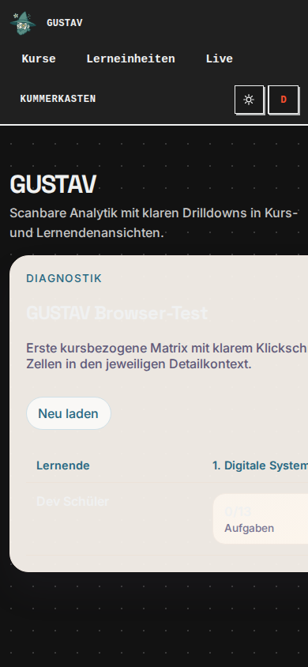

#### DS-21 · P2 · Aufgabenleiste in Live unterscheidet Module nicht ausreichend

Die 13 Aufgaben der Testlerneinheit erscheinen als schmale Farbfelder ohne sichtbare Titel oder Modulgruppen. Im zugänglichen DOM wiederholen sich Namen wie „1. Aufgabe: Noch offen“, weil mehrere Module ihre eigene Zählung haben. Quelle: `frontend/src/routes/live/+page.svelte:674`, Beschriftung aus `task.task_label` und Bewertung. Der Bildschirmbefund belegt fehlende sichtbare Kontextinformation; eine vollständige Hover-/Tooltip-Abnahme liegt noch nicht vor. Empfehlung: Modul und Aufgabentitel in der Orientierung berücksichtigen, nicht nur lokale Position und Farbe. Keine Farbskala ohne fachliche Beratung ändern.

#### DS-22 · P2 · Diagnostik-Profil verlinkt auf eine nicht vorhandene Detailseite

Normaler Klick auf die Lerneinheit im Lernendenprofil führt zu `/diagnostics/courses/[courseId]/units/[unitId]` und sichtbar „404 / Not Found“. Der Quellbaum enthält für diesen Pfad keine Svelte-Seite. Dies ist ein gesonderter Navigationsfehler, kein bloßes Stylingproblem. Die Fehlerseite enthält zudem keine kontextuelle Rückkehraktion und zeigt eine englische Meldung unter der allgemeinen Diagnostik-Einleitung.

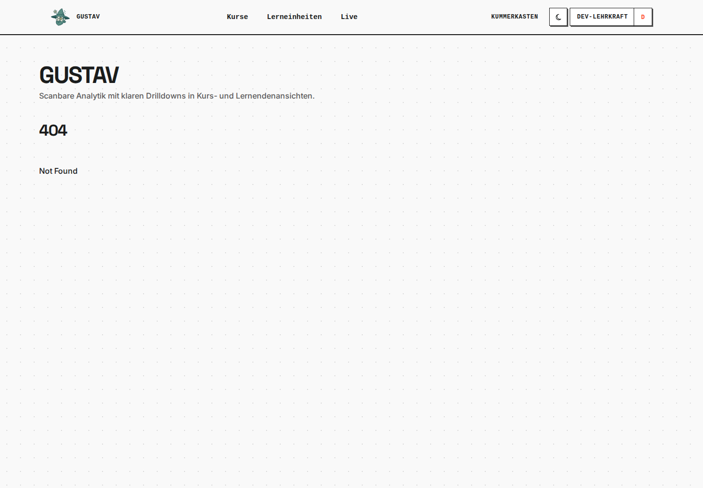

#### Positive Vergleichsergebnisse und weitere Grenzen

Textmaterial- und native Aufgabenbearbeitung teilen eine kantige, lesbare Formatierungsleiste. Diese verteilt sich mobil auf mehrere Zeilen statt rechts abgeschnitten zu werden. „Änderungen speichern“, „Vorschau öffnen“ und „Herunterladen“ folgen der etablierten Hauptaktionsgestaltung. Die Kriterienverwaltung zeigt erste/letzte Verschiebungsrichtung passend deaktiviert; es wurde nichts verschoben. Die einzeiligen Kriterienfelder zeigen mobil allerdings nur einen Ausschnitt längerer Kriterien: als Dichte-/Lesbarkeitsvorschlag vormerken, nicht als Datenverlust ausgeben.

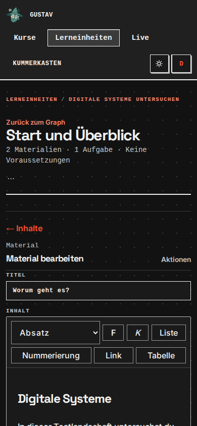

Weiter offen: übrige Aufgabentypen und deren Bearbeitungsdialoge, vollständig vergleichbare Graphzustände beider Rollen, Übungsrückmeldung und Zusammenfassung, reale Klassen mit vielen Lernenden, umfassende Tastatur-/Hover-Zustände sowie Auth-Folgeabläufe. Die leere Suche aus dem Prüfinventar wurde in diesem Durchgang mangels entsprechender Suche in den besuchten Ansichten nicht erneut geprüft; die vorherigen Suchstichproben bleiben bestehen. Der Durchgang liefert keine vollständige Plattformfreigabe.

### Ursachenvertiefung: H5P-Theme-Vertrag (DS-17, P2)

Fortsetzung am 9. September, reine Quellprüfung; keine neue Browserabnahme. Das H5P-Theme und das aktuelle Svelte-Theme verwenden teilweise unterschiedliche Variablennamen. Ein lesender Abgleich der `var(...)`-Referenzen in `h5p-service/vendor/theme/h5p-gustav.css` gegen Definitionen in `frontend/src/lib/styles/*.css` ergibt im untersuchten Arbeitsstand 29 unterschiedliche Referenzen, davon 16 ohne Definition in diesen Svelte-Styles:

`--font-base`, `--color-primary`, `--focus-ring-width`, `--color-focus-ring`, `--focus-ring-offset`, `--radius-full`, `--color-error`, `--color-bg-overlay`, `--radius-md`, `--color-bg-hover`, `--color-bg-focus`, `--color-border-focus`, `--radius-lg`, `--text-sm`, `--text-base`, `--color-text-heading`.

Das ist ein statischer Vertragsbefund, nicht die Behauptung von 16 unabhängig reproduzierten Darstellungsfehlern. Definitionen durch weitere Laufzeit-Styles, lokale Gültigkeitsbereiche und Fallbacks müssen bei der Browserprüfung berücksichtigt werden. Insbesondere enthält die parallele Reparatur bereits den Fallback `var(--color-link, var(--color-primary))` für JoubelUI-Buttons; diese Stelle ist deshalb nicht gleichzusetzen mit den verbleibenden direkten Verweisen.

| Bereich | Konkreter Quellhinweis | Noch nötiger Nachweis |
| --- | --- | --- |
| Core-Buttons | `h5p-gustav.css:55` und `:69` verwenden weiterhin direkt `--color-primary` | Standard und Fokus eines tatsächlich genutzten Core-Buttons in Light/Dark |
| Fokusrahmen | Unter anderem `:47`, `:104`, `:418` erwarten die drei alten Fokusvariablen | Mit Tastatur fokussieren; sichtbaren Rahmen prüfen, nicht nur Fokus im DOM |
| Editorbeschriftungen | Unter anderem `:449` erwartet `--color-text-heading`, `:649` weiterhin `--color-primary` | Konkrete Beschriftung im geladenen Editor nach Theme-Wechsel messen |
| Schrift und Formen | `--font-base`, `--radius-full`, `--radius-md` statt der aktuellen Schrift-/Radiusnamen | Tatsächliche Schrift und Ecken pro Bedienelement vergleichen; nicht blind alte Namen wieder einführen |

Die Theme-Übertragung in `backend/web/static/js/h5p_task_editor.js:27` liest vorhandene Variablen vom Hauptdokument und kopiert sie ab Zeile 61 ins Editor-Dokument. Sie übersetzt keine alten Namen in neue. Ein fehlender Name wird durch diese Übertragung daher nicht automatisch ergänzt. Der Svelte-Lader `frontend/src/lib/runtime/h5p-task-editor.ts` verwendet genau diesen Editor-Einstieg. Das erklärt die technische Bruchstelle; die genaue Kaskade jedes sichtbaren Fehlers ist separat nachzuweisen.

Abgrenzung zur parallelen Reparatur: Die aktuell uncommitteten Änderungen behandeln DragQuestion-Flächen, Zustände, einen JoubelUI-Buttonhintergrund und intrinsische Gridbreiten. Der zugehörige Plan berichtet außerdem eine separate Inhaltskorrektur der em-Geometrie sowie einen roten Kontrasttest. Das sind fremde Arbeitsnachweise, hier weder erneut ausgeführt noch als abgeschlossen bestätigt. Die vorhandene Spec prüft DragQuestion, nicht alle Core-Buttons, Editorfelder oder Auth-Seiten. Ein grüner DragQuestion-Test wäre deshalb kein Erledigungsnachweis für DS-16/DS-17.

Für eine spätere Reparatur zuerst Tests entwerfen: (1) benötigte H5P-Variablen und ihre wirksamen Werte im Player und Editor prüfen, (2) aktive Buttons und Editorbeschriftungen in beiden Modi messen, (3) Fokus mit echten Tastatureingaben prüfen, (4) mindestens einen weiteren tatsächlich genutzten Inhaltstyp neben DragQuestion einbeziehen. Ziel ist ein kleiner expliziter Theme-Vertrag, nicht zusätzliche unverbundene Einzelkorrekturen. Noch kein Implementierungsauftrag.

## Ergänzter Rollenvergleich der Graphansichten

Browserdurchgang am 9. September, reguläre getrennte Dev-Logins, erfolgreiche CA-Prüfung. Dieselbe modulare Lerneinheit mit drei Phasen und acht Modulen wurde in beiden Rollen betrachtet. Desktop 1440 × 1000, schmaler Viewport 390 × 844; keine Touchgeräte- oder umfassende Tastaturabnahme. Keine Module verschoben, Verbindungen geändert oder Lernleistungen gespeichert. Der laufende Stack wurde nicht neu gebaut.

**Positiver Nachweis zur bisher offenen Anordnung:** Alle acht Modulknoten besitzen rollenübergreifend dieselben Graphkoordinaten und dieselben unskalierten Maße von 248 × 104 px. Auch die drei Phasenbänder stimmen in Position und Größe überein. Die sichtbare Verzweigung und Zusammenführung sind nach „Gesamtansicht“ gleich. Unterschiedliche Metadaten sind fachlich sinnvoll: Lehrkräfte sehen Inhaltszahlen, Lernende Fortschritt beziehungsweise fällige Übungen. Die frühere pauschale Sorge einer abweichenden Knotenanordnung ist für diese Testlerneinheit damit nicht bestätigt. Andere Graphgrößen und gespeicherte Ansichten sind damit nicht vollständig geprüft.

Bediennachweise: In beiden Rollen Zoom hinein/heraus und „Gesamtansicht“ geklickt; Gesamtansichten separat visuell geprüft. Beim Lernenden zusätzlich Zoomfaktor 0,612385 → 0,734862 → 0,612385 gemessen. „Auswahl fokussieren“ stellt mobil Faktor 0,82 und einen lesbaren ausgewählten Knoten her. Ein vorhandenes Modul wurde über seinen Knoten geöffnet und über „Zum Lernpfad“ wieder verlassen. Light → Dark → Light durchgeführt. Der Interaktionsschalter der Lehrkraft und Änderungen am Graphen bleiben ungetestet. Ein erster zu enger Textselektor fand den Modulknoten nicht; nach Korrektur funktionierte der normale Klick. Dies ist kein Plattformfehler.

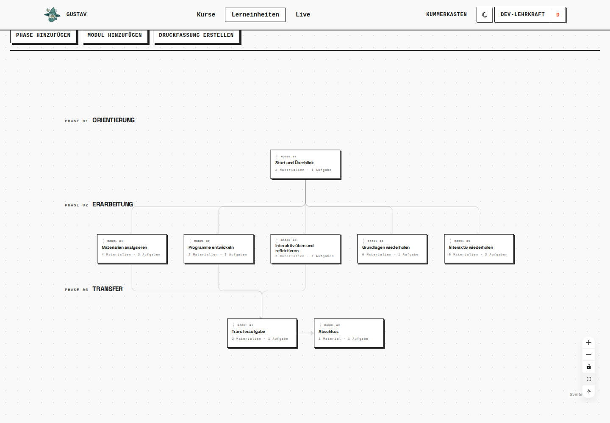

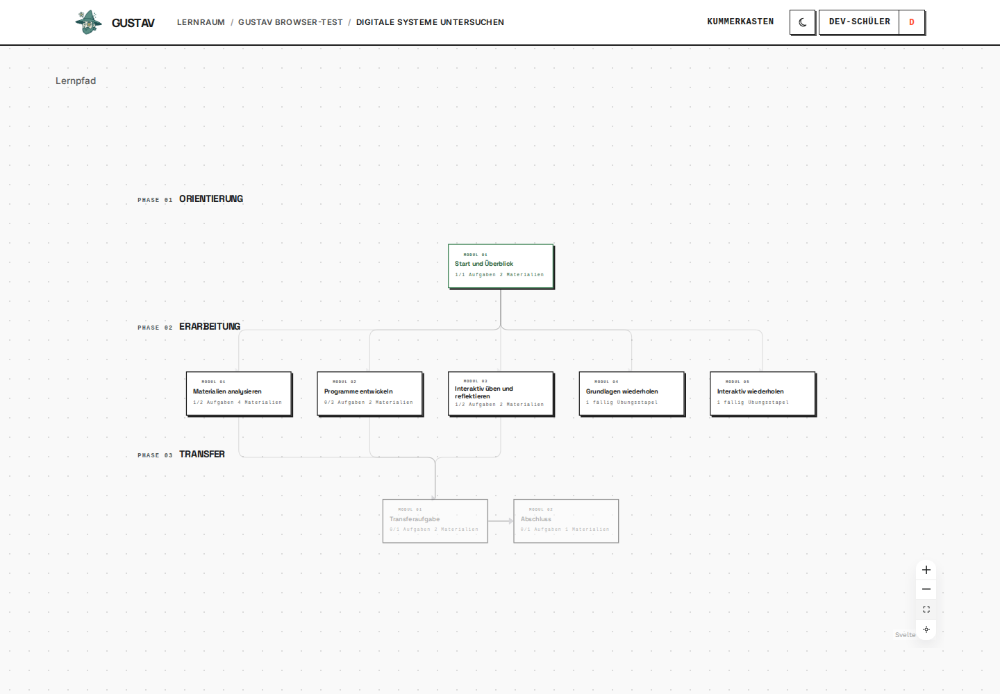

#### DS-23 · P2 · Graphwerkzeug verliert im Dark Mode beim Hover sein Symbol

„Gesamtansicht“ zeigt unter dem Mauszeiger einen nahezu weißen Hintergrund bei fast weißem Symbol. Am Lernendenbutton gemessen: Text-/Symbolfarbe `rgb(240, 241, 241)`, Hintergrund `rgb(244, 244, 244)`. Derselbe sichtbare Effekt trat bei der Lehrkraft auf. Der Button ist aktiv und funktioniert. Reproduktion: Dark Mode → Maus auf „Gesamtansicht“. Quelle zur Integration: `frontend/src/lib/components/ui/GraphViewportControls.svelte`; die Basisgestaltung in `frontend/src/lib/styles/teaching-workspace.css:2298` reicht für diesen Hover-Zustand nicht aus. Keine vollständige CSS-Kaskadenanalyse aller Werkzeugzustände. Ergänzt DS-07 um einen konkreten visuellen Fehler; die englischen Zoom-Bezeichnungen bestehen weiterhin.

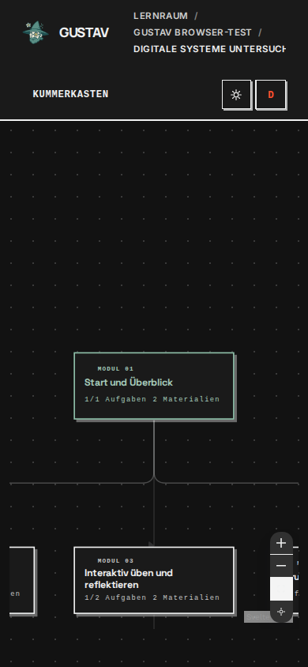

#### DS-24 · P2 · Graph-Startausschnitt und verfügbare Bildschirmhöhe passen nicht zusammen

Beim frischen Lehrkraftaufruf beginnt die 800 px hohe Graphfläche erst bei y ≈ 362 px. Auf dem 1000 px hohen Bildschirm liegen die unteren Phasen und die Werkzeuge daher außerhalb des ersten sichtbaren Bereichs. Zugleich nimmt Leerraum einen großen Teil der Fläche ein. Beim Lernenden ist initial ebenfalls nicht der gesamte Graph sichtbar; die Werkzeuge sind dort jedoch erreichbar. „Gesamtansicht“ korrigiert den Graphausschnitt, nicht die Höhe des umgebenden Seitenaufbaus. Der Klick auf die Lehrkraftwerkzeuge scrollt die Seite zu ihnen; die obige Vergleichsaufnahme ist deshalb ausdrücklich kein Startbild.

Quellhinweis: `.teacher-flow-shell` in `frontend/src/lib/styles/teaching-workspace.css` verwendet `height: min(80vh, 56rem)` und `min-height: 44rem`; `.learning-unit-stage--graph` in `frontend/src/lib/styles/learning-unit.css:480` verwendet eine eigene Höhenregel. Empfehlung: den tatsächlich verbleibenden Platz nach Kopfbereich berücksichtigen und bewusst entscheiden, ob der Einstieg Gesamtüberblick oder lesbarer Modulfokus sein soll. Nicht die übereinstimmenden Knotenkoordinaten ändern, um ein Ausschnittproblem zu kaschieren.

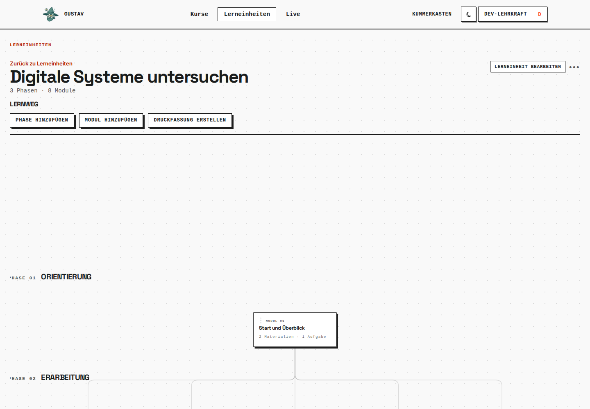

#### DS-25 · P3 · Gesperrte Module und mobile Übersicht brauchen verständlichere Orientierung

„Transferaufgabe“ und „Abschluss“ sind beim Lernenden tatsächlich deaktivierte Buttons, nicht bloß optisch blass. Ein Klick auf die umgebende Knotenfläche öffnet keine Erklärung. Die sichtbaren Knoten enthalten weder „Gesperrt“ noch eine Freischaltbedingung; der Button besitzt auch keinen erklärenden Titel. Anders als bei der aktiven H5P-Auswerten-Aktion ist der deaktivierte Zustand hier im DOM bestätigt. Die stark reduzierte Lesbarkeit betrifft aber die Orientierung über künftige Lernschritte und sollte nicht mit der deaktivierten Aktion gleichgesetzt werden. Quellen: `LearningGraphNode.svelte`, `disabled={!data.openable}`, und `teaching-workspace.css:2713`, zusätzliche Transparenz für gesperrte Knoten. Eine vollständige Screenreaderprüfung steht aus.

In der mobilen Gesamtansicht werden alle acht Knoten zu einer kaum lesbaren Miniatur – in beiden Rollen, Light wie Dark beim Lernenden. Das ist kein horizontaler Dokumentüberlauf: Beide Seiten bleiben bei 390 px Dokumentbreite. Die vorhandene Fokusaktion verbessert die Lesbarkeit des ausgewählten Moduls, blendet dafür andere Bereiche aus. Als Beratungspunkt festhalten: Übersicht und lesbare Navigation deutlicher unterscheiden, gegebenenfalls eine ergänzende Modulliste anbieten; nicht vorschnell alle Knoten auf Mobilbreite umordnen.

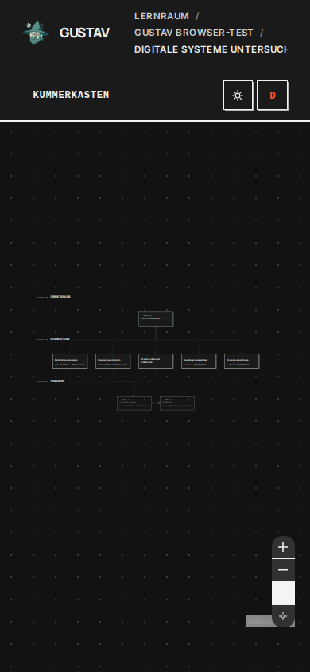

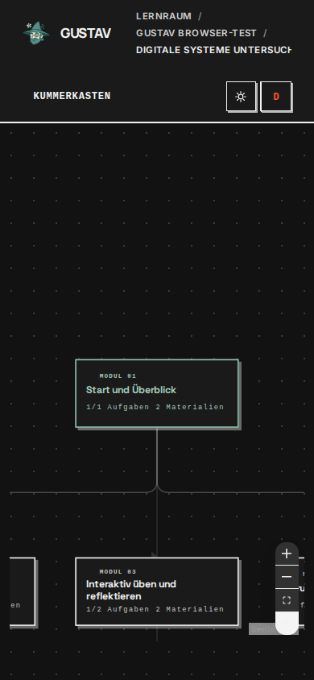

Abdeckung aktualisiert: Ein direkter Rollenvergleich gleicher Graphinhalte liegt jetzt vor. Offen bleiben weitere Graphgrößen, umfangreiche Tastatur-/Touch-/Fokuszustände, Bearbeitung und gespeicherte Ausschnitte. Die übrigen Aufgabentypen, Übungsabschluss und Auth-Folgeabläufe bleiben ebenfalls offen. Kein Nachweis vollständiger Designkonsistenz der Plattform. Der Browser-Skill hat insbesondere den Vergleich vor/nach Bedienung und die getrennte Beurteilung von Seitenbreite und tatsächlicher Lesbarkeit bestimmt.

## Empfohlene Reihenfolge für konsistente Weiterentwicklung

1. Die inzwischen belegten P1-Befunde DS-26 (Editor-Roundtrip mit Inline-Code) und DS-34 (normaler Bearbeitungsweg linearer Abschnitte) vorziehen. Danach Kontrast und mobile Nutzbarkeit einschließlich DS-01, DS-02, DS-06, Auth, Einladung, H5P, Live und Diagnostik behandeln. Vor Umsetzung jeweils gezielte fehlschlagende Tests entwerfen; Details stehen im aktuellen Abschlussbericht.
2. Eine gemeinsame Aktionsbasis und Feldbasis anhand der vorhandenen Designregeln festlegen. Varianten nach Bedeutung benennen: primär, sekundär, klein/kontextuell, destruktiv; außerdem Standard, Hover, Fokus und deaktiviert. Practice und Kurserstellung als verpflichtende Vergleichsseiten aufnehmen.
3. Dialoge und Schubladen anschließend auf diese Grundlagen bringen. Gleiche Aufgaben sollen gleich wirken; unterschiedliche Arbeitsabläufe bleiben erhalten.
4. Bei der späteren Freigabe die im aktuellen Abschlussbericht benannten Geräte-/IServ-/Accessibility-Grenzen beachten. Die repräsentativen lokalen Routennachweise liegen inzwischen vor. Graphen bei Reparaturen weiterhin für beide Rollen mit denselben Inhalten vergleichen. Diagnose-Einstieg und Aktionsgewichtung gesondert beraten.
5. Bei einer späteren Implementierung einen gezielten authentifizierten Browser-Akzeptanztest samt `make verify-feature FEATURE=<konkrete-spec>` zuordnen und zusätzlich echte Vergleichsscreenshots prüfen. Bestandene Funktions- oder Komponententests allein beweisen keine visuelle Konsistenz.

DSPy, Optimierung und KI-Inhalte bleiben außerhalb dieses Designauftrags. Der Browser-Skill hat die Trennung zwischen Sichtprüfung, Bedienprüfung und ausdrücklich offenen Zuständen bestimmt; Produktcode, API und Schema wurden nicht geändert.

## Repository-Prüfung

`make verify` wurde nach Abschluss der zusätzlichen Untersuchung erneut erfolgreich ausgeführt (Exit 0). Einzelzahlen und Grenzen stehen im [aktuellen Prüfvermerk](2026-09-09-designaudit-zusatzlandschaft.md#abschließende-repository-prüfung). Der Lauf prüft die technische Basis, nicht die visuelle Konsistenz. `git diff --check` und die lokalen Bild-/Dokumentverweise wurden zusätzlich geprüft. Die parallele H5P-Reparatur gehört nicht zu dieser Dokumentationsänderung; kein Push.
