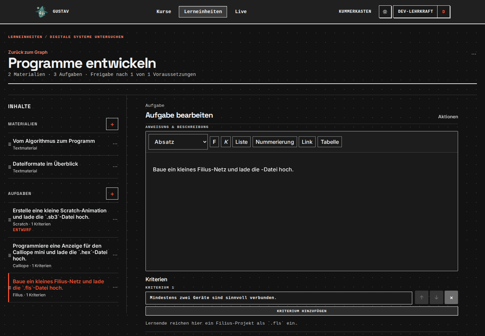
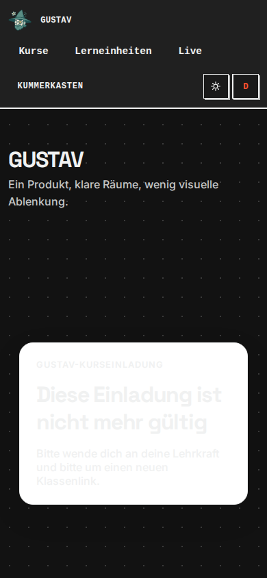
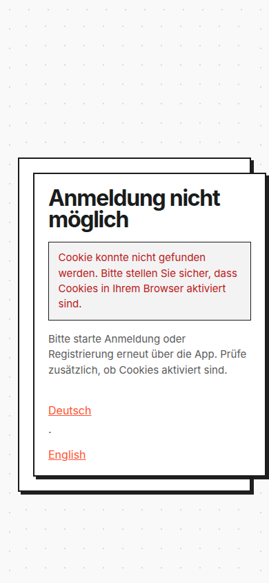
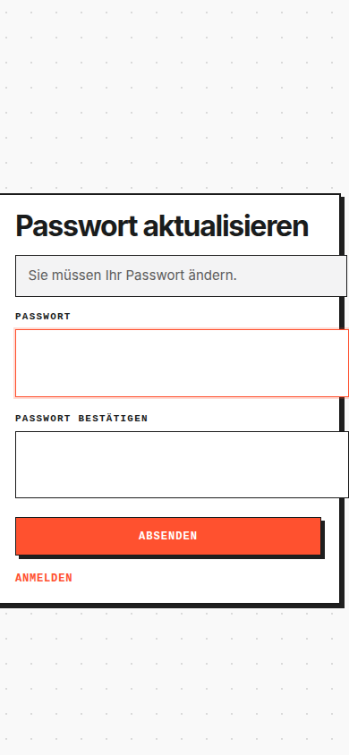
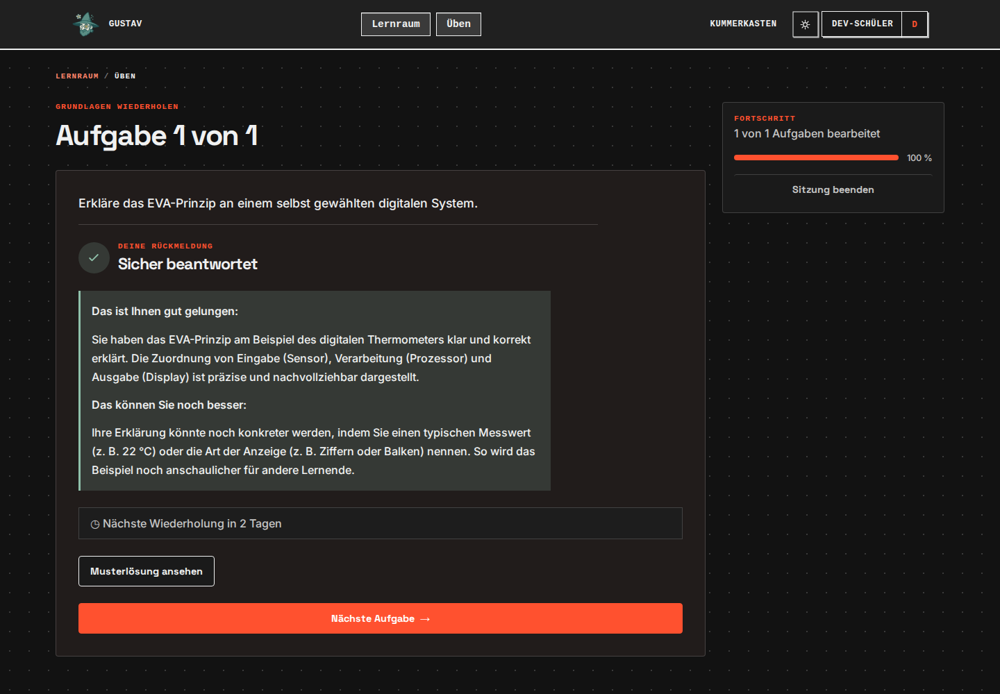
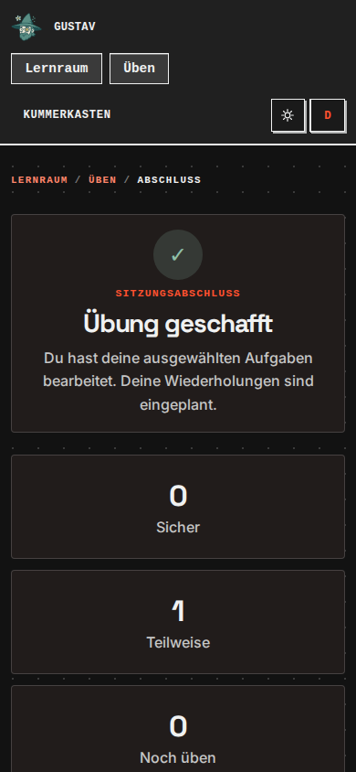
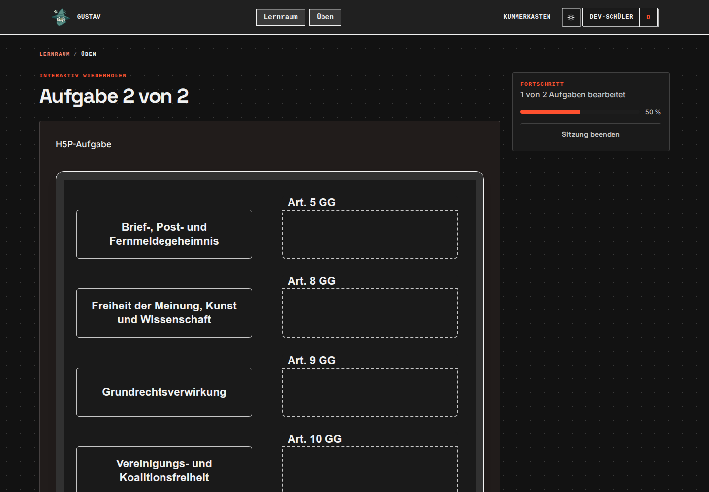
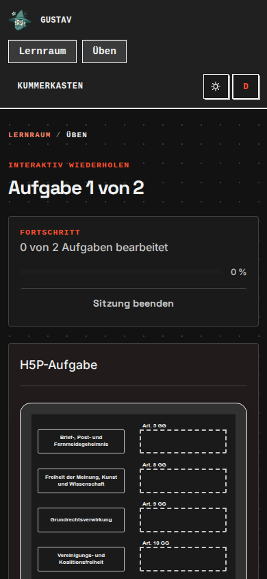

# Designaudit: Restprüfung und belastbarer Abschlussstand

**Historischer Zwischenstand:** Die anschließend ausdrücklich freigegebene Zusatzlandschaft und lokale Mailumleitung wurden inzwischen eingesetzt. Der [aktuelle Abschlussbericht mit DS-33 bis DS-35](2026-09-09-designaudit-zusatzlandschaft.md#abschluss-der-zusätzlichen-lokalen-untersuchung) ersetzt die unten genannten noch fehlenden lokalen Voraussetzungen und den damaligen Entscheidungsbedarf. Die Befunde und Nachweise dieses Durchgangs bleiben nachvollziehbar erhalten.

Stand: 9. September 2026. Ergänzung zum [Befundkatalog](2026-09-09-design-befundkatalog.md). Dieser Stand ersetzt dessen ältere pauschale Restlisten, nicht die historischen Nachweise. Auftrag ist Untersuchung und Bericht, keine Designimplementierung. Der Wunsch „bis nichts mehr offen ist“ ist noch nicht vollständig erfüllt: Die unten konkret benannten Nachweise benötigen weitere Voraussetzungen. Sie werden nicht als bestanden umetikettiert.

## Vorgehen und tatsächliche Änderungen

Browser-Skill für getrennte Bedien-/Sichtprüfung, PDF-Skill für die gerenderte Druckfassung. Reguläre lokale TLS-Prüfung erfolgreich; bestehender persistenter Browsercontroller gezielt freigegeben, keine abgeschwächte Zertifikatsprüfung. Chromium mit 1440 × 1000 und 390 × 844 CSS-Pixeln, kein physisches Smartphone. Quellstand beim Abschluss `master`, `4b94f14c`; die separate H5P-Reparatur wurde zwischen den Auditdurchgängen eingespielt. Keine eigenen Produktcodeänderungen oder Container-Neubauten.

Felix hat während dieses Durchgangs ausdrücklich Übungs-Testdaten und lokale Testmails erlaubt. Angelegt wurden fünf Übungssitzungen der Dev-Schüler-Persona: eine native Sitzung mit zwei Antworten, eine vorzeitig beendete H5P-Sitzung, eine H5P-Sitzung mit echter Zuordnung und Auswertung, eine Sitzung mit übersprungenen Aufgaben und eine abschließende mobile H5P-Sitzung. Alle wurden beendet. Die gespeicherten Übungsantworten und Wiederholungsstände bleiben als Testdaten erhalten; kein Reset und keine Löschung. Der KI-Dialog wurde geöffnet und ohne Abgabe abgebrochen, keine Dialogantwort gesendet. Keine Inhalte, Passwörter oder Kontoeinstellungen gespeichert; keine CLI-Tokens erzeugt. Eine vorübergehende Antwortmodus-Auswahl im Lehrkraftformular wurde auf den Ausgangswert zurückgestellt, nicht gespeichert.

**Keine Mail versendet:** Die konfigurierte SMTP-Adresse ist kein lokaler Mailfänger. Die Zustimmung zu lokalen Testmails autorisiert keinen Versand über diesen externen Dienst und keine Umkonfiguration der Plattform. Zugangsdaten, SMTP-Adresse und Kontokennungen werden hier nicht veröffentlicht. Screenshots von Profilabschnitten mit E-Mail-Adresse sowie der Mitgliederliste mit technischer Personenkennung bleiben außerhalb des öffentlichen Repositories.

## Neue Ergebnisse

### DS-26 · P1 · Rich-Text-Editor lässt vorhandene Inline-Code-Inhalte weg

**Reparaturstatus 10. September 2026: behoben.** Öffnen, unverändert speichern und erneut laden erhält Inline-Code und Codeblöcke. Nachweis: `make verify-feature FEATURE=editor-content-integrity`, ergänzende Adaptertests und gesichtete [Desktopansicht](assets/2026-09-10-designreparatur-paket1/editor-light-1440.png) / [mobile Dunkelansicht](assets/2026-09-10-designreparatur-paket1/editor-dark-390.png). Der folgende Text dokumentiert den ursprünglichen Befund.

In allen drei Lehrkraftformularen für Scratch, Calliope und Filius enthält die seitliche Aufgabenliste weiterhin die Dateiendung `.sb3`, `.hex` beziehungsweise `.fls`. Im geladenen Editor steht dagegen sinngemäß „lade die -Datei hoch“. Beim Filius-Editor wurde zusätzlich der tatsächliche Inhalt des `contenteditable` gelesen: Die Endung fehlt, es existiert auch kein verstecktes `code`-Element. Die Lernendenansicht und die erzeugte Druckfassung zeigen die Endungen korrekt. Das grenzt den Befund auf die Bearbeitungsdarstellung ein.

Quellhinweis: `frontend/src/lib/components/learning-unit/tiptap-markdown-editor.ts`, `StarterKit.configure({ code: false, codeBlock: false, ... })` bei Markdown-Import. Das ist ein konkreter Ursachenhinweis, keine abgeschlossene Reparaturanalyse. **Es wurde nicht gespeichert; ein persistierter Datenverlust ist deshalb nicht behauptet.** Die Priorität ergibt sich aus dem Risiko, bestehende Inhalte beim Bearbeiten unbemerkt zu verlieren. Vor einer Reparatur einen Roundtrip-Test mit vorhandenen Inline-Code-Fragmenten entwerfen.

### DS-27 · P2 · Einladungsseite im Dark Mode nahezu weiß auf weiß

**Reparaturstatus 10. September 2026: behoben.** Gültige und ungültige Einladung teilen den kantigen Auth-Rahmen und lesbare zentrale Farben. Vollständiges Gate `course-invite-registration` mit Registrierung, lokaler Verifikationsmail und Kursbeitritt bestanden; vier Breiten in beiden Darstellungen gesichtet, etwa [ungültige Einladung dunkel](assets/2026-09-10-designreparatur-paket3/invite-invalid-dark-390.png). Folgend der historische Befund.

`/invite` ohne Einladungstoken erreicht regulär die ungültige Einladung. Die Karte bleibt weiß und stark gerundet, während Überschrift und Erklärung hell werden. Die separate Route `/invite/result` zeigt denselben Fehlertyp dagegen lesbar ohne weiße Karte. Reproduziert bei 390 px. Quelle: `frontend/src/routes/invite/+page.svelte`, `.invite-card` mit `var(--color-surface, #fff)` und eigenständigen Rundungen; die Darstellung eines gültigen Einladungslinks wurde mangels vorhandenen Links nicht simuliert.

### DS-28 · P2 · Auth-Fehlerseite hat mobil verschachtelte, überbreite Karten

**Reparaturstatus 10. September 2026: behoben.** Gemeinsamer einfacher Rahmen, passende Feldbreiten und fester sicherer Rückweg über GUSTAV. Vollständiges Gate `auth-design-consistency` prüft echten verbrauchten Resetlink und fremde Rücksprungadresse; [Fehleransicht dunkel](assets/2026-09-10-designreparatur-paket3/consumed-link-dark-320.png) tatsächlich gesichtet. Folgend der historische Befund.

In einem separaten anonymen Browserkontext wurde das reguläre Loginformular geöffnet, dessen eigene Cookies entfernt und seine zuvor erhaltene Formularadresse erneut aufgerufen. Der Server zeigt daraufhin korrekt einen Cookie-Fehler. Dies ist ein echter Fehlerzustand, **kein Nachweis eines abgelaufenen E-Mail-Tokens**. Die Fehleransicht zeigt zwei gegeneinander versetzte Rahmen; der innere Rahmen ragt rechts aus dem Viewport. Deutsch-/English-Links stehen weit auseinander untereinander. Ein direkter Rückweg zur App wird im erreichten Zustand nicht angeboten, obwohl der Hinweis zum Neustart über die App auffordert.

Die Passwortänderungsseite wurde zusätzlich über Profil → Passwort ändern erreicht, Desktop und mobil betrachtet und leer abgeschickt. Die Fehlermeldung „Bitte geben Sie ein Passwort ein“ ist sichtbar; kein Passwort wurde geändert. Auch hier laufen die Eingabefelder mobil nach rechts aus der Karte. Dies erweitert DS-10/DS-12 auf eine tatsächliche Auth-Folgeseite. Der normale Logout führt direkt zur GUSTAV-Abgemeldet-Seite; „Erneut anmelden“ erreicht wieder das Loginformular. Eine separate Keycloak-Logoutbestätigung erschien in diesem Ablauf nicht.

### DS-29 · P2 · Erneute Übungsrunde wird nicht erklärt

Regulärer Rundlauf: natives Thema wählen → Antwort senden → Auswertung abwarten → „Sicher beantwortet“ → Musterlösung ansehen → „Nächste Aufgabe“. Danach erscheint dieselbe Aufgabe wieder als „Aufgabe 1 von 1“, der sichtbare Fortschritt fällt von 100 auf 0 Prozent. Das ist kein belegter Verlust der ersten Antwort: `backend/learning/practice/repo_db.py`, `continue_session`, sieht eine zweite Präsentation vor, wenn die Musterlösung angesehen wurde. Die Oberfläche erklärt diesen Wechsel jedoch nicht. Empfehlung: Wiederholungsrunde ausdrücklich benennen und den Fortschritt verständlich machen. Nicht die fachliche Wiederholungslogik im Designauftrag ändern.

Die zweite Antwort, erneute Rückmeldung und anschließende Zusammenfassung wurden vollständig erreicht. Gesamturteil der Sitzung: „Teilweise“ nach unterstützter Bearbeitung; keine Behauptung, dies widerspreche fachlich der vorherigen Einzelrückmeldung. Rückmeldung, Musterlösung und Zusammenfassung sind in den geprüften Dark-Zuständen lesbar. Die schon dokumentierte abweichende Practice-Buttonsprache setzt sich bis zum Abschluss fort. Die generierte Rückmeldung spricht mit „Sie“, während die Oberfläche „Du“ verwendet; dies als sprachlichen Beratungspunkt festhalten, DSPy nicht verändern.

### DS-30 · P2 · Separate Mitgliederseite zeigt Entwicklungsformulierungen und interne Kennung

`/teaching/courses/[courseId]/members` ist keine identische Kopie des Mitgliederdrawers: Sie zeigt Texte wie „eigene SvelteKit-Detailfläche“ und die technische Personenkennung unter dem Lernendennamen. Die Darstellung wurde tatsächlich geöffnet, auch mobil dunkel. Quelle: zugehörige `+page.svelte`, Ausgabe von `member.sub`. Das ist ein Verständlichkeits- und Präsentationsbefund, keine Behauptung einer unerlaubten Datenfreigabe: Der Aufruf erfolgte als berechtigte Lehrkraft. Die Personenkennung wird nicht als Screenshot ins öffentliche Repo übernommen.

Zusätzlicher kleiner Befund am Profil: Die Berechtigungscheckboxen für CLI-Tokens stehen räumlich von den Beschriftungen getrennt; „read“, „write“, „delete“ bleiben englisch. Dies erweitert das bereits bekannte Problem generischer Auswahlfeldgestaltung aus DS-06. Profiltextfelder, Namensspalten und Hauptaktionen sind ansonsten in den betrachteten Desktop-/Mobil-Dark-Ansichten lesbar und konsistent. Kein Token erstellt oder widerrufen.

### DS-31 · P3 · Druckfassung: Abstand zwischen Aufgabe und nächstem Modul zu klein

„Alle Inhalte auswählen“ aktiviert die PDF-Erzeugung. Mit allen 26 Inhalten meldet die Oberfläche konkret, welches Bildmaterial nicht übernommen werden konnte. Nach Abwahl beider winziger Bild-Testdateien wird eine fünfseitige PDF mit dem vorhandenen Quellen-PDF erzeugt. Alle fünf Seiten wurden gerendert und betrachtet. Schrift, Umlaute, Seitenzahlen, eingebettetes Quellenblatt und Dateiendungen sind lesbar; kein pauschaler Exportfehler. Auf Seite 3 steht die Modulüberschrift „Programme entwickeln“ jedoch unmittelbar unter dem letzten Satz der vorherigen Aufgabe, mit deutlich weniger Abstand als vergleichbare Modulwechsel. Als Layoutkorrektur vormerken. Die abgewählten Bild-Testdateien begrenzen den Bilddrucknachweis; nicht ungeprüft einen Fehler realer Unterrichtsbilder behaupten.

### DS-32 · P2 · H5P-Zuordnung bleibt auf Smartphonebreite zu klein

Die inzwischen separat implementierte H5P-Reparatur (`4b94f14c`) verbessert den hier vorhandenen realen Zuordnungsinhalt am Desktop sichtbar. Der neue Auditnachweis umfasst Light/Dark, echtes Ziehen in ein falsches und danach korrektes Zielfeld, weitere Zuordnungen per Enter-Taste sowie „Auswerten“, „Sicher beantwortet“ und Sitzungsabschluss. Keine synthetischen Bewertungsereignisse. Damit ist die frühere Minimalinhalt-Prüflücke für diesen Inhaltstyp am Desktop geschlossen; DS-15 ist nicht unverändert als aktueller Desktopzustand zu lesen.

Bei 390 px Viewport beträgt die gemessene Schriftgröße der sechs Karten jedoch nur etwa **7,95 px** bei ungefähr 127 px Kartenbreite. Die Begriffe und Artikelbeschriftungen werden zu einer winzigen Miniatur, in Light und Dark. Die korrekte Breitenanpassung reicht deshalb nicht als Lesbarkeitsnachweis. Die separate Reparatur hatte ausdrücklich Desktop und Tablet, nicht Smartphone-Eignung abgenommen. Empfehlung: lesbare schmale Inhaltsvariante beziehungsweise klarer Mindestbreitenhinweis und alternative Bedienung; keine vollständige Smartphonefreigabe aufgrund alleiniger Überlauffreiheit.

## Ergänzte Abdeckung und verbleibende Voraussetzungen

| Restposition | Jetzt geprüft | Nicht als bestanden ausgeben / Voraussetzung |
| --- | --- | --- |
| Scratch, Calliope, Filius | Drei Lehrkrafteditoren; Lernenden-Dateiaufgaben; mobile Uploadflächen; korrekte Deaktivierung ohne Datei | Kein gültiger Datei-Upload und keine vollständige Fachauswertung dieser Formate; dafür repräsentative Testdateien nötig |
| Bild-/PDF-Aufgabe | Lernendenansicht Desktop/Mobil Dark mit Materialkontext und Dateiauswahl | Keine neue Bild-/PDF-Abgabe erzeugt |
| KI-Dialog | Lehrkraftkonfiguration samt Antwortmoduswechsel und Rückstellung; Lernendenansicht Desktop/Mobil Dark; Abbruch ohne Abgabe | Kein neuer Dialog bis zur Auswertung; würde zusätzliche Dialog-Testdaten benötigen |
| Practice nativ | Leere Antwortvalidierung, Antwort, Wartezustand, Rückmeldung, Musterlösung, zweite Runde, Abschluss | Kein künstlich provozierter KI-/Netzwerkausfall; nicht jede Bewertungsklasse erzwungen |
| Practice beenden/überspringen | Dialog öffnen, „Weiter üben“, erneut öffnen und beenden; übersprungene Aufgaben; Zusammenfassung | Keine aktive Testsitzung zurückgelassen |
| Practice ohne fällige Aufgaben | Nach echter Bearbeitung „Für diese Auswahl ist heute nichts fällig“, deaktivierter Start | Separate `empty`-Zusammenfassung über diesen UI-Zustand nicht erreichbar; nicht durch API-/DOM-Manipulation fingiert |
| H5P real | DragQuestion Desktop Light/Dark inklusive Bewertung; Smartphone Light/Dark | Weitere reale Inhaltstypen und deren Zustände fehlen im Dev-Datenbestand; Minimalfixture ersetzt sie nicht |
| H5P-Lehrkrafteditor | Vorheriger Browsernachweis und Theme-Ursachenanalyse bleiben bestehen | Keine pauschale Wiederabnahme aller Editorbibliotheken nach separater DragQuestion-Reparatur |
| Profil | Desktop Light/Dark, mobile Dark-Formulare; Passwortänderung regulär geöffnet | Kein Namens-/Passwort-/Tokenwechsel, keine Lockout- oder Token-Erfolgszustände erzeugt |
| Auth | Passwortänderungsformular und Leerfehler; fehlendes Cookie; Logout und Rückkehr zum Login | Kein lokaler Mailfänger vorhanden: Reset-Mail, Verifikation und abgelaufener Mailtoken nicht live geprüft. Reguläres Login zeigt keinen IServ-Einstieg; echter IServ-Rundlauf benötigt passende Einrichtung/Zugang |
| Einladungen | Ungültige Einladung ohne Token und Ergebnisseite | Gültiger Link/Beitritt erfordert eine Testeinladung; kein Klassenlink erzeugt oder bestehender Link rotiert |
| Separate Mitgliederseite | Belegter Zustand, Desktop/Mobil | Keine Mitgliedschaften verändert |
| Druck | Auswahl, Fehlerzustand, Download und alle fünf PDF-Seiten ohne zwei Bildfixtures | Echte Bildmaterialien als weiterer Drucknachweis nötig |
| Lineare Lerneinheit | Dev-Katalog überprüft: nur eine modulare Einheit vorhanden | Isolierte lineare Testlerneinheit notwendig; keine bestehenden Inhalte umgewandelt |
| Belegter Lehrkraft-Kummerkasten | Vorheriger leerer Zustand bekannt | Kein vorhandener Testbeitrag; Erzeugung würde einen zusätzlichen Beitrag/Benachrichtigungsablauf auslösen |
| Große Klassen / weitere Graphen | Vorheriger direkter Rollenvergleich gleicher Graphdaten bleibt gültig | Eine Klasse mit einem synthetischen Lernenden ist kein dichter Klassen-/Langtexttest |
| Geräte und Zugänglichkeit | Chromium-Viewportvarianten, ausgewählte Tastatur-, Hover- und Disabled-Zustände | Keine vollständige Screenreader-, Safari-/Firefox- oder physische Touchgeräteabnahme |

Die frühere pauschale Restliste ist damit vollständig **bewertet**, aber nicht jede Prüfposition abgeschlossen. Fehlende Zugangsvoraussetzungen werden bewusst offen gehalten. UI-Labor und historische Implementierungen sind keine zusätzliche produktive Plattformabnahme. Ein Designaudit aller denkbaren Daten-/Fehler-/Gerätekombinationen wäre kein endlicher Abschlussmaßstab; für die nächste Stufe müssen die oben genannten repräsentativen Fixtures und Zugänge bereitstehen.

## Nächster notwendiger Entscheid

Für die verbleibenden echten Browsernachweise sind eine isolierte zusätzliche Testlandschaft (lineare Einheit, größere Klasse, Testeinladung, Kummerkastenbeitrag und repräsentative Datei-/H5P-Inhalte) sowie ein sicherer lokaler Mailweg erforderlich. Die aktuelle Freigabe umfasst Übungs-Testdaten und lokale Testmails, nicht diese weitergehenden Plattform-/Mailkonfigurationsänderungen. Kein Versand über den externen SMTP-Dienst und keine Veränderung bestehender Kontoeinstellungen als Ersatz. IServ und physische Geräte bleiben zusätzliche externe Voraussetzungen.

## Prüfstatus der Dokumentation

Produktcode unverändert. Acht öffentliche Bildnachweise tatsächlich betrachtet, technische Kennungen und Profil-E-Mail nicht in die öffentlichen Assets übernommen. `git diff --check` erfolgreich. Abschließender lesender Check bestätigt: keine aktive Übungssitzung der Dev-Schüler-Persona. Eigener Prüfbrowser geschlossen. Kein erneuter Gesamtlauf von `make verify` für diese reinen Auditdokumente; kein Commit oder Push. Die automatisierten Prüfergebnisse der parallelen H5P-Reparatur werden nicht als eigene Testausführung vereinnahmt.
