# Designaudit: zusätzliche Testlandschaft und lokale Mailprüfung

**Reparaturstand · 10. September 2026:** DS-33–35 sind im [freigegebenen Reparaturplan](2026-09-10-designkonsistenz-reparatur.md) lokal abgenommen. Jeder Eintrag enthält den aktuellen Reparaturnachweis; die anschließenden Untersuchungsprotokolle beschreiben den historischen Zustand vor der Umsetzung. Externe Abnahmegrenzen bleiben bestehen.

Felix hat die isolierte zusätzliche Testlandschaft und einen lokalen Mailfänger ausdrücklich freigegeben. Ziel bleibt die Untersuchung, nicht die Reparatur der Designbefunde.

## Plan und Sicherheitsnachweise vor Änderungen

1. Lokalen Stack und vorhandene Testhilfen prüfen. Nur neu angelegte synthetische Konten, Kurse, Einladungen und Inhalte verändern; bisherige Dev-Landschaft erhalten. Private Kennungen/Zugangsdaten ausschließlich in ignorierten temporären Dateien.
2. Lokalen Mailempfang ohne Weiterleitung einrichten. Vor einer Realm-Änderung Originalkonfiguration privat sichern; ausschließlich SMTP-Felder verändern. Lokalen Empfang zunächst mit einer synthetischen Testmail nachweisen. Während der Auth-Prüfung keine externe Zustellung; anschließend ursprüngliche SMTP-Konfiguration wiederherstellen und vergleichen. Keine TLS-/Cookie-Sicherheitsabschwächung an Web oder Auth.
3. Lineare Einheit und dichte Klasse sowie gültige Einladung über bestehende Schnittstellen anlegen. Browserprüfung über echte Oberflächen; API-Datenanlage nicht als UI-Nachweis ausgeben. Leere/belegte Zustände, Light/Dark, mobile Breite, lange Namen und letzte Position betrachten.
4. Auth: Registrierung, Verifikation und Reset über eigene Testkonten und lokale Mails bis zu den relevanten Formular-/Fehler-/Erfolgsschritten prüfen. Keine bestehenden Passwörter ändern. Weitere Inhaltstypen und gültige Testdateien nach Verfügbarkeit ergänzen; Grenzen ausdrücklich dokumentieren.
5. Bilder prüfen, Katalog aktualisieren, Testlaufzustand und wiederhergestellten Mailweg nachweisen. Keine unbegrenzte Geräte-/IServ-Freigabe behaupten. Neue Testlandschaft für Felix erhalten, temporäre Mailumleitung nicht aktiv zurücklassen.

## Prüfszenarien

- Gegeben ein Mailfänger ohne Relay, wenn eine synthetische Mail gesendet wird, dann ist sie nur lokal lesbar. Vorher gilt der Empfangstest als nicht bestanden.
- Gegeben gesicherte SMTP-Einstellungen, wenn die Prüfung endet, dann stimmen die ursprünglichen Einstellungen wieder vollständig überein.
- Gegeben eine gültige Testeinladung, wenn ein neues Testkonto beitritt, dann erscheinen reale Erfolgs-/Verifikationsansichten; ein ungültiger beziehungsweise wiederverwendeter Link erhält einen klaren Zustand.
- Gegeben eine lineare Testeinheit und lange Inhaltsnamen, wenn Lehrkraft und Lernender sie öffnen, dann werden Aufbau und Aktionen in beiden Modi/kleiner Breite sichtbar verglichen.
- Gegeben eine dichte synthetische Klasse, wenn Mitglieder und Live geöffnet werden, dann werden Scrollgrenzen und Orientierung tatsächlich geprüft.

Keine neue Produktfunktion, keine API-/Schemaänderung; daher keine neue Migration oder Feature-Akzeptanzspec. Temporäre Prüfwerkzeuge sind keine öffentliche Ops-Erweiterung. Browser-Skill bestimmt Bedien-/Sichtnachweise und Cleanup. Produktreparaturen benötigen weiterhin einen eigenen Contract-/TDD-Auftrag.

## Abschluss der zusätzlichen lokalen Untersuchung

Stand: 9. September 2026, Quellstand `4b94f14c`. Dies ist der aktuelle Abschlussbericht zum [Befundkatalog](2026-09-09-design-befundkatalog.md). Er ersetzt die inzwischen überholten Voraussetzungen der [vorherigen Restprüfung](2026-09-09-designabschluss-restpruefung.md). Die repräsentativen lokalen Bedienabläufe sind nun untersucht; die gefundenen Designfehler sind **nicht repariert**. Keine vollständige Geräte-, Barrierefreiheits- oder Funktionsfreigabe der Plattform.

Die nachträgliche Freigabe wurde genutzt, um genau die zuvor fehlenden Voraussetzungen herzustellen: eine separate Lehrkraft, 24 synthetische Lernende einschließlich eines frisch registrierten Kontos, eine eigene Klasse und eine lineare Einheit mit zwei langen Abschnittstiteln. Die Einheit enthält acht Aufgaben und ein Bildmaterial. Grunddaten wurden über die vorhandenen APIs angelegt; Auth, Einladung, Abgaben, KI-Dialog, H5P-Autorierung, Kummerkasten und Druck wurden anschließend über die echte Browseroberfläche bedient. API-Datenanlage ist kein Nachweis der entsprechenden Erstellungsformulare.

### DS-33 · P2 · Lineare Inhaltsübersicht unterschlägt die vergebenen Abschnittstitel

**Reparaturstatus 10. September 2026: behoben.** Abschnittsnummer und vorhandener Titel erscheinen gemeinsam, bei leerem Titel bleibt die Nummer. Nachweis: Projektionstest, authentifizierter Lernenden-Rundlauf in `make verify-feature FEATURE=teacher-linear-section-actions` und [gesichtete Inhaltsübersicht](assets/2026-09-10-designreparatur-paket1/learner-section-titles.png). Der folgende Text dokumentiert den ursprünglichen Befund.

Die Lehrkraft sieht die beiden tatsächlichen Titel „Grundlagen verstehen und anhand eines anschaulichen Beispiels erklären“ und „Ergebnisse prüfen und den eigenen Lösungsweg kritisch beurteilen“. In der Lernenden-Inhaltsübersicht und ihrem Inhaltsverzeichnis stehen dagegen nur „Abschnitt 1“ und „Abschnitt 2“. Der lange Einheitentitel selbst wird angezeigt und umgebrochen. Es handelt sich nicht um fehlende Testdaten: Auch die Druckfassung verwendet die gespeicherten Abschnittstitel.

Konkreter Quellhinweis: `frontend/src/lib/learning-unit/workspace.ts`, `contentGroupsForSections`, setzt den Gruppentitel ausschließlich aus der Position zusammen. Empfehlung: Abschnittsnummer und fachlichen Titel gemeinsam anzeigen. Dieser Unterschied ist ein Orientierungsproblem, kein Argument für identische Bearbeitungs- und Lernoberflächen.

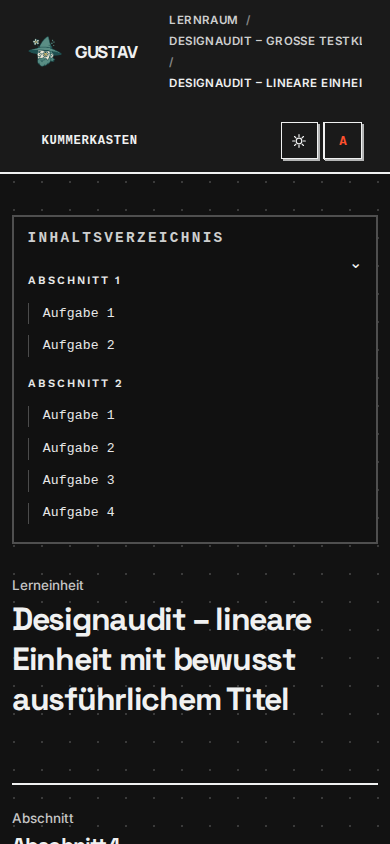

### DS-34 · P1 · Lineare Abschnittsauswahl bietet keinen sichtbaren Weg zum Inhaltseditor

**Reparaturstatus 10. September 2026: behoben.** Die gemeinsame Kontextleiste bietet „Inhalte bearbeiten“ und ausdrückliche „Eigenschaften“. Rückkehr bewahrt Auswahl und Kamera; alte Direktlinks und Zugriffsschutz sind geprüft. Nachweis: `make verify-feature FEATURE=teacher-linear-section-actions`, bestehender modularer Rückfalltest `teacher-graph-module-actions`, [Desktop](assets/2026-09-10-designreparatur-paket1/linear-light-1440.png) und [mobile Dunkelansicht](assets/2026-09-10-designreparatur-paket1/linear-dark-390.png). Die Graphhöhen-/Werkzeugbefunde wurden anschließend separat in Paket 5 mit dem vollständigen Gate `graph-role-parity` abgenommen. Der folgende Text dokumentiert den ursprünglichen Befund.

Bei einer linearen Einheit ändert das Anklicken eines Abschnitts die Auswahl und den URL-Parameter `section`, öffnet aber weder den Abschnittsinspektor noch eine sichtbare Aktion zum Bearbeiten seiner Inhalte. Einfacher Klick und Doppelklick wurden geprüft; die Auswahl ist am orangefarbenen Rahmen erkennbar. „Lerneinheit bearbeiten“ öffnet lediglich den Dialog für die Stammdaten der Einheit. Dieser wurde ohne Änderung per Escape geschlossen. Das Problem tritt auch am Desktop auf und ist deshalb nicht nur ein abgeschnittener mobiler Inspektor.

Der vorhandene Inhaltseditor unter `/teaching/units/[unitId]/nodes/[sectionId]` lässt sich dagegen direkt öffnen; darüber wurden das zusätzliche H5P und Bildmaterial angelegt. **Der direkte Aufruf ist eine diagnostische Umgehung, kein bestandener Navigationsrundlauf.** Quellhinweis: `frontend/src/routes/teaching/units/[unitId]/+page.svelte`, `inspectorOpen()` verlangt für lineare Abschnitte zusätzlich `quick=1`, während der angeklickte Abschnittslink nur `section` setzt. In der Quellsuche wurde kein aktueller Link gefunden, der `quick=1` anbietet. Die Reparatur muss Auswahl, sichtbare Inhaltsaktion und Tastaturzugang gemeinsam absichern.

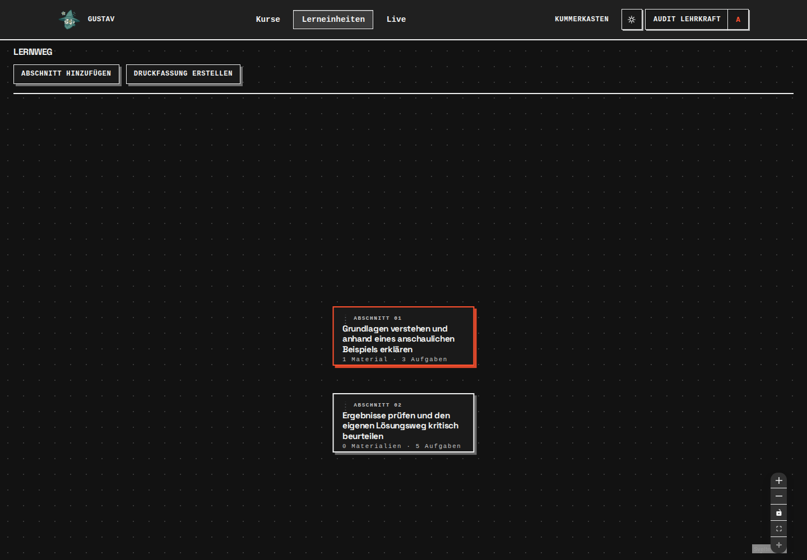

### DS-35 · P2 · Live wird bei langer Kurs-/Einheitsbezeichnung mobil überbreit

**Reparaturstatus 10. September 2026: behoben.** Lange Auswahlwerte verbreitern die Seite nicht; Klassenübersicht und Details stehen mobil untereinander. Eigener beschrifteter Tabellenbereich mit tatsächlicher Tastatur-Scrollprüfung, letzter Zeile und leerer/vorhandener Abgabe. Beide vollständigen Paket-6-Gates bestanden; [320 px hell](assets/2026-09-10-designreparatur-paket6/live-submission-320-light.png) und [390 px dunkel](assets/2026-09-10-designreparatur-paket6/live-empty-390-dark.png) gesichtet. Der folgende Text dokumentiert die ursprüngliche Überbreite.

Mit 24 Lernenden, einer langen Kursbezeichnung und einer langen linearen Einheit misst die tatsächliche Dokumentbreite bei 390 px Viewport ungefähr **535 px**. Auswahlfelder, Kennzahlen und Übersicht reichen rechts aus dem sichtbaren Bereich. Die letzte Tabellenzeile ist durch Scrollen erreichbar; ihre Auswahl führt nach dem Laden tatsächlich zum Zustand „Keine Abgabe“. Der Lernende mit echten Abgaben ist ebenfalls auswählbar. Damit ist nicht die Anzahl der Lernenden als Ursache bewiesen; die Kombination aus schmaler Breite und langen Inhalten reproduziert den Fehler.

Am Desktop sind Klassenübersicht und Kennzahlen lesbar. Die mobile Überbreite ist zusätzlich zum früheren Diagnostik-Befund DS-20 zu behandeln: Das sind unterschiedliche Oberflächen, keine doppelt gezählte Messung.

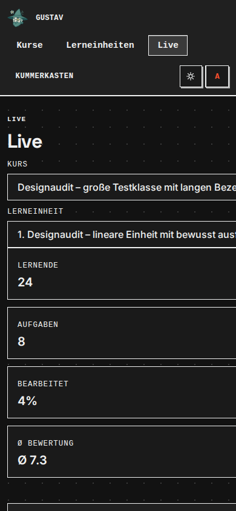

## Bestehende Befunde durch echte Folgezustände bestätigt

- **DS-27, Einladung:** Auch ein gültiger Klassenlink zeigt im Dark Mode fast weißen Text auf weißer Karte. Runde Pillenbuttons weichen zusätzlich von der GUSTAV-Aktionssprache ab. Registrierung und Kursbeitritt sind trotzdem möglich. Nach Widerruf des eigens erstellten Links erhält ein frischer Browserkontext korrekt die Meldung, dass die Einladung nicht mehr gültig ist. Kein bestehender Klassenlink wurde verändert.
- **DS-10/DS-28, Auth:** Registrierung, E-Mail-Verifikation, Passwort-Reset und verbrauchter Reset-Link zeigen mobil dieselben überbreiten Formulare beziehungsweise verschachtelten Karten. Der Test umfasst echte Mails und einen tatsächlichen Passwortwechsel ausschließlich am neu erstellten Auditkonto; eine anschließende neue Anmeldung mit diesem Passwort funktioniert. Der erneut benutzte Reset-Link wird serverseitig zurückgewiesen. Das ist ein Nachweis für einen **verbrauchten**, nicht für einen allein durch Zeitablauf verfallenen Token.
- **DS-14, H5P-Sprache:** Ein neuer Multiple-Choice-Inhalt wurde im eingebetteten Lehrkrafteditor erstellt und gespeichert. Lernendenseitig sind falsche Antwort, Auswertung, Wiederholung und korrekte Antwort tatsächlich geprüft. Die Standardtexte bleiben englisch („Check“, „Retry“, „Correct answer“). Mobile Darstellung in Light/Dark lesbar; Ergebnis nach abgeschlossener Aktualisierung 1/1. Dieser Inhalt zeigt gerade nicht das Miniaturproblem der DragQuestion aus DS-32. Keine neue H5P-Bibliothek installiert.
- **DS-02 und Aktionskonsistenz:** Die Mitgliedersuche funktioniert auch für den letzten Eintrag und ohne Treffer. Das helle stark gerundete Suchfeld und die unterschiedlichen Höhen von „Profil“ und „Entfernen“ bleiben im Dark Mode sichtbar. Aus einem fehlgeschlagenen exakten Automations-Locator wird kein zusätzlicher Accessibility-Fehler abgeleitet.
- **Sprachlicher Beratungspunkt:** Die fünf Datei-Rückmeldungen sprechen mit „Sie“, während die Oberfläche „Du“ verwendet. Der neu geprüfte KI-Dialog verwendet „Du“. Inhaltliche Qualität und DSPy-Optimierung wurden nicht verändert oder als Designreparatur bewertet.

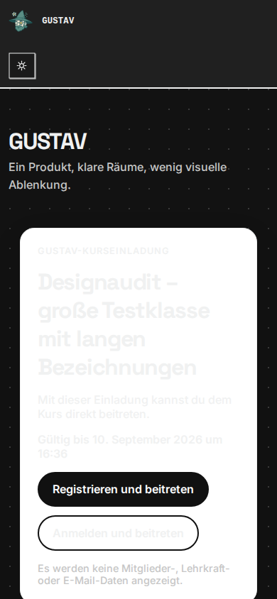

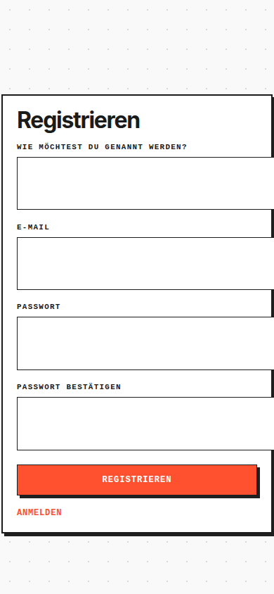

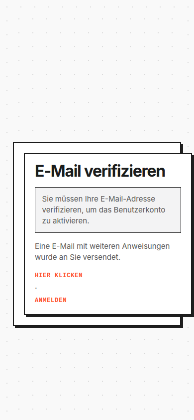

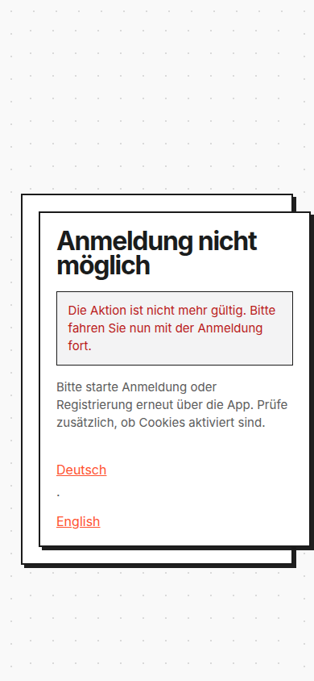

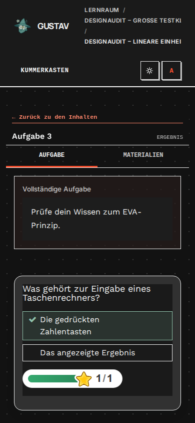

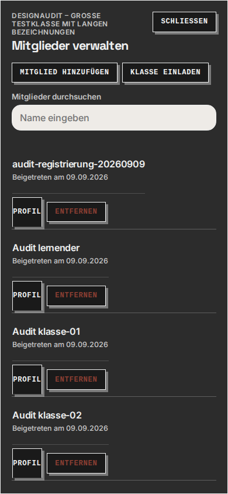

## Geschlossene lokale Prüflücken

| Ablauf | Tatsächlicher Nachweis | Einordnung |
| --- | --- | --- |
| Registrierung und Einladung | Klassenlink erzeugen, QR-Vollbild öffnen und per Escape schließen, über Link registrieren, lokale Verifikationsmail öffnen, Kursbeitritt erreichen | QR hatte messbare quadratische Zeichenfläche; kein physischer Kamerascan. Kein Versand von Klasseneinladungen über den externen Maildienst |
| Passwort-Reset | Lokale Reset-Mail, Passwortformular, Wechsel am neuen Testkonto, neue Anmeldung, Wiederverwendung des Links | Echte Erfolgs- und Fehlerzustände; bestehende Kontopasswörter unverändert |
| Scratch | Vorhandene echte SB3-Datei auswählen, hochladen, Rückmeldung erhalten, endgültig abgeben | Dark-Feedback mobil betrachtet; keine fachliche Vollabnahme des Parsers |
| Calliope | Vorhandene HEX-Datei auswählen, hochladen, Rückmeldung erhalten, endgültig abgeben | Wie oben, echte Dateiverarbeitung statt synthetischer Statusantwort |
| Filius | Vorhandene DNS-Testdatei auswählen, hochladen, Rückmeldung erhalten, endgültig abgeben | Wie oben; keine Änderung fremder Netzwerkdateien |
| Bild und PDF | GUSTAV-Logo sowie zuvor erzeugte fünfseitige Test-Druckfassung in getrennten Aufgaben hochladen, Rückmeldung erhalten, endgültig abgeben | Beide regulären Abgabewege tatsächlich abgeschlossen |
| KI-Dialog | Zwei echte Antworten, generierte Anschlussfragen, Rundengrenze, Abschlussantwort, endgültige Abgabe und Auswertung | Mobile Dark-Ansicht lesbar, keine manipulierten Modellantworten oder Datenbankzustände |
| H5P | Vorherige echte DragQuestion plus neu autoriertes Multiple Choice mit Fehler, Wiederholung und Erfolg | Zwei unterschiedliche reale Interaktionsfamilien; nicht alle angebotenen Hub-Bibliotheken abgenommen |
| Belegter Kummerkasten | Synthetischen anonymen Beitrag senden, als eigene Lehrkraft lesen, archivieren, wiederherstellen und erneut archivieren | Lesbare mobile Dark-Darstellung, kein externer Mailversand im geprüften Dienst |
| Lineare Einheit | Lehrkraftgraph, direkter Inhaltseditor, Lernenden-Inhaltsübersicht und Druck | DS-33/DS-34 dokumentieren die Abweichungen; kein vorgetäuschter erfolgreicher Normalweg zum Editor |
| Größere Klasse | 24 Lernende in Mitgliederverwaltung und Live; letzter Treffer, keine Treffer, letzte Tabellenzeile und Detail ohne Abgabe | Repräsentative dichte Liste, kein Leistungs-/Lasttest mit 24 gleichzeitig aktiven Lernenden |
| Bilddruck | Echtes Bildmaterial im Lehrkrafteditor hochladen, alle neun Inhalte auswählen, PDF herunterladen; beide Seiten rendern und betrachten | Bild vollständig, Umlaute/Titel lesbar, keine Überlagerung mit Fußzeilen. Die defekten winzigen Altfixtures waren kein allgemeiner Bilddruckfehler |

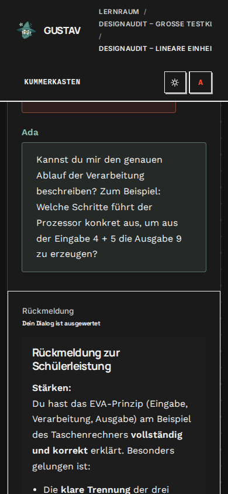

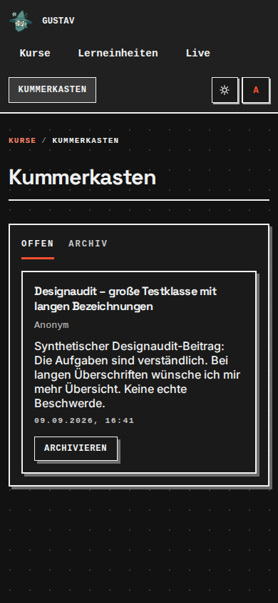

Die vorherigen Nachweise für Practice-Abschluss, Profil/Logout, Diagnostik, beide modularen Graphrollen und die übrigen Teaching-/Learning-Seiten bleiben gültige Bestandteile des Gesamtinventars. Sie wurden hier nicht unnötig erneut ausgeführt. Das PDF-Werkzeug bestimmte zusätzlich die gerenderte Sichtprüfung; die Beurteilung beruht nicht auf der KI-Rückmeldung zur PDF-Abgabe.

## Testzustand und Sicherheitsabschluss

- Eigene Zusatzlandschaft bleibt für spätere Reparaturtests erhalten. Fünf Datei-Abgaben endgültig abgeschlossen, KI-Dialog ausgewertet, Multiple Choice korrekt abgeschlossen; die übrige native Beispielaufgabe wurde nicht begonnen. Kein offener Abgabevorgang zurückgelassen.
- Synthetischer Kummerkastenbeitrag zuletzt archiviert, Test-Klassenlink widerrufen. Die 24 Mitgliedschaften bleiben bestehen. Keine alten Dev-Daten zurückgesetzt und keine bestehenden Inhalte umgewandelt.
- Temporärer Mailfänger empfing genau drei Nachrichten: synthetischer Empfangstest, Verifikationsmail und Reset-Mail. Kein Relay und keine externe Weiterleitung eingerichtet. Die vorherige Realm-SMTP-Konfiguration wurde privat gesichert und unmittelbar nach den Auth-Tests wiederhergestellt; sichtbare Konfigurationswerte wurden verglichen. Eine maskierte Passwortantwort wird nicht als ausgelesener Klartextnachweis ausgegeben. Der zusätzliche Mailfänger ist gestoppt.
- Browser geschlossen. Zugangsdaten, Testadressen, interne Kennungen, Einladungs-/Reset-Links und SMTP-Werte bleiben außerhalb öffentlicher Dokumente. Elf ausgewählte Bildnachweise tatsächlich betrachtet; kein QR-Code mit Beitrittsberechtigung veröffentlicht.
- Kein eigener Produktcode, API-Vertrag oder Schema verändert. Die parallel entstandene H5P-Reparatur wird nicht als eigene Arbeit ausgegeben. Kein Push.

## Abnahmegrenzen und nächster fachlicher Schritt

Die bisher durch fehlende **lokale Testdaten und Testmails** blockierten repräsentativen Untersuchungen sind erledigt. Für den Übergang zur Beratung der Designvereinheitlichung ist keine weitere allgemeine Bestandsaufnahme nötig. Offen sind die **Reparaturen** im Katalog, nicht ein weiterer pauschaler Rechercheauftrag.

Nicht als geprüft gelten ein echter IServ-Verbund ohne vorhandenen Einstieg/Zugang, physische Touchgeräte, Safari/Firefox, vollständige Screenreader-Konformität, jede H5P-Bibliothek und jede mögliche Graphgröße, künstliche Netz-/KI-Ausfälle oder ein vollständiger Sicherheitstest. Ein verbrauchter Reset-Link ersetzt keinen zeitgesteuerten Ablauf-Test. Diese Grenzen dürfen bei einer späteren plattformweiten Freigabe nicht übergangen werden; sie blockieren aber nicht die jetzt belegte Designberatung.

Priorität für diese Beratung: zuerst P1-Befunde (DS-26: Inhaltsverlust-Risiko im Editor; DS-34: linearer Navigationsweg), dann Kontrast und mobile Nutzbarkeit einschließlich Auth, Einladung, H5P-DragQuestion, Live und Diagnostik; danach gemeinsame Buttons, Felder, Dialoge und konsistente Beschriftungen. DSPy und Optimierung bleiben separat.

## Abschließende Repository-Prüfung

`make verify` erfolgreich, Exit 0: 3035 Backendtests bestanden, 33 übersprungen; 688 Frontendtests, acht Werkzeugtests und 67 H5P-Tests bestanden. Svelte-Prüfung ohne Fehler/Warnungen; Produktionsbuild erfolgreich mit den 16 ausdrücklich erlaubten bekannten Upstream-Hinweisen. Datenbank-Preflight, Architektur-/Importgrenzen, API-Vertrag, Inventare, Lieferkettenprüfung und Backend-Lint ebenfalls erfolgreich. Dieser Lauf bestätigt die technische Basis, nicht die Fehlerfreiheit der im Audit beanstandeten Oberflächen. Keine neue Feature-Implementierung und deshalb kein als Feature-Abnahme ausgegebener Browser-Gate-Lauf.

`git diff --check` erfolgreich; 55 lokale Dokument-/Bildverweise geprüft, anschließend nur Textkorrekturen und dieser Prüfvermerk ergänzt. Private Testmanifestdatei nachweislich ignoriert und mit Modus 0600 geschützt. Gestoppter Mailfänger zusätzlich lesend bestätigt. Die Auditdokumente und ihre Bildnachweise werden separat von Produktcode versioniert; kein Push.
