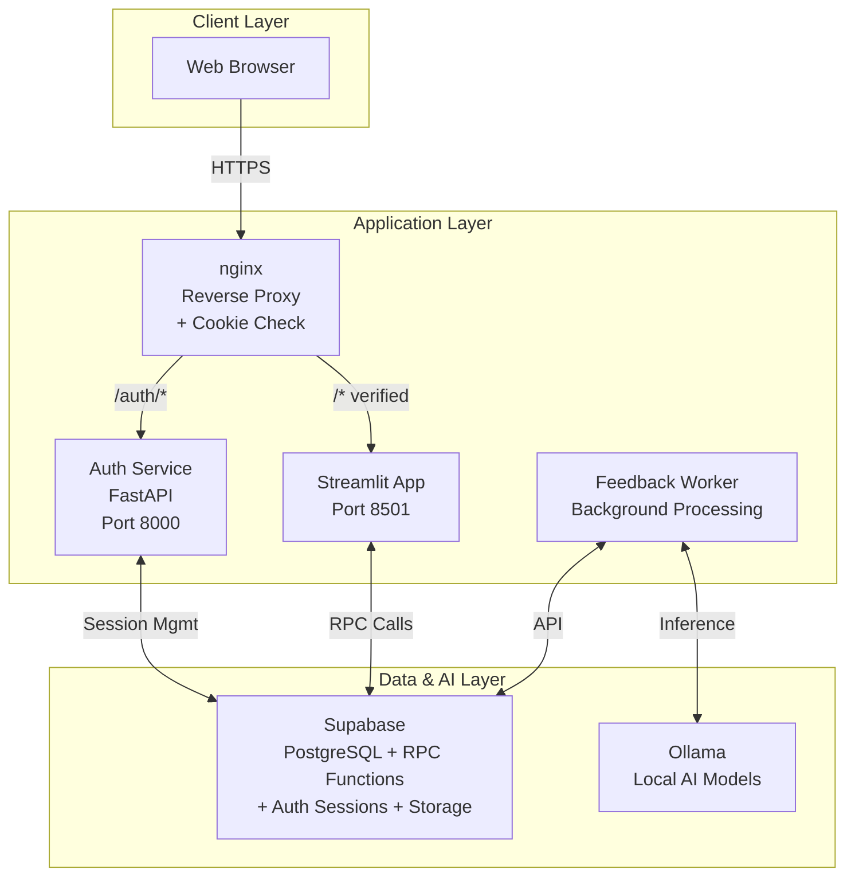
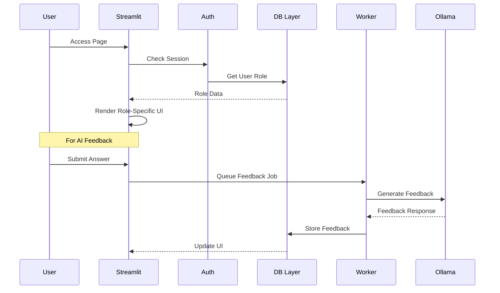
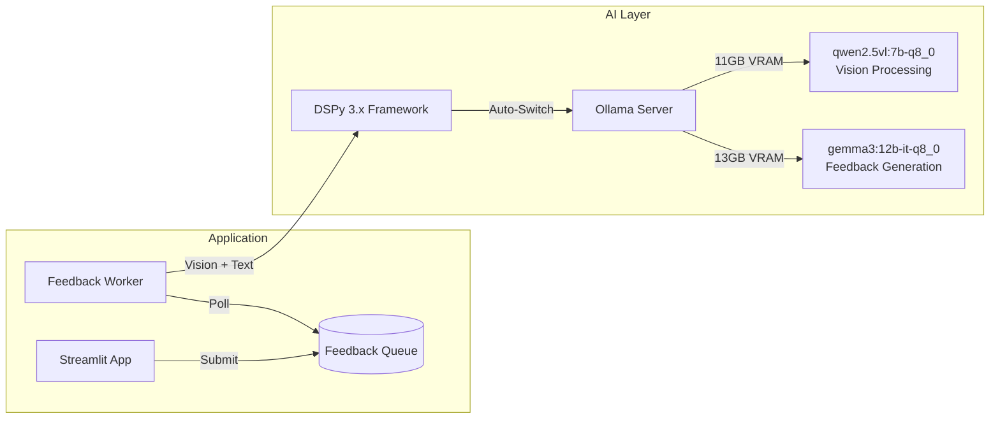
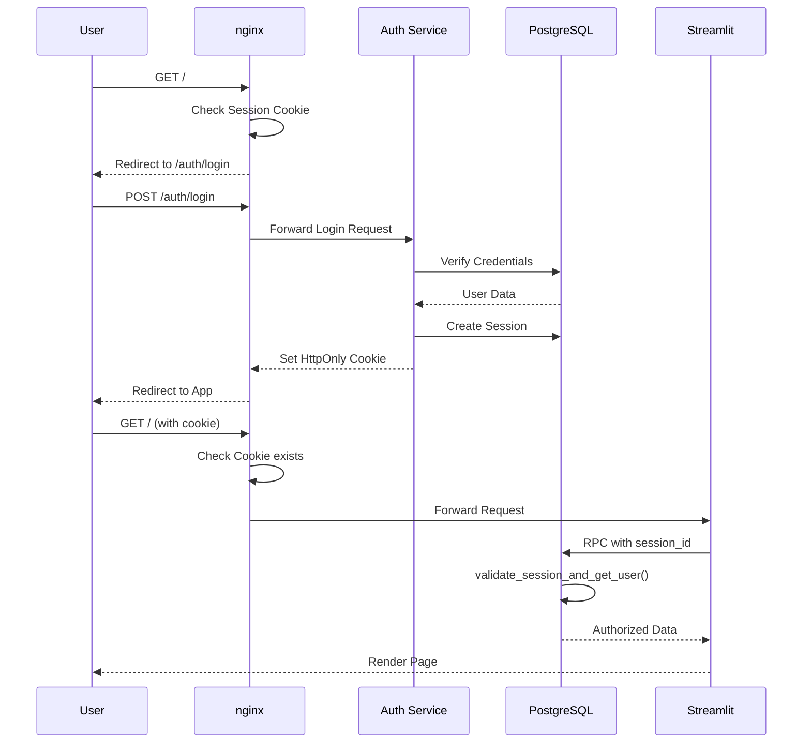
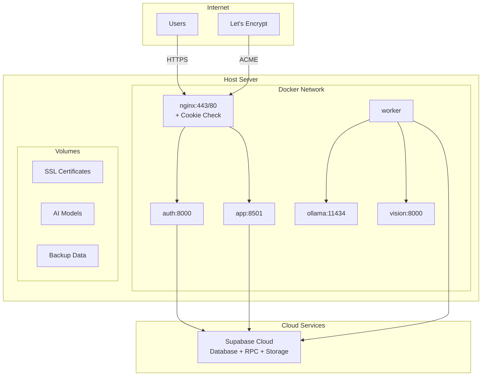
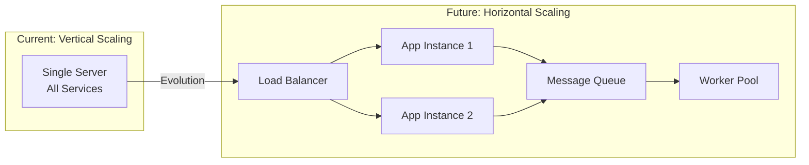
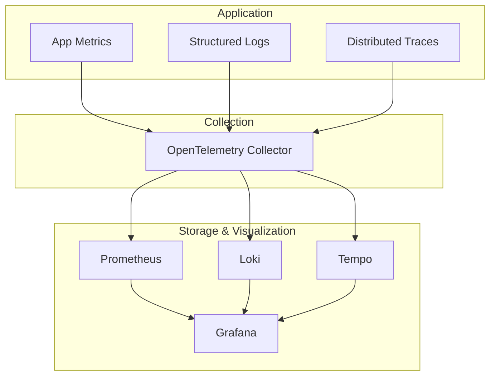

# GUSTAV Architecture Documentation

## Table of Contents
1. [Executive Summary](#executive-summary)
2. [System Overview](#system-overview)
3. [Technology Stack](#technology-stack)
4. [Component Architecture](#component-architecture)
5. [Data Model & Flows](#data-model--flows)
6. [AI Integration](#ai-integration)
7. [Security Architecture](#security-architecture)
8. [Deployment & Operations](#deployment--operations)
9. [Development & Testing](#development--testing)
10. [Performance & Scalability](#performance--scalability)
11. [Monitoring & Observability](#monitoring--observability)

---

## Executive Summary

**GUSTAV** (GUSTAV unterstützt Schüler tadellos als Vertretungslehrer) is an AI-powered learning platform designed for schools. It combines traditional course management with advanced features like:

- **Spaced Repetition Learning** (FSRS algorithm, "Wissensfestiger")
- **AI-Generated Feedback** (via local Ollama models and DSPy)
- **Multi-Role Support** (Teachers & Students)
- **Real-time Collaboration** (Live teaching mode)
- **Privacy-First Design** (GDPR/DSGVO compliant)

The platform is production-ready, actively used in schools, and designed for open-source collaboration.

---

## System Overview

### High-Level Architecture



### Key Design Principles

1. **Domain-Driven Design**: Separate tables for Regular Tasks (`regular_tasks`) and Mastery Tasks (`mastery_tasks`) with shared base (`task_base`)
2. **Component-Based Architecture**: Reusable UI components in `app/components/`
3. **Role-Based Access Control**: Teacher vs Student experiences
4. **Session-Based Security**: HttpOnly cookies with PostgreSQL session store
5. **Database-Level Authorization**: All data access through session-validated RPC functions
6. **Asynchronous Processing**: Background workers for heavy AI tasks
7. **Progressive Enhancement**: Core functionality works without JavaScript
8. **Zero-Downtime Migrations**: Views provide backward compatibility during schema evolution

---

## Technology Stack

### Frontend
- **Framework**: Streamlit 1.33+ (Python-based web UI)
- **Visualization**: Plotly for interactive charts
- **Styling**: Custom CSS via Streamlit theming

### Backend
- **Runtime**: Python 3.10+ (Docker), 3.12+ (development)
- **Web Framework**: Streamlit (main app), FastAPI (auth service)
- **Database**: PostgreSQL 17 (via Supabase)
- **Database Access**: PostgreSQL RPC Functions with session validation
- **Authentication**: HttpOnly Cookies with PostgreSQL session store
- **Session Management**: Auth Service (FastAPI) with CSRF protection
- **File Storage**: Supabase Storage (S3-compatible)
- **Background Jobs**: Custom worker with threading

### AI/ML
- **Model Server**: Ollama (local inference with automatic model switching)
- **Vision Models**: qwen2.5vl:7b-q8_0 (German handwriting recognition)
- **Text Models**: gemma3:12b-it-q8_0 (feedback generation)
- **Framework**: DSPy 3.x (native vision API with structured prompting)
- **GPU Support**: AMD ROCm (11GB VRAM optimization)

### Infrastructure
- **Containerization**: Docker & Docker Compose
- **Reverse Proxy**: nginx with SSL/TLS + Cookie-based routing
- **SSL Certificates**: Let's Encrypt (auto-renewal)
- **Development**: Local Supabase instance
- **Production Security**: Rate limiting, CSRF protection, secure headers

### Algorithms
- **Spaced Repetition**: FSRS (Free Spaced Repetition Scheduler)
- **Custom Algorithm**: Athena 2.0 (stability/difficulty based)

---

## Component Architecture

### Directory Structure

```
app/
├── components/          # Reusable UI components
├── pages/              # Streamlit pages (role-based)
├── utils/              # Business logic & DB layer
├── ai/                 # AI integration
├── workers/            # Background processing
├── mastery/            # Spaced repetition config
└── tests/              # Test suite
```

### Core Components

#### 1. **Authentication & Session Management**
- **Auth Service**: `auth_service/` - FastAPI-based authentication service
  - **Page Routes** (HTML forms with CSRF):
    - GET/POST `/auth/login` - Login page
    - GET/POST `/auth/register` - Registration page  
    - GET `/auth/logout` - Logout endpoint
    - GET/POST `/auth/forgot-password` - Password reset request
    - GET/POST `/auth/reset-password` - Password reset with OTP
  - **API Routes** (JSON responses):
    - POST `/auth/api/login` - API login endpoint
    - POST `/auth/api/logout` - API logout endpoint
    - POST `/auth/api/refresh` - Session refresh
    - GET `/auth/api/session/info` - Session information
  - **Session Routes**:
    - GET `/auth/session/me` - Current user info
    - GET `/auth/session/validate` - Session validation
  - **Data Proxy Routes** (authenticated data access):
    - GET `/auth/data/courses` - User's courses
    - GET `/auth/data/courses/{id}/units` - Course units
    - GET `/auth/data/user/progress` - Learning progress
    - GET `/auth/data/user/profile` - User profile
  - **Health Check Routes**:
    - GET `/auth/health` - Service health
    - GET `/auth/health/ready` - Readiness probe
    - GET `/auth/health/live` - Liveness probe
- **Main App Integration**: `app/auth.py`, `app/utils/auth_integration.py`
- **Features**: 
  - 90-minute session timeouts (optimized for school lessons)
  - HttpOnly cookies (no JavaScript access)
  - PostgreSQL session persistence (auth_sessions table)
  - CSRF protection (Double Submit Cookie)
  - OTP-based password reset (6-digit codes)
  - Domain-restricted registration (@gymalf.de)
  - Rate limiting on login endpoints

#### 2. **Database Abstraction Layer** 
- **Directory**: `app/utils/db/` (modularized from 3117-line db_queries.py)
- **Structure**: Hybrid Domain-Driven Design with 5 main areas:
  - `core/` (5 functions): Base functionality (session, auth)
  - `courses/` (18 functions): Course management (enrollment, management)
  - `content/` (24 functions): Learning content (units, sections, tasks)
  - `learning/` (21 functions): Learning process (submissions, progress, mastery)
  - `platform/` (2 functions): Platform features (feedback)
- **Migration Status**: 70 total functions, 59 migrated to PostgreSQL RPC
- **RPC Pattern**: 
  ```python
  # Python wrapper example
  def get_courses_for_user():
      session_id = get_session_id()
      result = client.rpc('get_user_courses', {
          'p_session_id': session_id
      }).execute()
      return handle_rpc_result(result)
  ```
- **Features**: 
  - All database access through session-validated RPC functions
  - validate_session_and_get_user() enforces authentication
  - Automatic RLS through user context setting
  - Batch operations support
  - Task-Type-Trennung Views integration
- **Migration Batches** (59 RPC functions):
  - Batch 1: Simple READ operations (10 functions)
  - Batch 2: User/Course management (10 functions)
  - Batch 3: Task CRUD operations (10 functions)
  - Batch 4: Submission system (10 functions)
  - Batch 5: Complex queries & matrix (10 functions)
  - Batch 6: Mastery & feedback system (9 functions)
- **Non-RPC Functions** (11 remaining):
  - Local utility functions
  - Cache management
  - Helper functions without direct DB access

#### 3. **Session Client Architecture**
- **File**: `app/utils/session_client.py`
- **Purpose**: Manages anonymous Supabase clients for RPC calls
- **HttpOnly Mode**: Bypasses user authentication, relies on RPC session validation
- **Benefits**: Clean separation between auth and data access

#### 4. **DateTime Utilities**
- **File**: `app/utils/datetime_helpers.py`
- **Purpose**: Consistent ISO datetime parsing across codebase
- **Features**: 
  - Robust microseconds normalization (handles variable-length microseconds from Supabase)
  - German locale formatting
  - Z-timezone conversion to +00:00 format
  - Comprehensive error handling

#### 5. **UI Component Library**
- **Directory**: `app/components/`
- **Key Components**:
  - `course_*.py`: Course management UI
  - `ui_components.py`: Extended sidebar navigation with section selection (2025-09-03)
  - `mastery_progress.py`: Spaced repetition visualization
  - `detail_editor.py`: Material/task editing with Task-Type-Trennung support
- **Recent Updates (2025-09-03)**:
  - `structure_tree.py`: **REMOVED** - Functionality integrated into sidebar
  - Extended sidebar with expandable section navigation and "⚡ Auswählen" buttons
  - Quick Actions Bar for context-sensitive content creation
  - Separate editors for Regular Tasks and Mastery Tasks

#### 6. **Page Router**
- **Directory**: `app/pages/`
- **Pattern**: Number-prefixed files for ordering
- **Role-Based**: Different pages for teachers vs students

### Component Interaction Flow



---

## Data Model & Flows

### Core Database Schema

```mermaid
erDiagram
    profiles ||--o{ auth_sessions : has
    profiles ||--o{ course_student : enrolls
    profiles ||--o{ course_teacher : teaches
    profiles ||--o{ submissions : creates
    courses ||--o{ course_student : has_students
    courses ||--o{ course_teacher : has_teachers
    courses ||--o{ course_learning_unit_assignment : uses
    learning_unit ||--o{ course_learning_unit_assignment : assigned_to
    learning_unit ||--o{ unit_section : contains
    unit_section ||--o{ course_unit_section_status : has_status
    
    %% Task-Type-Trennung (Domain-Driven Design)
    task_base ||--o{ regular_tasks : extends
    task_base ||--o{ mastery_tasks : extends
    task_base ||--o{ submissions : receives
    mastery_tasks ||--o{ mastery_states : tracks
    regular_tasks ||--o{ submissions : limits_attempts
    submissions ||--o{ feedback : generates
    
    profiles {
        uuid id PK
        string email
        string full_name
        string role
    }
    
    auth_sessions {
        uuid id PK
        string session_id UK
        uuid user_id FK
        string user_email
        string user_role
        jsonb data
        timestamp expires_at
        timestamp last_activity
        timestamp created_at
        inet ip_address
        string user_agent
    }
    
    courses {
        uuid id PK
        string name
        uuid creator_id FK
        timestamp created_at
    }
    
    course_student {
        uuid id PK
        uuid course_id FK
        uuid student_id FK
        timestamp created_at
    }
    
    course_teacher {
        uuid id PK
        uuid course_id FK
        uuid teacher_id FK
        timestamp created_at
    }
    
    learning_unit {
        uuid id PK
        string name
        string description
        uuid creator_id FK
        timestamp created_at
    }
    
    course_learning_unit_assignment {
        uuid id PK
        uuid course_id FK
        uuid unit_id FK
        int order_index
        timestamp created_at
    }
    
    unit_section {
        uuid id PK
        uuid unit_id FK
        string name
        string description
        text materials
        int order_in_unit
        timestamp created_at
    }
    
    course_unit_section_status {
        uuid id PK
        uuid course_id FK
        uuid section_id FK
        bool is_published
        timestamp published_at
    }
    
    task_base {
        uuid id PK
        uuid section_id FK
        string title
        string task_type
        int order_in_section
        timestamp created_at
        timestamp updated_at
    }
    
    regular_tasks {
        uuid task_id PK FK
        text prompt
        int max_attempts
        jsonb grading_criteria
    }
    
    mastery_tasks {
        uuid task_id PK FK
        text prompt
        string difficulty_level
        text concept_explanation
    }
    
    mastery_states {
        uuid student_id FK
        uuid task_id FK
        float difficulty
        float stability
        timestamp next_due_date
        timestamp last_reviewed_at
    }
```

### Key Data Flows

#### 1. **Authentication Flow**
```
Browser → nginx → Auth Service → Supabase Auth → PostgreSQL Session → HttpOnly Cookie
```

#### 2. **Database Access Flow (RPC)**
```
Streamlit → Session ID → RPC Function → validate_session_and_get_user() → Authorized Query → Result
```

#### 3. **File Upload Flow**
```
File Selection → Streamlit Upload → Supabase Storage → Public URL → Database Reference
```

#### 4. **AI Feedback Flow**
```
Answer Submission → Queue Entry → Worker Pickup → Ollama Processing → Feedback Storage → UI Update
```

#### 5. **Mastery/Spaced Repetition Flow**
```
Task Completion → FSRS Calculation → Next Review Date → Daily Task List → Review Prompt
```

---

## AI Integration

### Architecture Overview



### Key Components

#### 1. **Vision Processing & Feedback Generation**
- **Vision Pipeline**: `app/ai/vision_processor.py`
- **Framework**: DSPy 3.x with native vision API
- **Models**: 
  - qwen2.5vl:7b-q8_0 for handwriting recognition (German optimized)
  - gemma3:12b-it-q8_0 for text feedback generation
- **Features**:
  - Multi-format support (JPG, PNG, PDF)
  - PDF-to-image conversion with PyMuPDF
  - Context-aware feedback with vision understanding
  - Automatic model switching and VRAM management
  - Multi-language support (German primary)
- **Performance**: 15-20s vision processing, 2200+ characters accuracy

#### 2. **Worker Architecture**
- **File**: `app/workers/feedback_worker.py`
- **Pattern**: Queue-based async processing
- **Features**:
  - Retry with exponential backoff
  - Health checks
  - Graceful shutdown
  - Error logging

#### 3. **Timeout Handling**
- **File**: `app/ai/timeout_wrapper.py`
- **Purpose**: Prevent AI calls from blocking
- **Default**: 30-second timeout

### Multi-Model Configuration
- **Vision Model**: qwen2.5vl:7b-q8_0 (7B parameters, Q8_0 quantized, 11GB VRAM)
- **Text Model**: gemma3:12b-it-q8_0 (12B parameters, Instruct-Tuned, Q8_0 quantized, 13GB VRAM)
- **Deployment**: Local via Ollama with automatic model switching
- **Hardware**: AMD GPU (ROCm) with 16GB VRAM constraint
- **Optimization**: GPU offloading (48/49 layers), automatic VRAM management
- **Fallback**: CPU inference if GPU unavailable (significantly slower)

---

## Security Architecture

### Multi-Layer Security Model

```mermaid
graph TD
    subgraph "Layer 0: HttpOnly Cookies"
        Cookie[Session Cookie<br/>httpOnly, secure, sameSite=lax<br/>90min timeout]
    end
    
    subgraph "Layer 1: CSRF Protection"
        CSRF[Double Submit Cookie<br/>+ Form Token Validation<br/>secure=false for proxy]
    end
    
    subgraph "Layer 2: Session Management"
        Session[PostgreSQL Session Store<br/>auth_sessions table<br/>+ Cookie existence check]
    end
    
    subgraph "Layer 3: Database Authorization"
        RPC[RPC Functions with<br/>validate_session_and_get_user()<br/>Row Level Security]
    end
    
    subgraph "Layer 4: Application"
        Val[Input Validation]
        San[Output Sanitization]
        RBAC[Role-Based Access]
    end
    
    Cookie --> CSRF
    CSRF --> Session
    Session --> RPC
    RPC --> Val
    Val --> San
    San --> RBAC
```

### Security Features

1. **Authentication & Session Management**
   - HttpOnly cookies prevent JavaScript access to sessions
   - PostgreSQL-based session store (auth_sessions table)
   - Session validation on every request via nginx Lua
   - 90-minute session timeout (optimized for school lessons)
   - Automatic session regeneration on privilege changes
   - OTP-based password reset (6-digit codes, 15min validity)

2. **CSRF Protection**
   - Double Submit Cookie pattern
   - Form tokens validated on state-changing operations
   - CSRF cookies use secure=false for nginx proxy compatibility
   - SameSite=lax prevents cross-origin attacks

3. **Database Security**
   - All data access through RPC functions with session validation
   - validate_session_and_get_user() enforces authentication
   - Row Level Security (RLS) based on session user context
   - Parameterized queries prevent SQL injection
   - Function-level access control (teacher vs student)

4. **File Security**
   - File type validation (Extension + Magic Number Check)
   - Path traversal protection (sanitize_filename)
   - Size limits (50MB default)
   - Server-side rate limiting (10 uploads/hour, 50MB/hour per user)
   - Secure storage URLs with session validation

5. **Network Security**
   - HTTPS enforced via nginx
   - SSL/TLS with Let's Encrypt (auto-renewal)
   - Security headers (X-Frame-Options, X-Content-Type-Options)
   - Rate limiting on authentication endpoints
   - nginx cookie-based routing (redirect to /auth/login if no session cookie)

6. **Privacy & Compliance**
   - GDPR/DSGVO compliant design
   - No third-party tracking
   - Data minimization principle
   - Right to deletion implemented
   - Domain-restricted registration (@gymalf.de)

### Authentication Flow



### Known Security Considerations
See `SECURITY.md` for detailed security policies and known vulnerabilities.

---

## Deployment & Operations

### Production Architecture



### Deployment Process

1. **Prerequisites**
   ```bash
   # Required: Docker, Docker Compose, Git
   # Optional: AMD GPU with ROCm support
   ```

2. **Environment Configuration**
   ```bash
   cp .env.example .env
   # Edit .env with Supabase credentials
   ```

3. **Container Orchestration**
   ```bash
   docker-compose up -d
   ```

4. **SSL Setup**
   - Automatic via Let's Encrypt
   - Renewal handled by certbot service

5. **Auth Service Configuration**
   ```bash
   # Required environment variables
   ENVIRONMENT=production
   COOKIE_DOMAIN=your-domain.com
   COOKIE_SECURE=true
   SESSION_SECRET=your-secret-key
   ```

### Backup Strategy

- **Database**: Daily exports via Supabase
- **Files**: Storage bucket snapshots
- **Configuration**: Git repository
- **Retention**: 30 days rolling

### Monitoring

- **Application Logs**: Docker logs aggregation
- **Health Checks**: Worker status endpoint
- **Metrics**: Planned Prometheus integration
- **Alerts**: Email notifications for errors

---

## Development & Testing

### Development Setup

1. **Local Environment**
   ```bash
   # Python virtual environment
   python -m venv venv
   source venv/bin/activate  # or `venv\Scripts\activate` on Windows
   pip install -r app/requirements.txt
   
   # Local Supabase
   supabase start
   ```

2. **Code Standards**
   - Formatter: Ruff
   - Linter: Ruff
   - Type Checker: mypy (planned)
   - See `CODESTYLE.md` for details

3. **Testing Strategy**
   ```bash
   # Unit tests
   pytest app/tests/
   
   # Integration tests
   pytest app/tests/integration/ --integration
   
   # E2E tests (planned)
   playwright test
   ```

### Development Workflow

1. **Feature Development**
   - Create feature branch
   - Write tests first (TDD encouraged)
   - Implement feature
   - Update documentation
   - Submit PR

2. **Code Review Process**
   - Automated checks (lint, test)
   - Security review for auth/data changes
   - Performance impact assessment
   - Documentation completeness

3. **Release Process**
   - Semantic versioning
   - CHANGELOG.md updates
   - Database migration testing
   - Staged rollout (dev → staging → prod)

---

## Performance & Scalability

### Current Performance Characteristics

- **Concurrent Users**: 30+ tested successfully
- **Response Time**: <500ms for most operations
- **AI Feedback**: 2-10s depending on complexity
- **File Upload**: 50MB limit, chunked transfer

### Optimization Strategies

1. **Database**
   - Indexed foreign keys
   - Materialized views for reports
   - Connection pooling
   - Query optimization (prevent N+1)

2. **Caching**
   - `CacheManager` for expensive queries
   - Session state caching
   - Static asset caching via nginx

3. **Async Processing**
   - Background worker for AI tasks
   - Queue-based architecture
   - Prevents UI blocking

### Scalability Considerations



### Bottlenecks & Solutions

1. **AI Inference**
   - Current: Single Ollama instance
   - Solution: Multiple GPU nodes with load balancing

2. **Database Connections**
   - Current: Direct connections
   - Solution: PgBouncer for connection pooling

3. **File Storage**
   - Current: Supabase Storage
   - Solution: CDN for static content

---

## Monitoring & Observability

### Current Implementation

1. **Logging**
   ```python
   # Structured logging throughout
   logger.info("action", extra={"user_id": user_id, "course_id": course_id})
   ```

2. **Health Checks**
   - Worker health endpoint
   - Database connectivity check
   - Ollama availability check

3. **Error Tracking**
   - Exception logging with context
   - User-friendly error messages
   - Admin error notifications

### Planned Enhancements



### Key Metrics

1. **Application Metrics**
   - Request rate/latency
   - Active users
   - Task completion rate
   - AI feedback generation time
   - Session creation/validation rate

2. **Security Metrics**
   - Failed login attempts
   - CSRF validation failures
   - Session timeout events
   - Unauthorized access attempts
   - Rate limit violations

3. **Business Metrics**
   - Course engagement
   - Mastery progression
   - Feedback quality scores
   - User retention

4. **Infrastructure Metrics**
   - CPU/Memory usage
   - Database connections
   - Queue depth
   - Model inference time
   - Auth service response time

---

## Contributing

### Getting Started

1. **Read Documentation**
   - This ARCHITECTURE.md
   - CODESTYLE.md for coding standards
   - SECURITY.md for security guidelines
   - CLAUDE.md for AI assistant guidelines

2. **Setup Development Environment**
   - Fork repository
   - Clone locally
   - Install dependencies
   - Run tests

3. **Find Issues**
   - Check GitHub Issues
   - Look for "good first issue" labels
   - Review ROADMAP.md for planned features

### Architecture Decision Records (ADRs)

Major architectural decisions are documented in `docs/rfcs/`:
- Technology choices
- Design patterns
- Trade-offs considered
- Migration strategies

### Contact & Support

- **Issues**: GitHub Issues
- **Discussions**: GitHub Discussions
- **Security**: See SECURITY.md for vulnerability reporting

---

## Appendix

### Useful Commands

```bash
# Development
streamlit run app/main.py
python -m pytest app/tests/

# Docker Operations
docker-compose logs -f app
docker-compose exec app bash
docker-compose restart feedback_worker

# Database
supabase db reset
supabase migration new <name>

# AI Model Management
docker exec gustav-ollama ollama pull gemma3:2b
```

### Environment Variables

See `app/config.py` for required environment variables:
- `SUPABASE_URL`: Supabase project URL
- `SUPABASE_ANON_KEY`: Public anonymous key
- `OLLAMA_BASE_URL`: Ollama server endpoint

### Performance Profiling

```python
# Add to any Streamlit page for profiling
import cProfile
import pstats

profiler = cProfile.Profile()
profiler.enable()
# ... code to profile ...
profiler.disable()
stats = pstats.Stats(profiler).sort_stats('cumulative')
stats.print_stats(20)
```
