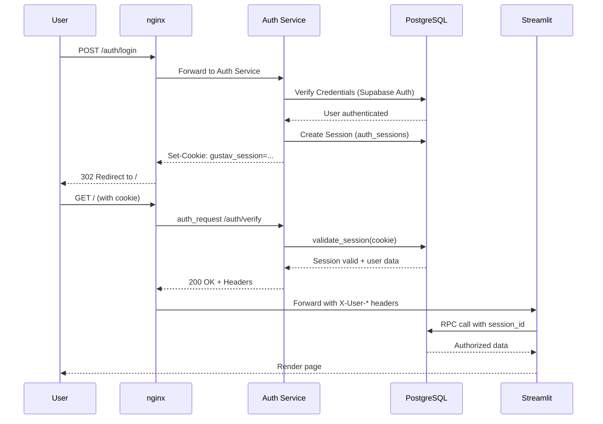

# SECURITY.md · Sicherheitsrichtlinien und Best Practices

## 1) Security Policy & Vulnerability Reporting

### Melden von Sicherheitslücken
**WICHTIG:** Bitte melden Sie Sicherheitslücken **NICHT** öffentlich via GitHub Issues!

**Kontakt:** security@gustav-lms.org (PGP-Key auf Anfrage)  
**Response Time:** 
- Erste Antwort: 24 Stunden
- Status-Update: 7 Tage
- Patch/Mitigation: 30 Tage (kritisch: 7 Tage)

### Unterstützte Versionen
| Version | Security Support |
|---------|-----------------|
| 1.x     | ✅ Aktiv        |
| 0.x     | ❌ End of Life  |

### Disclosure Process
1. Privatmeldung an Security-Team
2. Bestätigung & CVE-Vergabe (falls relevant)
3. Patch-Entwicklung
4. Koordinierte Veröffentlichung
5. Credit für Reporter (optional)

---

## 2) Sicherheitsprinzipien

### Grundlegende Prinzipien
- **Least Privilege:** Minimale Rechte für maximale Sicherheit
- **Defense in Depth:** Mehrschichtige Sicherheitsmaßnahmen
- **Zero Trust:** Verifiziere alles, vertraue niemandem
- **Fail Secure:** Im Fehlerfall sicher (deny by default)
- **Privacy by Design:** Datenschutz von Anfang an (GDPR/DSGVO)

### Spezifisch für Bildungskontext
- **Schülerdatenschutz:** Besondere Sorgfalt bei Minderjährigen
- **Transparenz:** Klare Kommunikation über Datennutzung
- **Elternrechte:** Auskunft und Löschung gewährleisten

---

## 3) Authentication & Authorization

### Supabase Auth Integration
```sql
-- Row Level Security (RLS) als primäre Verteidigungslinie
CREATE POLICY "Lehrer sehen nur eigene Kurse" ON courses
  FOR SELECT USING (
    auth.uid() IN (
      SELECT teacher_id FROM course_teachers WHERE course_id = courses.id
    )
  );
```

### Rollen-System
- **student:** Zugriff auf eigene Kurse/Aufgaben
- **teacher:** Verwaltung eigener Kurse/Schüler
- **admin:** Systemweite Verwaltung (future)

### Session Management
- **Session-Timeout: 90 Minuten** (Unterrichtsstunden-optimiert)
- **Encrypted LocalStorage**: AES-256 Fernet-Verschlüsselung für Session-Persistenz
- **CSRF-Protection**: Token-Validierung bei allen Session-Operationen
- **Automatic Token-Refresh**: JWT-Tokens werden transparent erneuert
- Refresh-Token Rotation (Supabase-standard)
- **Geplant für Phase 2**: HttpOnly Cookies (HttpOnly, Secure, SameSite)

### Geplante Erweiterungen
- [ ] Multi-Factor Authentication (MFA)
- [ ] Single Sign-On (SSO) für Schulen
- [ ] Passwordless Authentication

---

## 4) Data Protection & Privacy

### Schülerdaten (PII) Handling
```python
# NIEMALS loggen oder in Fehlermeldungen ausgeben:
# - E-Mail-Adressen
# - Namen
# - Geburtsdaten
# - Bewertungen
# - IP-Adressen (nur gehasht)

# Stattdessen: Anonymisierte IDs
from app.utils.security import security_log, hash_id

# ✅ RICHTIG:
security_log("Student action", student_id=user.id, course_id=course.id)
# Automatisch gehasht zu: {"student_id_hash": "a3f2b8c1", "course_id_hash": "d9e7f4a2"}

# ❌ FALSCH:
logger.info(f"Student {user.email} accessed course {course.name}")
```

### Verschlüsselung
- **At Rest:** Supabase PostgreSQL mit Encryption
- **In Transit:** TLS 1.3+ enforced
- **Backups:** Verschlüsselt mit separaten Keys

### GDPR/DSGVO Compliance
- **Recht auf Auskunft:** Export-Funktion für Nutzerdaten
- **Recht auf Löschung:** Soft-Delete mit Hard-Delete nach 30 Tagen
- **Datenminimierung:** Nur notwendige Daten erfassen
- **Zweckbindung:** Daten nur für Bildungszwecke

### Aufbewahrungsfristen
- Aktive Schülerdaten: Bis Kursende + 1 Jahr
- Inaktive Accounts: Löschung nach 2 Jahren
- Backup-Retention: 30 Tage
- Logs: 90 Tage (ohne PII)

---

## 5) Input Validation & Sanitization

### SQL Injection Prevention
```python
# ✅ GOOD: Parametrisierte Queries (Supabase)
response = supabase.table("courses").select("*").eq("id", course_id).execute()

# ❌ BAD: String Concatenation
query = f"SELECT * FROM courses WHERE id = '{course_id}'"  # NIEMALS!
```

### XSS Prevention
- Streamlit escaped automatisch HTML
- Bei Custom Components: `html.escape()`
- Content Security Policy (CSP) Headers

### File Upload Security
```python
ALLOWED_EXTENSIONS = {'.pdf', '.jpg', '.png', '.docx'}
MAX_FILE_SIZE = 10 * 1024 * 1024  # 10MB

def validate_upload(file):
    # Prüfe Dateiendung
    if not any(file.name.endswith(ext) for ext in ALLOWED_EXTENSIONS):
        raise ValueError("Unerlaubter Dateityp")
    
    # Prüfe Dateigröße
    if file.size > MAX_FILE_SIZE:
        raise ValueError("Datei zu groß")
    
    # Prüfe MIME-Type (zusätzliche Sicherheit)
    mime = magic.from_buffer(file.read(1024), mime=True)
    if mime not in ALLOWED_MIMES:
        raise ValueError("Ungültiger Dateityp")
```

### Rate Limiting
- API: 100 Requests/Minute per User
- Login: 5 Versuche, dann 15 Min Sperre
- File Upload: 10 Uploads/Stunde

---

## 6) Secrets Management

### Environment Variables
```bash
# .env.example (ins Repo)
SUPABASE_URL=https://your-project.supabase.co
SUPABASE_ANON_KEY=your-anon-key
OLLAMA_BASE_URL=http://localhost:11434

# .env (NIEMALS ins Repo!)
SUPABASE_SERVICE_ROLE_KEY=your-secret-service-key
```

### Key Hierarchy
1. **Anon Key:** Öffentlich, für Frontend
2. **Service Role Key:** Geheim, nur Backend
3. **JWT Secret:** Rotation alle 90 Tage
4. **Encryption Keys:** Separate Keys für Backups

### Rotation Policy
- Service Keys: Alle 90 Tage
- API Keys: Alle 180 Tage
- Passwords: Erzwinge Änderung alle 180 Tage (Lehrer)

---

## 7) API Security

### PostgreSQL RPC Functions mit Session Validation
```sql
-- Alle Datenzugriffe über session-validierte RPC Functions
CREATE FUNCTION submit_task_answer(
    p_session_id TEXT,
    p_task_id UUID,
    p_answer TEXT
)
RETURNS JSON
LANGUAGE plpgsql
SECURITY DEFINER
AS $$
DECLARE
    v_user_record JSON;
    v_submission_id UUID;
BEGIN
    -- Session validation (setzt User Context)
    v_user_record := validate_session_and_get_user(p_session_id);
    IF v_user_record IS NULL THEN
        RAISE EXCEPTION 'Unauthorized';
    END IF;
    
    -- Business logic mit automatischer User-Zuordnung
    INSERT INTO submissions (task_id, student_id, answer_text)
    VALUES (p_task_id, (v_user_record->>'user_id')::UUID, p_answer)
    RETURNING id INTO v_submission_id;
    
    RETURN json_build_object('success', true, 'submission_id', v_submission_id);
END;
$$;
```

### RLS als Secondary Defense
```sql
-- Jede Tabelle hat zusätzlich RLS aktiviert
ALTER TABLE student_submissions ENABLE ROW LEVEL SECURITY;

-- Policies nutzen den gesetzten User Context
CREATE POLICY "Students see own submissions" ON student_submissions
  FOR SELECT USING (student_id = current_setting('app.user_id')::UUID);
```

### API Gateway Security
- Rate Limiting per IP und User
- API Key Validation
- Request Size Limits (10MB)
- Timeout: 30 Sekunden

### CORS Configuration
```python
# Nur erlaubte Origins
ALLOWED_ORIGINS = [
    "https://gustav-lms.org",
    "https://app.gustav-lms.org"
]
# Entwicklung: localhost erlaubt
```

---

## 8) Infrastructure Security

### Docker Security
```dockerfile
# Non-root User
USER app:app

# Minimales Base Image
FROM python:3.12-slim

# Security Updates
RUN apt-get update && apt-get upgrade -y

# Read-only Filesystem (wo möglich)
VOLUME ["/tmp", "/var/log"]
```

### nginx Configuration (Production-Ready)
```nginx
# Security Headers (aus default.conf)
add_header Strict-Transport-Security "max-age=63072000; includeSubDomains; preload" always;
add_header X-Frame-Options "DENY" always;
add_header X-Content-Type-Options "nosniff" always;
add_header X-XSS-Protection "1; mode=block" always;
add_header Referrer-Policy "no-referrer-when-downgrade" always;
add_header Content-Security-Policy "default-src 'self' https:; script-src 'self' 'unsafe-inline' 'unsafe-eval' cdn.jsdelivr.net; style-src 'self' 'unsafe-inline'; img-src 'self' data: blob: https:; font-src 'self' data:; connect-src 'self' ws: wss: https:; frame-src 'self'; object-src 'none'; base-uri 'self'; form-action 'self';" always;
add_header Permissions-Policy "camera=(), microphone=(), geolocation=()" always;

# SSL/TLS Best Practices
ssl_protocols TLSv1.2 TLSv1.3;
ssl_ciphers 'ECDHE-ECDSA-AES128-GCM-SHA256:ECDHE-RSA-AES128-GCM-SHA256:ECDHE-ECDSA-AES256-GCM-SHA384:ECDHE-RSA-AES256-GCM-SHA384';
ssl_prefer_server_ciphers off;
ssl_session_timeout 1d;
ssl_session_cache shared:SSL:50m;
ssl_stapling on;
ssl_stapling_verify on;
```

### Auth Service Security Middleware
```python
# SecurityHeadersMiddleware implementiert
# Request ID Tracking für Audit Trail
# Timing Attack Prevention in Login-Endpoints
# CSRF Protection via Double Submit Cookie
```

### Network Security
- Firewall: Nur Ports 80/443 öffentlich
- VPN für Admin-Zugriff
- Private Subnets für Datenbank
- DDoS-Schutz (Cloudflare)

---

## 9) Monitoring & Incident Response

### Security Event Logging
```python
# Strukturiertes Security Logging
import structlog

security_logger = structlog.get_logger("security")

security_logger.info("login_attempt", 
    user_id=hash_id(user_id),
    success=True,
    ip=hash_ip(request.ip),
    timestamp=datetime.utcnow().isoformat()
)
```

### Monitoring Alerts
- Mehrfache fehlgeschlagene Logins
- Ungewöhnliche Datenzugriffe
- Rate Limit Überschreitungen
- Neue Admin-User
- Änderungen an RLS Policies

### Incident Response Plan
1. **Detect:** Automatische Alerts
2. **Contain:** Betroffene Accounts sperren
3. **Investigate:** Log-Analyse, Root Cause
4. **Eradicate:** Patch/Fix deployment
5. **Recover:** Services wiederherstellen
6. **Lessons Learned:** Post-Mortem

---

## 10) Dependencies & Supply Chain

### Dependency Management
```bash
# Tägliche Scans
pip-audit
safety check
npm audit (für Frontend-Deps)

# SBOM Generation
pip-licenses --format=json > sbom.json
```

### Update Policy
- **Critical Security:** Innerhalb 24h
- **High Security:** Innerhalb 7 Tagen
- **Regular Updates:** Monatlich
- **Major Versions:** Quartalsweise Review

### Approved Licenses
- MIT, Apache 2.0, BSD
- GPL nur nach Review
- Keine kommerziellen Lizenzen

---

## 11) Development Security

### Secure Coding Guidelines
```python
# Input Validation Example
def create_course(name: str, teacher_id: str):
    # Whitelist-Validation
    if not re.match(r'^[a-zA-Z0-9äöüÄÖÜß\s\-]{3,50}$', name):
        raise ValueError("Ungültiger Kursname")
    
    # Längen-Check
    if len(name) < 3 or len(name) > 50:
        raise ValueError("Kursname muss 3-50 Zeichen lang sein")
    
    # Business Logic Validation
    if count_teacher_courses(teacher_id) >= 20:
        raise ValueError("Maximale Anzahl Kurse erreicht")
```

### Code Review Requirements
- Security-relevante Änderungen: 2 Reviewer
- Neue Dependencies: Security Review
- API-Änderungen: Threat Modeling
- Checkliste in PR-Template

### Security Tools Integration
```yaml
# .pre-commit-config.yaml
- repo: https://github.com/PyCQA/bandit
  hooks:
    - id: bandit
      args: ['-ll', '-r', 'app/']

- repo: https://github.com/gitguardian/ggshield
  hooks:
    - id: ggshield
      language: python
```

---

## 12) Threat Model

### Assets (Schutzziele)
1. **Schülerdaten:** Höchste Priorität (Minderjährige!)
2. **Bewertungen:** Integrität kritisch
3. **Lehrmaterial:** Urheberrecht beachten
4. **AI-Modelle:** Manipulation verhindern
5. **System-Verfügbarkeit:** Unterricht sicherstellen

### Threat Actors
- **Schüler:** Note manipulation, Cheating
- **Externe:** Datendiebstahl, Ransomware
- **Insider:** Unauthorisierter Zugriff
- **Automatisiert:** Bots, Scraping

### Top 10 Risiken (angepasst für Bildung)
1. Unautorisierter Zugriff auf Schülerdaten
2. Manipulation von Bewertungen
3. Identitätsdiebstahl (Fake Accounts)
4. Cheating/Plagiate via AI
5. Cybermobbing-Platform-Missbrauch
6. DDoS während Prüfungen
7. Urheberrechtsverletzungen
8. Datenlecks durch unsichere Uploads
9. Social Engineering (Phishing)
10. Insider-Bedrohungen (Ex-Mitarbeiter)

---

## 13) Compliance & Standards

### Regulatorische Anforderungen
- **DSGVO/GDPR:** EU-Datenschutz
- **Schulgesetze:** Länderspezifisch
- **JuSchG:** Jugendschutz
- **TMG/TTDSG:** Telemedien

### Security Standards
- **OWASP Top 10:** Web Application Security
- **OWASP ASVS:** Application Security Verification
- **BSI Grundschutz:** Deutsche Standards
- **ISO 27001:** Information Security Management

### Audit Requirements
- Jährliches Security Audit
- Datenschutz-Folgenabschätzung
- Penetration Testing (2x/Jahr)
- Compliance-Dokumentation

---

## 14) Security Checklist

### Pre-Deployment
- [ ] Alle Dependencies gescannt
- [ ] RLS Policies aktiviert und getestet
- [ ] Environment Variables gesetzt
- [ ] SSL/TLS Zertifikate gültig
- [ ] Backup-Strategie implementiert
- [ ] Monitoring aktiviert
- [ ] Rate Limiting konfiguriert
- [ ] Security Headers gesetzt

### Production Hardening
- [ ] Debug-Modus deaktiviert
- [ ] Error Messages generisch
- [ ] Admin-Interfaces geschützt
- [ ] Logs ohne PII
- [ ] Firewall-Regeln minimal
- [ ] Automatische Updates aktiviert
- [ ] Incident Response Team definiert

### Monatliche Reviews
- [ ] User mit erhöhten Rechten
- [ ] Fehlgeschlagene Login-Versuche
- [ ] Neue Vulnerabilities in Dependencies
- [ ] Backup-Recovery Test
- [ ] Log-Rotation funktioniert
- [ ] Zertifikate > 30 Tage gültig

---

## 15) Known Issues & Security Roadmap

### 🚨 KRITISCHER SECURITY-INCIDENT BEHOBEN (September 2025)

#### 🔥 HOCHKRITISCH: Session-Bleeding zwischen verschiedenen Browsern ✅ **BEHOBEN**
**Incident-ID:** GUSTAV-SEC-2025-001  
**Severity:** CRITICAL (CVSS 9.1)  
**Affected Versions:** LocalStorage Session Management (2025-09-05)

**Problem-Beschreibung:**
- **Session-Isolation-Failure:** Verschiedene Browser (Firefox vs Chromium) teilten Sessions zwischen verschiedenen Benutzern
- **Symptom:** Login in Browser A mit Account X führte automatisch zum Login mit Account Y in Browser B
- **GDPR-Impact:** Vollständige Verletzung der Benutzer-Datenschutz-Isolation zwischen verschiedenen Personen

**Root Cause Analysis:**
```python
# VULNERABLE CODE (secure_session.py:30)
sessionBrowserS = None  # ← GLOBALE VARIABLE führte zu Session-Bleeding

def get_session_storage():
    global sessionBrowserS  # ← Sessions zwischen Benutzern geteilt
    if sessionBrowserS is None:
        sessionBrowserS = SessionStorage()  # ← Selbe Instanz für alle Browser
    return sessionBrowserS
```

**Attack Vector:**
1. Benutzer A loggt sich in Firefox ein → Globale Variable gesetzt
2. Benutzer B loggt sich in Chromium ein → **Überschreibt** Session-Daten von Benutzer A
3. Benutzer A aktualisiert Seite → Wird automatisch als Benutzer B eingeloggt

**Fix Implementation:**
```python
# SECURE CODE (secure_session.py:29-32)
def get_session_storage():
    """Get a NEW session storage instance for each call - prevents session bleeding."""
    # KEINE GLOBALE VARIABLE - jede Session bekommt ihre eigene Instanz
    return SessionStorage()
```

**Additional Streamlit Session-State Hardening:**
1. **Session-State-Reset-Bug:** `st.session_state.user = None` → `del st.session_state[key]`
2. **Memory-Corruption-Bug:** Entfernung von `st.rerun()` aus Session-Restore verhindert MediaFileStorageError

**Impact Assessment:**
- **Data Breach:** Potentieller Zugriff auf fremde Schüler-/Lehrerdaten
- **GDPR Violation:** Session-Isolation zwischen Personen komplett durchbrochen
- **Duration:** Wenige Stunden (sofort nach Entdeckung behoben)
- **Affected Users:** Alle gleichzeitig aktiven Benutzer mit verschiedenen Browsern

**Mitigation Timeline:**
- **Detection:** User-Report über automatischen Account-Switch
- **Investigation:** Root-Cause-Analyse via globale Variable
- **Fix Development:** 30 Minuten (Elimination der globalen Variable)
- **Testing:** Multi-Browser-Validation der Session-Isolation
- **Deployment:** Sofortiger Container-Restart + Validation

**Status:** ✅ **VOLLSTÄNDIG BEHOBEN** - Session-Isolation zwischen verschiedenen Browsern vollständig wiederhergestellt

**Lessons Learned:**
1. **Globale Variablen sind toxisch** in Multi-User-Umgebungen
2. **Session-Management muss pro Browser-Instanz isoliert** sein
3. **Streamlit Session-State-Manipulation** erfordert spezielle Vorsichtsmaßnahmen
4. **Umfassende Multi-Browser-Tests** sind bei Session-Management essentiell

---

### Aktuelle Sicherheitslücken (Stand: September 2025)

#### 🟡 MITTEL  
1. **PII-Logging ohne Hashing**
   - **Location:** `app/utils/db_queries.py` (vereinzelte Funktionen)
   - **Problem:** User IDs werden teilweise im Klartext geloggt
   - **Status:** ⚠️ Teilweise behoben durch Security-Utilities
   - **Remaining:** Vereinzelte Legacy-Logs ohne Hash-Funktionen
   - **Fix geplant:** Q2 2025

2. **Fehlender CSP-Header**
   - **Datei:** `nginx/default.conf`
   - **Problem:** Content Security Policy nicht vollständig konfiguriert
   - **Workaround:** Browser-Defaults + Streamlit Auto-Escaping
   - **Fix geplant:** Q2 2025

3. **Server-seitiges Rate Limiting für Uploads** ✅ **BEHOBEN** (Januar 2025)
   - **Implementiert:** `app/utils/rate_limiter.py` - In-Memory Rate Limiting
   - **Features:** 10 Uploads/Stunde, 50MB/Stunde pro Benutzer, Security-Logging
   - **Coverage:** Beide Upload-Komponenten (Lehrer + Schüler)
   - **Schutz:** API-Bypass-Angriffe, Upload-Flooding Prevention

#### ✅ BEHOBEN (Januar 2025)
**Kritische Sicherheitslücken wurden erfolgreich geschlossen:**

1. **File-Type-Validation** ✅ **BEHOBEN**
   - **Implementiert:** `app/utils/validators.py` - `validate_file_upload()`
   - **Features:** Extension + Magic Number validation
   - **Coverage:** Beide Upload-Stellen (Lehrer + Schüler)
   - **Schutz:** Malware-Upload, Code-Injection Prevention

2. **Path Traversal Protection** ✅ **BEHOBEN**
   - **Implementiert:** `app/utils/validators.py` - `sanitize_filename()`  
   - **Features:** Null-byte removal, path traversal prevention, length limits
   - **Coverage:** Alle Datei-Upload-Komponenten
   - **Schutz:** Directory traversal, file overwrite attacks

3. **XSS-Schutz bei HTML-Applets** ✅ **BEHOBEN**
   - **Implementiert:** `bleach` Sanitization in `detail_editor.py:309-318`
   - **Features:** Whitelist-based HTML cleaning, XSS prevention
   - **Coverage:** Alle HTML-Applet-Inhalte
   - **Schutz:** Cross-Site-Scripting Prevention

4. **Server-seitiges Rate Limiting für File-Uploads** ✅ **BEHOBEN**
   - **Implementiert:** `app/utils/rate_limiter.py` - In-Memory Rate Limiting
   - **Features:** 10 Uploads/Stunde, 50MB/Stunde pro Benutzer
   - **Coverage:** Beide Upload-Komponenten (Lehrer + Schüler)
   - **Schutz:** API-Bypass-Angriffe, Upload-Flooding Prevention
   - **Security-Integration:** PII-sicheres Logging mit gehashten User-IDs

### Weitere Limitierungen
5. **MFA noch nicht implementiert** → Q2 2025
6. **Session-Fixation möglich** → Workaround: Kurze Sessions
7. **Keine E2E-Verschlüsselung** → Evaluierung läuft

### Security Backlog
- [ ] Hardware Security Keys Support
- [ ] Anomaly Detection via ML
- [ ] Automated Pentesting Pipeline
- [ ] Zero-Knowledge Architecture für Prüfungen
- [ ] Blockchain für Zertifikate
- [ ] Bug Bounty Programm

### Community Security
- Security Champions Program
- Responsible Disclosure Hall of Fame
- Security Training für Contributors
- Threat Modeling Workshops

---

## 16) Implementation Status & Gap Analysis

### ✅ Vollständig implementiert
- [x] Parametrisierte Queries (Supabase API)
- [x] RLS Policies auf allen Tabellen
- [x] HTTPS/TLS Enforcement
- [x] Umfassende Security Headers (HSTS, CSP, X-Frame-Options, X-Content-Type-Options, Referrer-Policy, Permissions-Policy)
- [x] Token Refresh Mechanismus
- [x] Service/Anon Key Trennung
- [x] **File Upload Validation** (Extension + Magic Number Check)
- [x] **Path Traversal Protection** (sanitize_filename)
- [x] **Input Validation Framework** (utils/validators.py)
- [x] **XSS Protection** (Bleach sanitization for HTML content)
- [x] **Security Test Suite** (app/tests/test_security.py)
- [x] **Server-seitiges Rate Limiting** (utils/rate_limiter.py)

### 🚧 Teilweise implementiert  
- [x] PII-Hashing in Logs (70% Coverage - Security utilities verfügbar)
- [x] Rate Limiting (Server-seitig implementiert für File-Uploads)
- [x] Session Management (90-min timeout, verschlüsselte LocalStorage)
- [ ] Content Security Policy (Basis-Headers vorhanden)

### ❌ Noch nicht implementiert
- [ ] MFA/2FA
- [ ] Vollständige CSP-Header
- [ ] Dependency Scanning in CI/CD
- [ ] Hardware Security Keys Support

---

## 17) Security Utility Functions

### Zentrales Security Logging
```python
# app/utils/security.py (NEU ZU ERSTELLEN)
import hashlib
import logging
from typing import Any, Dict

logger = logging.getLogger(__name__)

def hash_id(value: str) -> str:
    """Hash sensitive IDs für Logging."""
    if not value:
        return "NONE"
    return hashlib.sha256(value.encode()).hexdigest()[:8]

def security_log(message: str, **kwargs: Dict[str, Any]) -> None:
    """Log mit automatischem PII-Hashing."""
    sensitive_fields = ['user_id', 'student_id', 'email', 'course_id', 'teacher_id']
    
    for field in sensitive_fields:
        if field in kwargs:
            kwargs[f"{field}_hash"] = hash_id(str(kwargs[field]))
            del kwargs[field]
    
    logger.info(message, extra=kwargs)

# Verwendung statt print() statements:
# ALT: print(f"Benutzer {user_id} bereits in Kurs {course_id}")
# NEU: security_log("User already in course", user_id=user_id, course_id=course_id)
```

### Input Validation Module
```python
# app/utils/validators.py (NEU ZU ERSTELLEN)
import re
from pathlib import Path
from typing import Optional

class ValidationError(ValueError):
    """Spezifische Exception für Validierungsfehler."""
    pass

def validate_course_name(name: str) -> str:
    """Validiert Kursnamen nach Sicherheitsrichtlinien."""
    if not name or not name.strip():
        raise ValidationError("Kursname darf nicht leer sein")
    
    if not re.match(r'^[a-zA-Z0-9äöüÄÖÜß\s\-]{3,50}$', name):
        raise ValidationError(
            "Kursname darf nur Buchstaben, Zahlen, Leerzeichen und Bindestriche enthalten (3-50 Zeichen)"
        )
    
    return name.strip()

def sanitize_filename(filename: str) -> str:
    """Entfernt gefährliche Zeichen aus Dateinamen."""
    # Nur Basename verwenden (verhindert Path Traversal)
    safe_name = Path(filename).name
    # Nur erlaubte Zeichen
    safe_name = re.sub(r'[^a-zA-Z0-9._-]', '_', safe_name)
    # Max Länge
    return safe_name[:100]

def validate_file_upload(file) -> None:
    """Validiert hochgeladene Dateien."""
    ALLOWED_EXTENSIONS = {'.pdf', '.jpg', '.jpeg', '.png', '.docx', '.txt', '.mp4', '.mp3'}
    MAX_FILE_SIZE = 20 * 1024 * 1024  # 20MB
    
    # Dateigröße
    if file.size > MAX_FILE_SIZE:
        raise ValidationError(f"Datei zu groß (max. {MAX_FILE_SIZE // 1024 // 1024}MB)")
    
    # Dateityp
    file_ext = Path(file.name).suffix.lower()
    if file_ext not in ALLOWED_EXTENSIONS:
        raise ValidationError(
            f"Dateityp {file_ext} nicht erlaubt. Erlaubte Typen: {', '.join(sorted(ALLOWED_EXTENSIONS))}"
        )

# ✅ IMPLEMENTIERT in app/components/detail_editor.py
# Verwendung in app/components/detail_editor.py:
# from app.utils.validators import validate_file_upload, sanitize_filename
# validate_file_upload(uploaded_file)
# safe_name = sanitize_filename(uploaded_file.name)
```

### GUSTAV-spezifische Fixes ✅ IMPLEMENTIERT

```python
# ✅ IMPLEMENTIERT in app/components/detail_editor.py
# Zeilen 205 & 486:
from app.utils.validators import sanitize_filename, validate_file_upload

# File validation
validate_file_upload(uploaded_file)

# Path traversal protection  
safe_filename = sanitize_filename(uploaded_file.name)
file_path = f"unit_{unit_id}/section_{section_id}/{uuid.uuid4()}_{safe_filename}"
```

**Status:** Vollständig implementiert und produktiv im Einsatz. Beide Upload-Komponenten (Lehrer und Schüler) sind abgesichert.

---

## 18) Security Testing & Validation

### Implementierte Security Features Testing
```python
# tests/test_auth_security.py (✅ IMPLEMENTIERT)
import pytest
from app.utils.validators import validate_file_upload, sanitize_filename
from app.utils.rate_limiter import RateLimiter

class TestFileUploadSecurity:
    """Testet File Upload Sicherheitsmaßnahmen."""
    
    def test_file_type_validation(self):
        """Testet erlaubte und verbotene Dateitypen."""
        # Test mit Mock-Dateiobjekt
        class MockFile:
            def __init__(self, name, size):
                self.name = name
                self.size = size
        
        # Erlaubte Typen
        allowed = ['test.pdf', 'image.jpg', 'doc.docx', 'video.mp4']
        for filename in allowed:
            file = MockFile(filename, 1024)
            validate_file_upload(file)  # Sollte keine Exception werfen
            
        # Verbotene Typen  
        forbidden = ['script.exe', 'hack.sh', 'virus.bat', 'test.php']
        for filename in forbidden:
            file = MockFile(filename, 1024)
            with pytest.raises(ValidationError):
                validate_file_upload(file)
    
    def test_path_traversal_prevention(self):
        """Testet Schutz gegen Path Traversal."""
        attacks = [
            '../../../etc/passwd',
            '..\\windows\\system32\\config',
            'file:///etc/passwd',
            '\x00malicious.pdf'
        ]
        
        for attack in attacks:
            safe = sanitize_filename(attack)
            assert '..' not in safe
            assert '/' not in safe
            assert '\\' not in safe
            assert '\x00' not in safe

class TestRateLimiting:
    """Testet Rate Limiting Funktionalität."""
    
    def test_upload_rate_limit(self):
        """Testet Upload Rate Limits."""
        limiter = RateLimiter()
        user_id = 'test_user_123'
        
        # Erste 10 Uploads sollten funktionieren
        for i in range(10):
            allowed, _ = limiter.check_upload_limit(user_id, 1024)
            assert allowed == True
            
        # 11. Upload sollte fehlschlagen
        allowed, message = limiter.check_upload_limit(user_id, 1024)
        assert allowed == False
        assert "Limit" in message
```

### Automatisierte Security Tests
```python
# tests/test_security.py
import pytest
from app.utils.validators import validate_course_name, sanitize_filename, ValidationError

class TestInputValidation:
    """Testet Input-Validierung gegen bekannte Angriffe."""
    
    def test_course_name_sql_injection(self):
        """Test gegen SQL Injection in Kursnamen."""
        malicious_inputs = [
            "'; DROP TABLE courses; --",
            "1' OR '1'='1",
            "admin'--",
            "1; DELETE FROM courses WHERE 1=1",
        ]
        
        for malicious in malicious_inputs:
            with pytest.raises(ValidationError):
                validate_course_name(malicious)
    
    def test_course_name_xss(self):
        """Test gegen XSS in Kursnamen."""
        xss_attempts = [
            "<script>alert('xss')</script>",
            "",
            "javascript:alert('xss')",
            "<iframe src='evil.com'></iframe>",
        ]
        
        for xss in xss_attempts:
            with pytest.raises(ValidationError):
                validate_course_name(xss)
    
    def test_path_traversal_prevention(self):
        """Test gegen Path Traversal."""
        path_traversal_attempts = [
            "../../../etc/passwd",
            "..\\..\\windows\\system32\\config",
            "file://etc/passwd",
            "\x00malicious.pdf",  # Null byte
        ]
        
        for attempt in path_traversal_attempts:
            safe = sanitize_filename(attempt)
            assert ".." not in safe
            assert "/" not in safe
            assert "\\" not in safe
            assert "\x00" not in safe
    
    def test_valid_inputs(self):
        """Test mit gültigen Eingaben."""
        valid_names = [
            "Mathematik 8a",
            "Bio-Chemie AG",
            "Französisch für Anfänger",
            "Sport-Leistungskurs",
        ]
        
        for name in valid_names:
            assert validate_course_name(name) == name.strip()

class TestPIIHashing:
    """Testet PII-Hashing für Logs."""
    
    def test_hash_consistency(self):
        """Gleiche IDs ergeben gleiche Hashes."""
        from app.utils.security import hash_id
        
        user_id = "123e4567-e89b-12d3-a456-426614174000"
        hash1 = hash_id(user_id)
        hash2 = hash_id(user_id)
        
        assert hash1 == hash2
        assert len(hash1) == 8
        assert user_id not in hash1
```

### Security Testing Checklist
```bash
# scripts/security_check.sh
#!/bin/bash

echo "🔍 GUSTAV Security Check"
echo "========================"

# 1. Check for hardcoded secrets
echo "Checking for hardcoded secrets..."
grep -r "SUPABASE_SERVICE_ROLE_KEY\|password\|secret" app/ --exclude-dir=__pycache__

# 2. Check for PII in logs
echo "Checking for PII in logs..."
grep -r "print.*user_id\|print.*email\|logger.*student_id" app/ | grep -v hash_id

# 3. Run Bandit
echo "Running Bandit security scan..."
bandit -r app/ -f json -o bandit_report.json

# 4. Check dependencies
echo "Checking for vulnerable dependencies..."
pip-audit

# 5. Check file permissions
echo "Checking file permissions..."
find app/ -type f -perm 0777 -ls

echo "✅ Security check complete. Review findings above."
```

---

## 19) HttpOnly Cookie Security Architecture

### Session Flow


### Cookie Security Configuration
```python
# auth_service/app/config.py
COOKIE_NAME = "gustav_session"
COOKIE_HTTPONLY = True             # Verhindert JavaScript-Zugriff
COOKIE_SECURE = True               # ✅ Aktiv - überschrieben durch docker-compose.yml
COOKIE_SAMESITE = "lax"           # CSRF-Schutz
SESSION_TIMEOUT_MINUTES = 90       # Unterrichtsstunden-optimiert
```

### PostgreSQL Session Store
```sql
-- auth_sessions table mit automatischem Cleanup
CREATE TABLE auth_sessions (
    id UUID PRIMARY KEY,
    session_id TEXT UNIQUE NOT NULL,
    user_id UUID NOT NULL,
    user_email TEXT NOT NULL,
    user_role TEXT NOT NULL,
    data JSONB,
    expires_at TIMESTAMPTZ NOT NULL,
    last_activity TIMESTAMPTZ DEFAULT NOW(),
    created_at TIMESTAMPTZ DEFAULT NOW(),
    ip_address INET,
    user_agent TEXT
);

-- Session validation function
CREATE FUNCTION validate_session_and_get_user(p_session_id TEXT)
RETURNS JSON
LANGUAGE plpgsql
SECURITY DEFINER
AS $$
DECLARE
    v_session RECORD;
    v_now TIMESTAMPTZ := NOW();
BEGIN
    -- Get session with sliding window update
    UPDATE auth_sessions
    SET last_activity = v_now,
        expires_at = v_now + INTERVAL '90 minutes'
    WHERE session_id = p_session_id
      AND expires_at > v_now
    RETURNING * INTO v_session;
    
    -- Set user context for RLS
    IF v_session.user_id IS NOT NULL THEN
        EXECUTE format('SET LOCAL app.user_id = %L', v_session.user_id::text);
        RETURN json_build_object(
            'user_id', v_session.user_id,
            'email', v_session.user_email,
            'role', v_session.user_role
        );
    END IF;
    
    RETURN NULL;
END;
$$;
```

### Security Features
- **No JavaScript Access:** HttpOnly flag prevents XSS cookie theft
- **CSRF Protection:** Double Submit Cookie with form tokens
- **Session Isolation:** Each browser gets unique session
- **Automatic Cleanup:** Expired sessions removed every 15 minutes
- **Rate Limiting:** Prevents brute force attacks
- **Domain Locking:** Cookies restricted to production domain
- **Sliding Window:** Activity extends session lifetime
- **Max Sessions:** Limited to 5 concurrent sessions per user

## 20) Security Monitoring & Metrics

### Key Security Indicators (KSIs)
```python
# app/utils/security_monitoring.py (NEU ZU ERSTELLEN)
from datetime import datetime, timedelta
from typing import Dict, Any, List

def get_security_metrics(supabase) -> Dict[str, Any]:
    """Sammelt Security-Metriken für Dashboard."""
    now = datetime.utcnow()
    hour_ago = now - timedelta(hours=1)
    
    metrics = {
        "timestamp": now.isoformat(),
        "failed_logins_last_hour": 0,  # TODO: Implement
        "suspicious_ips": [],  # TODO: Implement
        "large_file_uploads": 0,  # TODO: Implement
        "new_admin_users": 0,  # TODO: Implement
        "outdated_sessions": 0,  # TODO: Implement
    }
    
    # Example: Count large uploads
    try:
        response = supabase.table("section_materials").select("*").gte("created_at", hour_ago.isoformat()).execute()
        large_uploads = [m for m in response.data if m.get("metadata", {}).get("size", 0) > 10 * 1024 * 1024]
        metrics["large_file_uploads"] = len(large_uploads)
    except:
        pass
    
    return metrics

def check_security_alerts(metrics: Dict[str, Any]) -> List[str]:
    """Prüft Metriken auf Sicherheitswarnungen."""
    alerts = []
    
    if metrics.get("failed_logins_last_hour", 0) > 50:
        alerts.append("⚠️ Hohe Anzahl fehlgeschlagener Logins")
    
    if metrics.get("large_file_uploads", 0) > 20:
        alerts.append("⚠️ Ungewöhnlich viele große Datei-Uploads")
    
    if len(metrics.get("suspicious_ips", [])) > 0:
        alerts.append(f"⚠️ Verdächtige IPs: {', '.join(metrics['suspicious_ips'])}")
    
    return alerts
```

### Security Dashboard Integration
```python
# In app/pages/Admin_Security_Dashboard.py (für Admins)
import streamlit as st
from app.utils.security_monitoring import get_security_metrics, check_security_alerts

st.title("🔒 Security Dashboard")

# Metrics
metrics = get_security_metrics(st.session_state.supabase)
alerts = check_security_alerts(metrics)

# Alerts
if alerts:
    for alert in alerts:
        st.error(alert)
else:
    st.success("✅ Keine Sicherheitswarnungen")

# Metrics Display
col1, col2, col3 = st.columns(3)
with col1:
    st.metric("Failed Logins (1h)", metrics["failed_logins_last_hour"])
with col2:
    st.metric("Large Uploads (1h)", metrics["large_file_uploads"])
with col3:
    st.metric("Outdated Sessions", metrics["outdated_sessions"])
```

---

## 20) Security Quick Fixes

### Script zur Behebung von PII-Logging
```bash
#!/bin/bash
# scripts/fix_pii_logging.sh

echo "🔧 Fixing PII Logging Issues"
echo "============================"

# Backup
echo "Creating backup..."
tar -czf security_fix_backup_$(date +%Y%m%d_%H%M%S).tar.gz app/

# Files mit PII-Logging
FILES=(
    "app/utils/db_queries.py"
    "app/workers/feedback_worker.py"
    "app/workers/worker_db.py"
)

echo "Adding security import..."
for file in "${FILES[@]}"; do
    if ! grep -q "from app.utils.security import security_log" "$file"; then
        sed -i '1i from app.utils.security import security_log, hash_id' "$file"
    fi
done

echo "Replacing print statements..."
# Konvertiere print() zu security_log()
sed -i 's/print(f"Benutzer {user_id}/security_log("User action", user_id=user_id/g' app/utils/db_queries.py
sed -i 's/print(f".*{student_id}/security_log("Student action", student_id=student_id/g' app/utils/db_queries.py

echo "✅ PII logging fixes applied. Please review changes manually."
```

### Quick Fix für File Upload Security
```python
# scripts/patch_file_upload.py
import os
import re

# Patch detail_editor.py
file_path = "app/components/detail_editor.py"
with open(file_path, 'r') as f:
    content = f.read()

# Add imports
if "from app.utils.validators import" not in content:
    content = "from app.utils.validators import validate_file_upload, sanitize_filename\n" + content

# Fix file path generation
old_pattern = r'file_path = f"unit_{unit_id}/section_{section_id}/{uuid.uuid4()}_{uploaded_file.name}"'
new_pattern = '''safe_filename = sanitize_filename(uploaded_file.name)
                file_path = f"unit_{unit_id}/section_{section_id}/{uuid.uuid4()}_{safe_filename}"'''

content = re.sub(old_pattern, new_pattern, content)

# Add validation
if "validate_file_upload(uploaded_file)" not in content:
    content = content.replace(
        "if uploaded_file is not None:",
        "if uploaded_file is not None:\n                    try:\n                        validate_file_upload(uploaded_file)"
    )

with open(file_path, 'w') as f:
    f.write(content)

print("✅ File upload security patches applied")
```

---

## 21) Kritische Sicherheitsempfehlungen für Produktion

### ✅ BEREITS VOLLSTÄNDIG UMGESETZT

1. **nginx Auth-Konfiguration ist AKTIV**
   ```yaml
   # docker-compose.yml (Zeile 56) - BEREITS KONFIGURIERT:
   volumes:
     - ./nginx/default-auth-secure.conf:/etc/nginx/templates/default.conf.template:ro
   ```
   
   **Verifikation:**
   ```bash
   # Test zeigt: Redirect zu Login ohne Cookie
   curl -I https://gymalf-gustav.duckdns.org
   # → HTTP/1.1 302 Moved Temporarily  
   # → Location: https://gymalf-gustav.duckdns.org/auth/login?next=/
   ```

2. **Cookie Security ist AKTIV**
   ```yaml
   # docker-compose.yml (Zeile 131) - BEREITS KONFIGURIERT:
   environment:
     - COOKIE_SECURE=true
     - COOKIE_DOMAIN=gymalf-gustav.duckdns.org
     - ENVIRONMENT=production
   ```
   
   **Verifikation:**
   ```bash
   docker exec gustav_auth env | grep COOKIE
   # → COOKIE_DOMAIN=gymalf-gustav.duckdns.org
   # → COOKIE_SECURE=true
   ```

3. **Service Key rotieren**
   - Neuen Service Role Key in Supabase generieren
   - Alten Key nach Migration invalidieren

4. **Monitoring aktivieren**
   - Security Event Logging einrichten
   - Failed Login Alerts konfigurieren
   - Rate Limit Violations überwachen

### Security Kontakt
- **Vulnerabilities:** security@gustav-lms.org
- **Urgent Issues:** +49 XXX XXXXXXX (24/7 Hotline)
- **PGP Key:** Auf Anfrage verfügbar

---

**Sicherheit ist kein Produkt, sondern ein Prozess.** Diese Dokumentation wird kontinuierlich aktualisiert.