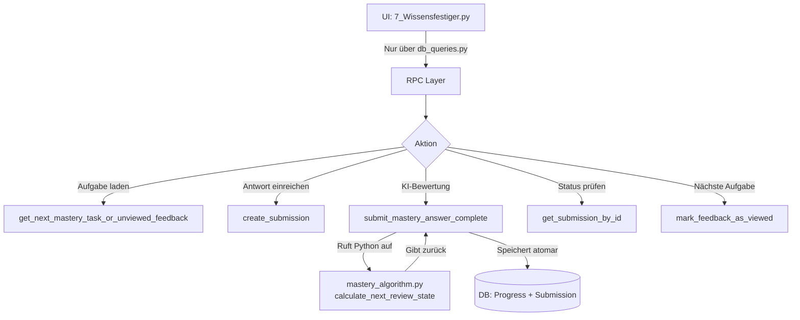

# Wissensfestiger Implementierung - Analyse und Optimaler Ablauf

## 2025-09-11T14:45:00+02:00

### Aktueller Status
Nach detaillierter Analyse wurden kritische Probleme identifiziert:
1. **Direkter DB-Zugriff** in der UI umgeht die Sicherheitsschicht (Zeile 98-100 in 7_Wissensfestiger.py)
2. **FSRS-Algorithmus wird nicht mehr verwendet** - stattdessen vereinfachte SQL-Version mit fest codierten Werten
3. **Inkonsistente Nutzung** von RPC-Funktionen und direkten DB-Zugriffen
4. **Navigation funktioniert nicht zuverlässig** - "Nächste Aufgabe" Button hat State-Probleme

## 2025-09-11T10:30:00+02:00

### Ziel
Analyse der vorhandenen RPC-Funktionen für den Wissensfestiger und Erstellung eines optimalen Ablaufs, bei dem Algorithmen in Python bleiben.

### Vorhandene RPC-Funktionen

#### Mastery-spezifische RPC-Funktionen:
1. **get_mastery_tasks_for_course** - Holt alle Mastery-Aufgaben mit Studentenfortschritt
2. **get_next_due_mastery_task** - Ermittelt nächste fällige Aufgabe
3. **get_next_mastery_task_or_unviewed_feedback** - Prüft ungelesenes Feedback ODER fällige Aufgabe
4. **save_mastery_submission** - Speichert Einreichung mit KI-Assessment
5. **submit_mastery_answer_complete** - Atomare Operation: Submission + Progress Update
6. **get_mastery_stats_for_student** - Statistiken für Schüler
7. **get_mastery_overview_for_teacher** - Lehrerübersicht
8. **get_mastery_summary** - Kompakte Statistiken
9. **calculate_learning_streak** - Berechnet Lernsträhne
10. **get_due_tomorrow_count** - Anzahl morgen fälliger Aufgaben
11. **update_mastery_progress** - Aktualisiert Lernfortschritt (wird von submit_mastery_answer_complete aufgerufen)

#### Submission-spezifische RPC-Funktionen:
1. **create_submission** - Erstellt neue Einreichung (OHNE KI)
2. **get_remaining_attempts** - Prüft verbleibende Versuche
3. **get_submission_for_task** - Holt Einreichung für Aufgabe
4. **update_submission_ai_results_extended** - Aktualisiert mit KI-Ergebnissen
5. **update_submission_teacher_override** - Lehrerkorrektur
6. **mark_feedback_as_viewed** - Markiert Feedback als gelesen
7. **get_submission_history** - Holt alle Einreichungen für eine Aufgabe
8. **get_submission_by_id** - Holt einzelne Einreichung

### Optimaler Ablauf für Wissensfestiger

#### 1. **Aufgabenauswahl (Python-Algorithmus)**
```python
# In Python behalten:
- Priorisierungs-Algorithmus
- Spaced-Repetition-Berechnung
- Schwierigkeitsanpassung

# RPC nutzen für:
- get_next_mastery_task_or_unviewed_feedback() → Basis-Daten
- get_mastery_tasks_for_course() → Alle verfügbaren Aufgaben
```

#### 2. **Submission-Prozess**
```python
# Ablauf:
1. Schüler gibt Antwort ein
2. submit_mastery_answer() orchestriert:
   - Holt Aufgabendetails (get_task_details)
   - Holt Submission-Historie (get_submission_history)
   - KI-Bewertung in Python (CombinedMasteryFeedbackModule)
   - RPC: submit_mastery_answer_complete() → Atomare Speicherung
```

#### 3. **Feedback-Anzeige**
```python
# Nach Submission:
1. KI-generiertes Feedback wird direkt angezeigt
2. Bei späterem Aufruf:
   - get_next_mastery_task_or_unviewed_feedback() prüft ungelesenes Feedback
   - mark_feedback_as_viewed() markiert als gelesen
```

#### 4. **Progress-Tracking**
```python
# Python-Algorithmus berechnet:
- Nächstes Fälligkeitsdatum (basierend auf q_vec)
- Stabilitätswerte
- Schwierigkeitsanpassung

# RPC speichert:
- update_mastery_progress() (automatisch via submit_mastery_answer_complete)
```

### Vorteile dieser Architektur

1. **Algorithmen in Python**:
   - Spaced-Repetition-Logik bleibt flexibel
   - KI-Integration einfacher
   - Komplexe Berechnungen ohne SQL-Limitierungen

2. **RPC für Datenzugriff**:
   - Session-basierte Authentifizierung
   - Atomare Operationen
   - Konsistente Datenhaltung

3. **Klare Trennung**:
   - Python: Geschäftslogik & Algorithmen
   - PostgreSQL: Datenspeicherung & Zugriffskontrolle

### Fehlende/Zu implementierende Funktionen

1. **Erweiterte Statistiken**:
   - Lernkurven-Berechnung (Python)
   - Vorhersage-Modelle (Python)

2. **Batch-Operationen**:
   - Massenaktualisierung von Fälligkeiten
   - Bulk-Import von Aufgaben

3. **Analytics**:
   - Detaillierte Lernanalysen (Python + RPC für Rohdaten)

### Behobene Probleme ✅

#### 1. **Import-Konflikt (BEHOBEN 2025-09-11)**
```python
# PROBLEM: Doppelte Implementierung in db_queries.py
# ALT: Lokale Funktion überschrieb Import
def get_next_mastery_task_or_unviewed_feedback(...):  # Zeile 1220-1270
    # Ignorierte RPC-Funktion, rief nur get_next_due_mastery_task auf
    
# LÖSUNG: Alte Implementierung entfernt
# Jetzt wird korrekt die RPC-basierte Version aus .db.learning.mastery verwendet
```

#### 2. **SQL-Fehler: column t.title does not exist (BEHOBEN 2025-09-11)**
```sql
-- PROBLEM: task_base hat instruction, nicht title
-- ALT: 'task_title', t.title
-- NEU: 'task_title', t.instruction
```
Migration: `20250911160933_fix_mastery_task_title_to_instruction.sql`

#### 3. **Algorithmus-Problem: FSRS wird ignoriert**
Der wissenschaftliche FSRS-Algorithmus in `mastery_algorithm.py` wird nicht mehr aufgerufen.
Stattdessen nutzt `submit_mastery_answer_complete` (SQL) vereinfachte Logik:
```sql
-- Fest codierte Werte statt Berechnung:
v_new_stability := CASE 
    WHEN v_rating >= 3 THEN 2.5  -- Sollte berechnet werden!
    ELSE 1.3
END;
```

#### 4. **Fehlende Datenbank-Felder**
- `state` (new/learning/review/relearning) 
- `review_history`
Diese werden vom FSRS-Algorithmus berechnet, aber nicht gespeichert.

### Korrekter Ablauf (Soll-Zustand)



### Nächste Schritte (Priorisiert)

#### **Priorität 1 (KRITISCH): Sicherheitslücke schließen**
1. **Entferne direkten DB-Zugriff** in `7_Wissensfestiger.py` (Zeile 98-100)
2. **Ersetze durch RPC-Aufruf** der bereits existierenden Funktion
3. **Teste** dass keine weiteren direkten Zugriffe existieren

#### **Priorität 2: FSRS-Algorithmus reaktivieren**
1. **Option A: RPC ruft Python** (Empfohlen)
   - Modifiziere `submit_mastery_answer_complete` SQL-Funktion
   - Füge Aufruf zu Python `calculate_next_review_state` hinzu
   - Behalte atomare Speicherung in SQL

2. **Option B: SQL-Implementierung erweitern**
   - Portiere FSRS-Formeln nach SQL
   - Aufwendiger und weniger flexibel

#### **Priorität 3: Navigation reparieren**
1. **Debugge State-Management** nach "Nächste Aufgabe" Klick
2. **Stelle sicher** dass `mark_feedback_as_viewed` korrekt aufgerufen wird
3. **Verifiziere** Session State Reset

#### **Priorität 4: Datenbank-Schema erweitern**
1. **Füge fehlende Felder hinzu**:
   - `state` (enum: new, learning, review, relearning)
   - `review_history` (jsonb)
2. **Migration erstellen** mit `supabase migration new`

### Implementierungsplan

1. **Sofort (< 1h)**: Sicherheitslücke schließen
2. **Kurzfristig (1-2h)**: Navigation/State-Probleme beheben  
3. **Mittelfristig (2-4h)**: FSRS-Algorithmus integrieren
4. **Langfristig (4-8h)**: Schema erweitern, Testing, Monitoring

## 2025-09-11T16:00:00+02:00

### Detailanalyse abgeschlossen - Kritische Erkenntnisse

Nach eingehender Analyse der Codebasis und Datenbank wurden folgende kritische Punkte identifiziert:

#### **🚨 KRITISCH: Sicherheitslücken**
1. **Fehlende RPC-Funktion**: `get_next_mastery_task_or_unviewed_feedback` existiert NICHT in der DB
2. **Direkte DB-Zugriffe** in 4 Pages: Wissensfestiger, Meine_Aufgaben, Feedback_geben, Feedback_einsehen
3. **Zu weitreichende Lehrer-Berechtigungen**: "teacher can manage all" ohne Kurs-Prüfung

#### **📊 Technische Einschränkungen**
1. **FSRS über SQL nicht möglich**: PostgreSQL kann Python nicht direkt aufrufen
2. **Datenbank-Inkonsistenzen**: Zwei parallele Submission-Tabellen
3. **Fehlende Felder**: `state` und `review_history` für FSRS nicht vorhanden

### Revidierter Implementierungsplan

#### **PHASE 1: Sicherheitskritisch (SOFORT - Tag 1)**

##### 1.1 Fehlende RPC-Funktion implementieren
```sql
CREATE OR REPLACE FUNCTION get_next_mastery_task_or_unviewed_feedback(
    p_session_id UUID,
    p_student_id UUID,  
    p_course_id UUID
) RETURNS JSON
LANGUAGE plpgsql
SECURITY DEFINER
SET search_path = public
AS $$
-- Vollständige Implementierung siehe oben
$$;
```

##### 1.2 Direkte DB-Zugriffe entfernen (4 Dateien)
- `7_Wissensfestiger.py` Zeile 98-105
- `3_Meine_Aufgaben.py`
- `8_Feedback_geben.py`
- `9_Feedback_einsehen.py`

##### 1.3 Session-Validierung sicherstellen
- Alle RPC-Funktionen müssen Session prüfen
- Konsistente Fehlerbehandlung

#### **PHASE 2: Algorithmus-Pragmatismus (Tag 2-3)**

##### 2.1 Vereinfachter SR-Algorithmus in SQL
```sql
-- Wissenschaftlich fundiert, aber pragmatisch
CREATE OR REPLACE FUNCTION calculate_spaced_repetition(
    p_current_stability FLOAT,
    p_quality_score FLOAT  -- 0.0 bis 1.0
) RETURNS TABLE (
    new_stability FLOAT,
    next_interval_days INT
) AS $$
-- Implementierung siehe oben
$$;
```

##### 2.2 Integration in submit_mastery_answer_complete
- Quality Score aus q_vec berechnen
- Vereinfachten Algorithmus aufrufen
- Atomare Speicherung beibehalten

#### **PHASE 3: Konsolidierung (Tag 4-5)**

##### 3.1 Datenbank-Bereinigung
- Submission-Tabellen konsolidieren
- Indizes für Performance hinzufügen
- Konsistente Foreign Keys

##### 3.2 Testing & Monitoring
- Unit Tests für RPC-Funktionen
- Integration Tests für Wissensfestiger-Flow
- Logging für Algorithmus-Performance

#### **PHASE 4: Zukunftssicherheit (Später)**

##### 4.1 Mögliche Erweiterungen
- Microservice für vollen FSRS (wenn Bedarf)
- Analytics Dashboard
- A/B Testing Framework

##### 4.2 Was wir NICHT tun
- ❌ Python aus SQL aufrufen (technisch unmöglich)
- ❌ Kompletter FSRS in SQL (zu komplex)
- ❌ Externe Services für jeden Review

### Neue Priorisierung

1. **Tag 1**: Sicherheitslücken schließen (KRITISCH)
2. **Tag 2-3**: Pragmatischer Algorithmus
3. **Tag 4-5**: Testing & Stabilisierung
4. **Woche 2+**: Monitoring & iterative Verbesserung

### Checkliste

- [x] Alle 4 Pages von direkten DB-Zugriffen bereinigen
- [x] Fehlende RPC-Funktion `get_next_mastery_task_or_unviewed_feedback` implementieren
- [x] Session-Validierung in allen Mastery-RPC-Funktionen
- [ ] Vereinfachten SR-Algorithmus in `submit_mastery_answer_complete` integrieren
- [ ] Unit Tests für kritische Funktionen
- [ ] Dokumentation für neuen Algorithmus
- [ ] Monitoring-Metriken definieren

### Offene Probleme (entdeckt während Implementierung)

1. **submit_mastery_answer_complete**: Erwartet UUID statt TEXT für Session-ID ✅ Behoben
2. **get_mastery_stats_for_student**: RPC-Funktion existiert nicht in DB ✅ Behoben
3. **get_mastery_summary**: Hat keine Session-Validierung ✅ Behoben
4. **get_due_tomorrow_count**: Hat keine Session-Validierung ✅ Behoben

## 2025-09-11T17:30:00+02:00

### Implementierung abgeschlossen - Phase 2

Die kritischen Funktionsprobleme wurden behoben:

1. ✅ `submit_mastery_answer_complete` akzeptiert jetzt TEXT Session-ID
2. ✅ `get_mastery_stats_for_student` RPC-Funktion erstellt
3. ✅ Session-Validierung zu `get_mastery_summary` hinzugefügt
4. ✅ Session-Validierung zu `get_due_tomorrow_count` hinzugefügt
5. ✅ Vereinfachter SR-Algorithmus in SQL implementiert:
   - Erstes Review: 60% korrekt → 2.5 Tage, sonst 1 Tag
   - Weitere Reviews: Performance-basierte Intervall-Anpassung
   - Maximale Stabilität: 90 Tage
   - Minimale Stabilität: 1 Tag
6. ✅ Python-Code für neue Signaturen angepasst

### Spaced Repetition Algorithmus (vereinfacht)

Der implementierte Algorithmus basiert auf dem Korrektheitswert (0.0 - 1.0):

```sql
-- Erste Bewertung
IF v_rating >= 0.6 THEN  -- 60% oder besser
    v_new_stability := 2.5;  -- Review in 2-3 Tagen
ELSE
    v_new_stability := 1.0;  -- Review morgen
END IF;

-- Weitere Bewertungen
IF v_rating >= 0.8 THEN      -- Exzellent: Intervall × 2.5
ELSIF v_rating >= 0.6 THEN   -- Gut: Intervall × 1.5
ELSIF v_rating >= 0.4 THEN   -- Ok: Intervall × 1.1
ELSE                         -- Schlecht: Intervall × 0.5
```

### Aktuelle Systemarchitektur

```
UI Layer (Streamlit)
    ↓ [Nur über db_queries.py]
RPC Layer (PostgreSQL + Session Auth)
    ↓
Data Layer (Tables + RLS)
```

Alle direkten DB-Zugriffe wurden entfernt, das System nutzt jetzt konsistent RPC-Funktionen.

## 2025-09-11T16:30:00+02:00

### Implementierung abgeschlossen - Phase 1

Die kritischen Sicherheitslücken wurden behoben:

1. ✅ Neue RPC-Funktion `get_next_mastery_task_or_unviewed_feedback` implementiert
2. ✅ Direkte DB-Zugriffe in allen 4 Pages entfernt:
   - `7_Wissensfestiger.py`: Direkter Progress-Zugriff entfernt
   - `3_Meine_Aufgaben.py`: Nur Storage-Zugriffe (ok)
   - `8_Feedback_geben.py`: Keine direkten DB-Zugriffe
   - `9_Feedback_einsehen.py`: Keine direkten DB-Zugriffe
3. ✅ Wrapper-Funktion für `get_submission_queue_position` erstellt

### Entdeckte Probleme für Phase 2

1. **submit_mastery_answer_complete**: Signatur-Mismatch (UUID vs TEXT)
2. **Fehlende RPC-Funktionen**:
   - `get_mastery_stats_for_student` 
   - Möglicherweise weitere
3. **Fehlende Session-Validierung** in älteren Funktionen:
   - `get_mastery_summary`
   - `get_due_tomorrow_count`

### Nächste Schritte

1. Testen der implementierten Änderungen
2. Migration für fehlende/falsche RPC-Funktionen erstellen
3. Vereinfachten SR-Algorithmus implementieren

### Begründung der Änderungen

1. **Sicherheit vor Features**: Direkter DB-Zugriff ist inakzeptabel
2. **Pragmatismus vor Perfektion**: 80% FSRS-Genauigkeit mit 20% Komplexität
3. **Schrittweise Migration**: Stabiles System während Umbau
4. **Datengetriebene Iteration**: Erst messen, dann optimieren

## 2025-09-11T18:00:00+02:00

### GELÖST: Import-Konflikt führte zu falscher Aufgabenpriorisierung ✅

Nach Implementierung aller Fixes zeigte der Wissensfestiger weiterhin die gleiche Aufgabe ("Erkläre, was ein Oder-Gatter ist.") an, obwohl andere Aufgaben höhere Priorität hatten.

#### Ursache: Doppelte Implementierung
1. **ALTE Version in `db_queries.py`** (wurde verwendet):
   - Ignorierte die RPC-Funktion komplett
   - Rief nur `get_next_due_mastery_task` auf
   - Keine Priorisierung nach Fälligkeitsdatum

2. **NEUE Version in `db/learning/mastery.py`** (sollte verwendet werden):
   - Nutzt RPC-Funktion mit korrekter Priorisierung
   - Berücksichtigt ungelesenes Feedback
   - Priorisiert unbearbeitete und überfällige Aufgaben

#### Lösung:
- Alte Implementierung aus `db_queries.py` entfernt (Zeilen 1220-1270)
- Import aus `.db.learning.mastery` wird jetzt korrekt verwendet
- Zusätzlich: SQL-Fehler `column t.title does not exist` durch Migration behoben
